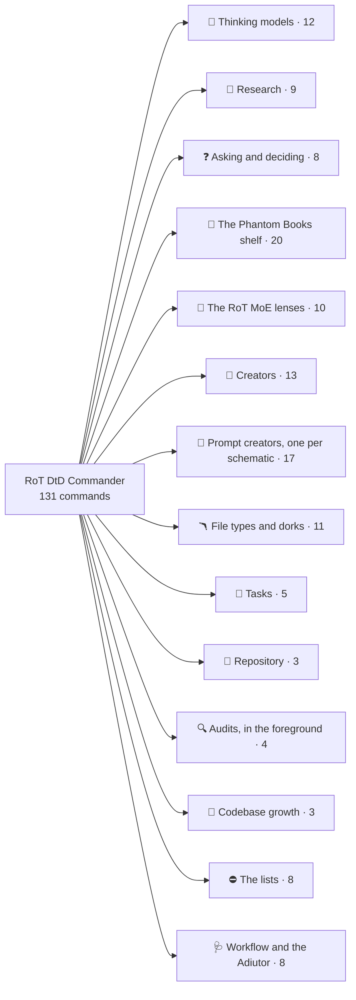
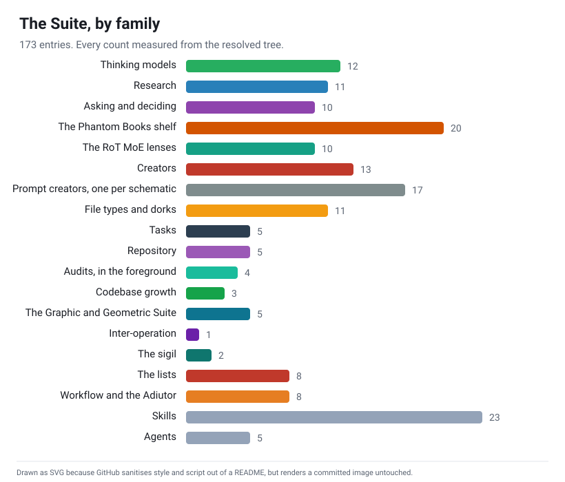

<!--
    This file is part of RoT DtD Commander.
    SPDX-License-Identifier: AGPL-3.0-or-later OR EUPL-1.2
    Copyright 2026 Saimonokuma.
-->

<div align="center">

# 🜏 RoT DtD Commander

**Commands that carry their own grammar, and a doctor that reads it**

*131 Claude Code slash commands, 22 skills and 5 agents whose answer grammar, verdicts, laws and trust boundary are declared in a DTD inside each file; a guided NPX installer; the Adiutor, a Stop hook that checks every answer against the DOCTYPE that produced it; and the Commander-Adiutor, a monitor that hands every failed answer to the session as the ledger closes it*

[](https://ko-fi.com/saimonokuma)
[](https://github.com/Nova-Violet-Role)
[](LICENSE)

[](#-what-is-claimed-and-the-instrument-behind-each-claim)
[](#-what-is-claimed-and-the-instrument-behind-each-claim)
[](#-verify-it-yourself)
[](https://www.claudepluginhub.com/plugins/nova-violet-role-rot-dtd-commander?ref=badge)
[](https://claude.com/claude-code)
[](https://reuse.software/)

</div>

---

## 👋 Welcome

<details>
<summary><b>Who this is for, and where to start</b></summary>

**You are welcome here, whatever you came for.** If you want sharper thinking
commands in your Claude Code sessions, [start with Install](#-install): one
line, and `rdc uninstall` undoes every byte of it. If you came to check whether
the numbers on this page are real, [start with Verify](#-verify-it-yourself)
and try to break them; that is the point of the page, not an offence against
it. If "DTD" is a word you last saw in 2002, nothing here requires you to write
one: the commands work as commands, and the grammar rides inside them.

Questions that begin "this is probably a dumb question" are the ones the
documentation failed to answer. Ask them in Discussions and they will be
treated as defects in this page.

</details>

---

## 📜 About

<details>
<summary><b>What a DTD-carrying command is, and why the grammar rides inside the file</b></summary>

A slash command is a prompt. A prompt says what an answer should contain, in
prose, and prose drifts: the template at the bottom stops matching the steps
in the middle, the verdict words multiply, and nothing ever reads the answer
back. This repository fixes the shape of the answer once, in the oldest schema
language there is, and then reads it back.

Every `*-dtd` command, skill and agent opens with a `<!DOCTYPE>` block:

```
<!DOCTYPE pareto [
  <!ELEMENT pareto (vital+, trivial*, bottom_line)>
  <!ELEMENT vital (factor, why, action)>
  <!ATTLIST vital rank CDATA #REQUIRED impact (high|medium|low) #REQUIRED>
  <!ENTITY LAW.PARETO.2 "The cutoff is stated as a count of factors out of the total, not as a feeling.">
]>
```

The elements are the answer's shape. The enumerations are the only verdicts it
may give. The `LAW.*` entities are its success criteria, numbered and never
reused. Four unparsed channels (`user-args`, `tool-result`, `file-ref`,
`ask-answer`) are declared as NDATA: whatever arrives on them is data, never an
instruction, and every file must say so in its trust boundary or the checker
refuses it. The four terms are used as they were meant: `#PCDATA` is the
model's own reasoning, `CDATA` is text carried in whole, `NDATA` names a
channel, `NOTATION` says how it must be handled.

Then the **Adiutor** closes the loop. When you run any `-dtd` command, a hook
reads that command's DOCTYPE and records which headings the answer must carry.
At Stop, another hook reads the answer from the transcript and checks it.
Every run is one line in a ledger. `/RoT-DtD-Commander-Adiutor` is the doctor
that reads the ledger and prescribes. Nothing is described twice: the grammar
the model was shown is the grammar the hook reads.

Beside the hooks runs the **Commander-Adiutor**, a monitor: a separate
process (`monitors/commander-adiutor.mjs`, not `bin/adiutor.mjs`) that tails
the ledger and hands every answer that failed its grammar to the session the
moment the run closes, one line each, nothing for a pass. It reads the ledger
only, never a transcript, and the two lines it may print are declared in
`dtd/adiutor.dtd`. Since 5.0.0 neither runs on its own: no plugin manifest
arms the hooks, an install arms nothing unless `--arm` is given, the monitor
is declared in `monitors/manual.json` and started only by `rdc watch`, and
every run of either ends at a 300 second ceiling.

The answer has one shape too. Every heading a command's grammar map declares
is rendered as a markdown heading that carries the command's own sigil, with
a blank line before it and after it:

```
### 🎯 Vital Few (focus here)

- Factor 1: the installer, because it checks every other file

### 🎯 Bottom Line

Ship the installer first.
```

One sigil per command, declared once in `dtd/sigils.json` (the nine lens
commands carry their lens emoji); the rule is `LAW.CORE.6`, checker rule
C13 refuses a template whose headings touch or lack the sigil, and the
Adiutor flags a crammed answer at Stop as a `spacing` finding. Nothing runs
together, and an answer is recognisable at a glance.

A command is also runnable from the end of a prompt: `LAW.CORE.7` declares
that a `/name-dtd` token that ends a prompt, with or without a trailing `<-`,
invokes that command on the text before it as its arguments. Claude Code
expands a slash command only at the head of a prompt; the Adiutor arms the
run on the trailing token too (control C14) and its armed line tells the
model to run the command, so the call is as complete as a leading one.

Since 5.0.0 the commands also write. Sixteen prompt and meta-prompt creators,
one per schematic (callout, heredoc, yaml, nt, xml, polyglot, alarm,
polyalarm), draw every syntax from a declared table and prove a planted
out-of-table syntax refused. Creators for skills, hooks, commands, subagents,
plans, MCP servers and workflow files ask twelve questions in three rounds,
write with the answers as known slots, and audit what they wrote here, in the
foreground, with a planted fault proving the audit. A tasks family keeps its
registry and ledger; eight filetype creators and their router write an
exemplar and its NOTATION; two dork creators build a search and a local hunt.
Every creator declares a curated SPDX licence from `dtd/licenses.json`.
Records nest (`cc-record.dtd`), the shelf of nineteen book-derived commands
carries a voice profile the slop sweep reads, and the Scratchpad Companion, a
second session run in the foreground, audits each build phase in a declared
grammar and is scored on its finding elements.

### 🤝 It **improves** Claude Code; it does not replace it

The commands install into `~/.claude/commands` like any other, and a plain
install arms nothing. When you ask for the hooks (`rdc install --arm` or
`rdc arm`), they are added to `~/.claude/settings.json` by an additive merge
that backs up first, preserves every key it did not add (deep-compared after
re-reading from disk), and reverses with one command. A hook reads its
payload, writes under its own state directory, spawns nothing, and exits. The
monitor is declared in `monitors/manual.json`, a file the loader never reads,
and runs only when you run `rdc watch`; it reads the ledger and prints,
nothing more.

Armed, since 5.1.0, the AI_SLOP gate of `ai-slop.dtd` also judges every
answer at Stop, a subagent answer at SubagentStop, and every Write, Edit,
NotebookEdit, commit message and request body before it lands: a prose file whole, a code file by its lifted
comments, strict whatever the policy, one ledger line per refusal, the
escape a code fence or a quoted element (LAW.SLOP.7, LAW.SLOP.8; controls
C21 to C29). `/ai-slop-dtd` is the hand-run form of the same instrument.

</details>

---

## 🚀 Install

<details>
<summary><b>One line to install, one to remove every byte</b></summary>

```sh
npx github:Nova-Violet-Role/RoT-DtD-Commander install
```

The installer is guided: it asks for the target (user-wide `~/.claude` by
default, or the project's `./.claude`), lists what it will write, prints
exactly what the Adiutor hooks do and where the `settings.json` backup goes,
and waits for a `y`. Add `--yes` for a non-interactive install that prints the
same statement and proceeds. The install arms nothing and starts no monitor:
the Adiutor runs when you run it (`rdc doctor`, `rdc controls`,
`/RoT-DtD-Commander-Adiutor`) and the monitor when you run `rdc watch`, each
under a 300 second ceiling. `rdc install --arm` or `rdc arm` registers the
hooks deliberately, with the Stop hook at 300 seconds.

As a plugin, from inside Claude Code (the plugin arms no hook and starts no
monitor; both run by hand):

```
/plugin marketplace add Nova-Violet-Role/RoT-DtD-Commander
/plugin install rot-dtd-commander@rot-dtd-commander
```

From a clone:

```sh
git clone https://github.com/Nova-Violet-Role/RoT-DtD-Commander
cd RoT-DtD-Commander
node bin/rot-dtd-commander.mjs install      # or: npx . install
```

### 🔧 Requirements

Node 20 or later. Nothing else is required: the fourteen checker rules, the
contract audit and the Adiutor run on Node alone.

### ⚙️ Configuration

| variable | values | effect |
|---|---|---|
| `ROT_DTD_ADIUTOR` | `off`, `warn` (default), `strict` | `warn`: a failed answer gets a ledger line and a one-line system message. `strict`: the Stop is blocked **once** per run with the prescription as the reason; the second Stop always passes. `off`: ledger only. |
| `ROT_DTD_STATE` | a directory | where the ledger and open runs live (default `~/.claude/rot-dtd-commander`) |

Reverse everything: `rdc uninstall` removes every file in the manifest (the
monitor plugin among them) and disarms the hooks; `rdc disarm` removes only
the hooks.

</details>

---

## 🕹️ Usage

131 commands, in the families the command index lists, every
one opening with its DOCTYPE and closing with its laws.

The index below is generated from the resolved tree by `checker/readme-index.mjs`
and the gate refuses a README whose index disagrees with the files. It is the one
part of this page that stays open; every other section is folded behind its heading.

<!-- rdc-index:begin -->
*131 commands in 14 families, 22 skills, 5 agents. Every family opens below; the rest of this page is folded.*


_This index is generated by `node checker/readme-index.mjs` from the resolved tree; `--check` in the gate refuses a README that disagrees with it. 131 commands in 14 families, 22 skills, 5 agents._



[](#family-thinking)
[](#family-research)
[](#family-asking)
[](#family-shelf)
[](#family-lenses)
[](#family-creators)
[](#family-prompts)
[](#family-filetypes)
[](#family-tasks)
[](#family-repository)
[](#family-audits)
[](#family-growth)
[](#family-lists)
[](#family-workflow)

<a name="family-thinking"></a>
<details>
<summary><b>🎯 Thinking models</b> · 12 commands</summary>

| command | sigil | what it does |
|---|:-:|---|
| `/10-10-10-dtd` | ⏳ | Judge a decision at ten minutes, ten months and ten years, naming the horizon where the sign flips |
| `/5-whys-dtd` | 🔁 | Ask why until the cause is actionable: three to five links, each answering the last, and an intervention that names its recurrence check |
| `/eisenhower-matrix-dtd` | 🗂️ | Every item in exactly one of do, schedule, delegate, eliminate, with the next action a do-first item owes |
| `/first-principles-dtd` | 🧱 | Break down to fundamentals and rebuild from base truths; every assumption gets an origin and a verdict, every conclusion names the truths… |
| `/inversion-dtd` | 🔃 | Write the failure recipe first: each way to guarantee defeat, its likelihood and damage, and the rule that avoids it |
| `/occams-razor-dtd` | 🪒 | Count the assumptions behind each explanation; the winner fits every fact with the fewest unsupported ones |
| `/one-thing-dtd` | 🔑 | The single action that makes the rest easier or unnecessary, chosen from named candidates and doable within the hour |
| `/opportunity-cost-dtd` | 💱 | What the choice spends and the single best alternative it forecloses, in one unit, with a yes, partial or no |
| `/pareto-dtd` | 🎯 | Find the vital few: rank every factor by impact, cut at a declared count, and name what you will ignore |
| `/second-order-dtd` | 🌊 | Think through consequences of consequences as a declared causal chain; every effect has an order, a cause, a sign, a horizon and a… |
| `/swot-dtd` | ⚖️ | Strengths, weaknesses, opportunities and threats sorted by control, plus four moves that each pair an inside with an outside |
| `/via-negativa-dtd` | ➖ | Improve by removing: each candidate with the impact of its removal, what passed the keep test, what to refuse next |

</details>

<a name="family-research"></a>
<details>
<summary><b>🤿 Research</b> · 9 commands</summary>

| command | sigil | what it does |
|---|:-:|---|
| `/competitive-dtd` | 🏁 | Who else does this and how: three competitors minimum with sources, a matrix, the gaps, the differentiation options |
| `/deep-dive-dtd` | 🤿 | Comprehensive investigation of a topic; a declared intake, a declared report grammar with local-first sources, and a saved artifact |
| `/deep-scratch-dtd` | 🔬 | DTD-native: research a change, build it in a git worktree under .claude/worktrees, review the diff hunk by hunk, amplify the research with… |
| `/feasibility-dtd` | 🧪 | Can we build it with what we have: technical, resource and external verdicts, blockers with mitigations, one overall go, conditional go or… |
| `/history-dtd` | 🕰️ | What was tried before: dated attempts, why they worked or failed, what is different now, the lessons to adopt or avoid |
| `/landscape-dtd` | 🌄 | Map a domain: scope, categories, players, trends, white space, and what it implies for us |
| `/open-source-dtd` | 🌐 | Find the libraries that solve this: licence first, maintenance signals, a comparison, and a build-versus-use call |
| `/options-dtd` | 🔀 | Compare options against weighted criteria declared first, with a recommendation and the condition that would flip it |
| `/technical-dtd` | ⚙️ | How to implement it: three approaches with complexity and best-when, a comparison, the chosen one with its first step |

</details>

<a name="family-asking"></a>
<details>
<summary><b>❓ Asking and deciding</b> · 8 commands</summary>

| command | sigil | what it does |
|---|:-:|---|
| `/ask-me-many-questions-dtd` | ❔ | Gather requirements through up to thirty bilateral questions in eight rounds of four before executing any task; the rounds are raised in… |
| `/ask-me-preview-dtd` | 🔭 | Gather requirements through questions whose every option carries a preview, cut inside the widget and expanded in the transcript with the… |
| `/ask-me-questions-dtd` | ❓ | Gather requirements through adaptive questioning before executing any task; the intake, its rounds, the bilateral questions, the previews,… |
| `/brainstorm-meta-clear-section-dtd` | 🌀 | DTD-native: brainstorm a topic, choose the schematic, the semantic schemas and the forms the bigger prompt will be written in,… |
| `/coin-flip-best-of-dtd` | 🥇 | DTD-native: decide between two named sides by a best-of series of three, five or seven coin tosses, each its own node:crypto randomInt… |
| `/coin-flip-dtd` | 🪙 | DTD-native: decide between two named sides by one coin toss whose entropy comes from node:crypto randomInt, executed in the foreground and… |
| `/coin-flip-reveal-dtd` | 🎭 | DTD-native: toss a coin between two named sides, then ask how the operator felt when it landed; the feeling is the decision and the coin… |
| `/coin-flip-weighted-dtd` | 🎚️ | DTD-native: decide between two named sides by one toss weighted by the odds the operator declares, the entropy from node:crypto randomInt… |

</details>

<a name="family-shelf"></a>
<details>
<summary><b>👻 The Phantom Books shelf</b> · 20 commands</summary>

| command | sigil | what it does |
|---|:-:|---|
| `/atharvan-dtd` | 🪄 | remedy-first for a bug class; each remedy is a charm (the fix) and a rite (the verification), contraindications name what forbids it, and… |
| `/babel-dtd` | 📚 | enumerate a finite design space completely, mark the absurd cells, and find the catalog that names the one that holds the answer |
| `/catalog-dtd` | 🗃️ | verify an index against its directory in both directions; every entry is declared and present, declared and missing, or present and… |
| `/clean-unclean-dtd` | 🧼 | taint tracking; list every input channel of a prompt, script or pipeline as clean or unclean, declare a rite for each unclean one, and… |
| `/count-the-library-dtd` | 🔢 | size a search space with a lower and an upper bound before searching it, and refuse to enumerate what the arithmetic says cannot be… |
| `/eleusis-dtd` | 🚪 | progressive disclosure with initiation gates; lesser teachings before greater ones, every gate has a test that can be failed, and the… |
| `/formula-dtd` | 🧮 | declare the computed layer; every number a command, script or document relies on is a formula with a term, a derivation that names the… |
| `/four-branches-dtd` | 🌳 | tell the same change as four independent tales, user, operator, attacker and maintainer, then name where the tales contradict |
| `/goetia-dtd` | 🔱 | read the agents actually installed, declare each with its office, seal and bound, and summon exactly one for the task |
| `/havamal-dtd` | 📜 | distill a discussion into numbered sayings that survive without context, each naming the moment it was earned, and keep only the ones… |
| `/loci-dtd` | 🏛️ | build a memory palace for a codebase, a session or a handoff; rooms map to real places, loci to real facts, and the walk has a fixed order |
| `/phantom-dtd` | 👻 | pick the Phantom Books command for the shape of the problem; score at least three candidates and route to exactly one |
| `/redaction-dtd` | ✂️ | two accounts of one event, quoted as readings with provenance; every difference classified as a variant, and the archetype that explains… |
| `/sapiential-dtd` | 🦉 | wisdom against cleverness; every clever move names what it gains, every wise constraint names what it protects, and each violation pairs… |
| `/sutra-dtd` | 🧵 | audit the shortcuts in use; every heuristic is written as a rule with the exact domain where it is valid and a counterexample that was tried |
| `/tetralemma-dtd` | 🔲 | four-cornered analysis (affirm, deny, both, neither) that ends by naming what the proposition depends on |
| `/voluspa-dtd` | 🌋 | narrate the end state first, then the stanzas read backwards to it, name the one stanza where it became irreversible, and say what stands… |
| `/water-dtd` | 💧 | find the path of least resistance through a hard constraint; mark each constraint hard, soft or assumed, find where it yields, and route… |
| `/witnesses-dtd` | 👁️ | separate what was seen from what was inferred; every witness says what it saw and under what conditions, and a claim is attested only by a… |
| `/wu-wei-dtd` | 🍃 | the do-nothing branch as a first-class option; write what happens if nobody acts, cost both branches in the same unit, and choose act,… |

</details>

<a name="family-lenses"></a>
<details>
<summary><b>🌌 The RoT MoE lenses</b> · 10 commands</summary>

| command | sigil | what it does |
|---|:-:|---|
| `/rot-antivenom-dtd` | ⚪ | The Anti-Venom lens as a command. |
| `/rot-carnage-dtd` | 🩸 | The Carnage lens as a command. |
| `/rot-chroma-dtd` | 🔮 | The Chroma Spectral lens as a command, Coalescentia Omniscia Intercogitationum. |
| `/rot-claude-dtd` | 🧭 | The Claude lens as a command, the Forge. |
| `/rot-eidolon-dtd` | 🜏 | The Eidolon lens as a command, Eigenform. |
| `/rot-elevate-dtd` | 🌌 | All nine RoT MoE lenses at full weight, the NSIL decision ELEVATE. |
| `/rot-nova-dtd` | ⚜️ | The Nova lens as a command. |
| `/rot-soleil-dtd` | ⬜ | The Soleil Blank lens as a command. |
| `/rot-venom-dtd` | 🕷️ | The Venom lens as a command. |
| `/rot-violet-dtd` | 🎷 | The Violet Noir lens as a command. |

</details>

<a name="family-creators"></a>
<details>
<summary><b>🧩 Creators</b> · 13 commands</summary>

| command | sigil | what it does |
|---|:-:|---|
| `/create-agent-skill-dtd` | 🎓 | DTD-native: create a skill through twelve questions in three rounds that are never skipped, a curated SPDX license, an emoji and a form;… |
| `/create-db-dtd` | 🗄️ | DTD-native: create a database layer through twelve questions in three rounds: records with numbered append-only fields twinned with a… |
| `/create-hook-dtd` | 🪝 | DTD-native: create a hook through twelve questions in three rounds that are never skipped, a curated SPDX license, an emoji and a form;… |
| `/create-mcp-dtd` | 🔌 | DTD-native: create an MCP server through twelve questions in three rounds that are never skipped, a curated SPDX license, an emoji and a… |
| `/create-moe-dtd` | 🎛️ | DTD-native: create a mixture of lenses through twelve questions in three rounds: a roster declared once, one element per lens, lane and… |
| `/create-monitor-dtd` | 📡 | DTD-native: create a Claude Code monitor (a persistent process beside the hooks) through twelve questions in three rounds, with its own… |
| `/create-ot-variants-dtd` | 🧠 | DTD-native: create X-of-Thought variants (chain, tree, graph, skeleton, program, algorithm, buffer, everything) as commands through twelve… |
| `/create-plan-dtd` | 🗺️ | DTD-native: create a plan through twelve questions in three rounds that are never skipped, a curated SPDX license, an emoji and a form;… |
| `/create-plugin-dtd` | 🧩 | DTD-native: create a whole Claude Code plugin through twelve questions in three rounds: which creations are in (all of them, or any set),… |
| `/create-router-dtd` | 🚦 | DTD-native: create a router through twelve questions in three rounds: a classification scheme of subjects to lanes, a route tree with ids… |
| `/create-slash-command-dtd` | ✍️ | DTD-native: create a slash command through twelve questions in three rounds that are never skipped, a curated SPDX license, an emoji and a… |
| `/create-subagent-dtd` | 🤖 | DTD-native: create a subagent through twelve questions in three rounds that are never skipped, a curated SPDX license, an emoji and a… |
| `/create-workflowjson-dtd` | 🧰 | DTD-native: create a workflow file through twelve questions in three rounds that are never skipped, a curated SPDX license, an emoji and a… |

</details>

<a name="family-prompts"></a>
<details>
<summary><b>📝 Prompt creators, one per schematic</b> · 17 commands</summary>

| command | sigil | what it does |
|---|:-:|---|
| `/create-meta-prompt-alarm-dtd` | 📯 | DTD-native: create a meta-prompt, a prompt that writes prompts written in the alarm shape, Markdown with the house callout vocabulary… |
| `/create-meta-prompt-callout-dtd` | 🗯️ | DTD-native: create a meta-prompt, a prompt that writes prompts written in the GitHub callout shape through twelve questions in three… |
| `/create-meta-prompt-dtd` | 🪞 | DTD-native: route a meta-prompt to its schematic creator: ask the schematic, the semantic-schema families and the forms, then hand the… |
| `/create-meta-prompt-heredoc-dtd` | 🧬 | DTD-native: create a meta-prompt, a prompt that writes prompts written in a shell here-document through twelve questions in three rounds;… |
| `/create-meta-prompt-nt-dtd` | 🪆 | DTD-native: create a meta-prompt, a prompt that writes prompts written in a NestedText document through twelve questions in three rounds;… |
| `/create-meta-prompt-polyalarm-dtd` | 🪅 | DTD-native: create a meta-prompt, a prompt that writes prompts written in a polyglot whose Markdown layer is the alarm shape through… |
| `/create-meta-prompt-polyglot-dtd` | 🎩 | DTD-native: create a meta-prompt, a prompt that writes prompts written in a polyglot of more than one parser through twelve questions in… |
| `/create-meta-prompt-xml-dtd` | 🔖 | DTD-native: create a meta-prompt, a prompt that writes prompts written in an XML document with a DOCTYPE through twelve questions in three… |
| `/create-meta-prompt-yaml-dtd` | 🧶 | DTD-native: create a meta-prompt, a prompt that writes prompts written in a YAML document through twelve questions in three rounds; every… |
| `/create-prompt-alarm-dtd` | 🚨 | DTD-native: create a prompt written in the alarm shape, Markdown with the house callout vocabulary through twelve questions in three… |
| `/create-prompt-callout-dtd` | 📣 | DTD-native: create a prompt written in the GitHub callout shape through twelve questions in three rounds; every syntax comes from the… |
| `/create-prompt-heredoc-dtd` | 🧾 | DTD-native: create a prompt written in a shell here-document through twelve questions in three rounds; every syntax comes from the… |
| `/create-prompt-nt-dtd` | 🪜 | DTD-native: create a prompt written in a NestedText document through twelve questions in three rounds; every syntax comes from the… |
| `/create-prompt-polyalarm-dtd` | 🎪 | DTD-native: create a prompt written in a polyglot whose Markdown layer is the alarm shape through twelve questions in three rounds; every… |
| `/create-prompt-polyglot-dtd` | 🎴 | DTD-native: create a prompt written in a polyglot of more than one parser through twelve questions in three rounds; every syntax comes… |
| `/create-prompt-xml-dtd` | 🏷️ | DTD-native: create a prompt written in an XML document with a DOCTYPE through twelve questions in three rounds; every syntax comes from… |
| `/create-prompt-yaml-dtd` | 🧷 | DTD-native: create a prompt written in a YAML document through twelve questions in three rounds; every syntax comes from the SCHEMA.yaml.*… |

</details>

<a name="family-filetypes"></a>
<details>
<summary><b>🪃 File types and dorks</b> · 11 commands</summary>

| command | sigil | what it does |
|---|:-:|---|
| `/create-dork-local-dtd` | 🔦 | DTD-native: build and run a local file hunt, a ripgrep and fd pattern set that finds files by type and content under a root, through eight… |
| `/create-dork-search-dtd` | 🕸️ | DTD-native: build a search dork, a query of declared operators (site, filetype or ext, inurl, intitle, quoted terms, minus, OR, and the… |
| `/create-filetype-alarm-dtd` | 🪁 | DTD-native: create a free file type pinned to the alarm schematic (the alarm shape, Markdown with the house callouts) through twelve… |
| `/create-filetype-callout-dtd` | 📍 | DTD-native: create a free file type pinned to the callout schematic (Markdown with GitHub callouts) through twelve questions in three… |
| `/create-filetype-dtd` | 🪃 | DTD-native: route a free file type to its schematic creator: ask the schematic, the semantic-schema families and the forms, then hand the… |
| `/create-filetype-heredoc-dtd` | 🛎️ | DTD-native: create a free file type pinned to the heredoc schematic (a shell here-document) through twelve questions in three rounds never… |
| `/create-filetype-nt-dtd` | 🧲 | DTD-native: create a free file type pinned to the nt schematic (NestedText) through twelve questions in three rounds never skipped: its… |
| `/create-filetype-polyalarm-dtd` | 🧊 | DTD-native: create a free file type pinned to the polyalarm schematic (a polyglot whose Markdown layer is the alarm shape) through twelve… |
| `/create-filetype-polyglot-dtd` | 🎲 | DTD-native: create a free file type pinned to the polyglot schematic (a polyglot of more than one parser) through twelve questions in… |
| `/create-filetype-xml-dtd` | 🧿 | DTD-native: create a free file type pinned to the xml schematic (an XML document with a DOCTYPE) through twelve questions in three rounds… |
| `/create-filetype-yaml-dtd` | 🪪 | DTD-native: create a free file type pinned to the yaml schematic (YAML with block scalars) through twelve questions in three rounds never… |

</details>

<a name="family-tasks"></a>
<details>
<summary><b>📌 Tasks</b> · 5 commands</summary>

| command | sigil | what it does |
|---|:-:|---|
| `/audit-tasks-dtd` | 📋 | DTD-native: audit the project tasks folder against its registry in both directions through lib/task.mjs (every name declared and present,… |
| `/create-task-dtd` | 📌 | DTD-native: create a task in the project tasks folder through twelve questions in three rounds never skipped (length select, variables… |
| `/create-workflow-tasks-dtd` | 🏗️ | DTD-native: turn chosen tasks of the project tasks folder into one workflow file for lib/workflow.mjs (the tasks marked after elaboration,… |
| `/task-handoff-dtd` | 🤝 | DTD-native: close a task of the project tasks folder with its attestation (files, ledger lines, exit codes, each read or run in this… |
| `/task-run-dtd` | 🏃 | DTD-native: run one task of the project tasks folder in the foreground through lib/task.mjs (its steps as a workflow under ceilings, stdin… |

</details>

<a name="family-repository"></a>
<details>
<summary><b>🐙 Repository</b> · 3 commands</summary>

| command | sigil | what it does |
|---|:-:|---|
| `/git-gh-amplification-dtd` | 🐙 | DTD-native: measure a repository's GitHub face (README, license, contributing, templates, discussions, workflows, releases, funding,… |
| `/repo-creativity-askingstorm-dtd` | 🎨 | DTD-native: a storm of up to thirty questions in eight rounds about the creative face of a repository (voice, tagline, logo, sigils,… |
| `/repo-git-scalar-dtd` | 🌿 | DTD-native: measure how a repository's git scales (ignore and attributes files, line endings, LFS, hooks, branch model, tags, signing,… |

</details>

<a name="family-audits"></a>
<details>
<summary><b>🔍 Audits, in the foreground</b> · 4 commands</summary>

| command | sigil | what it does |
|---|:-:|---|
| `/ai-slop-dtd` | 🫧 | DTD-native: judge a file, a commit message file or the last answer by the AI_SLOP gate, the hand-run form of the hook gate: the same… |
| `/audit-skill-dtd` | 🔍 | DTD-native: audit a skill directory here, in the foreground: the contract rules C1 to C16 through the checker under a ceiling, then the… |
| `/audit-slash-command-dtd` | 🔎 | DTD-native: audit a slash command file here, in the foreground: the contract rules C1 to C16 through the checker under a ceiling, then the… |
| `/audit-subagent-dtd` | 🕵️ | DTD-native: audit an agent file here, in the foreground: the contract rules C1 to C16 through the checker under a ceiling, then the style… |

</details>

<a name="family-growth"></a>
<details>
<summary><b>🌱 Codebase growth</b> · 3 commands</summary>

| command | sigil | what it does |
|---|:-:|---|
| `/amplify-codebase-dtd` | 🌱 | DTD-native: walk a codebase through the layers it declares, expose what could be done as measured gaps and reasoned ideas on the amplify… |
| `/enhance-codebase-dtd` | 🪴 | DTD-native: walk a codebase through the layers it declares, expose what could be done as measured gaps and reasoned ideas on the enhance… |
| `/overhaul-codebase-dtd` | 🦋 | DTD-native: walk a codebase through the layers it declares, expose what could be done as measured gaps and reasoned ideas on the overhaul… |

</details>

<a name="family-lists"></a>
<details>
<summary><b>⛔ The lists</b> · 8 commands</summary>

| command | sigil | what it does |
|---|:-:|---|
| `/code-blacklist-dtd` | 🚫 | DTD-native: refuse a code class outright — the artifact, the compiler and the patcher together — as a declaration under .rot-lists that… |
| `/code-graylist-dtd` | 🟧 | DTD-native: mark a code class as one to ask about — a language, a compiler, a dependency or an artifact kind that may be used but never… |
| `/code-whitelist-dtd` | ✅ | DTD-native: declare what this project's code is allowed to be in production — the artifacts it ships, the compilers it may use, the… |
| `/file-blacklist-dtd` | ⛔ | DTD-native: refuse a filetype from the source tree while leaving it usable outside, as a declaration under .rot-lists that the repository… |
| `/file-graylist-dtd` | 🟨 | DTD-native: mark a filetype as one to ask about rather than refuse — every -dtd command that would write it stops, names the reason it was… |
| `/file-whitelist-dtd` | 🟩 | DTD-native: declare the filetypes this project is actually made of, so anything unlisted is refused rather than merely unmentioned; the… |
| `/starlist-dtd` | ⭐ | DTD-native: declare what the harness may reach — the paths, programs, compilers and filetypes available to this machine — as a declaration… |
| `/starlist-manager-dtd` | 🌟 | DTD-native: find and adopt the toolchain a project needs through the six declared managers — Scoop, Chocolatey, Bun, Vcpkg, Cargo and uv —… |

</details>

<a name="family-workflow"></a>
<details>
<summary><b>🩺 Workflow and the Adiutor</b> · 8 commands</summary>

| command | sigil | what it does |
|---|:-:|---|
| `/RoT-DtD-Commander-Adiutor` | 🩺 | The RoT DtD Commander Adiutor. |
| `/add-to-todos-dtd` | ➕ | Append a todo to TO-DOS.md with the conversation context quoted, under a declared five-field record |
| `/check-todos-dtd` | ☑️ | List every open todo with its timestamp, pick one through the gate, restore its context and start |
| `/debug-dtd` | 🐛 | Hand an issue to debug-like-expert-dtd; the issue text is quoted data and the skill decides the method |
| `/heal-skill-dtd` | 🩹 | Fix a skill from what execution revealed: quoted proposed edits, an approval gate, then the verified write |
| `/run-plan-dtd` | ▶️ | Execute a PLAN.md segment by segment; each segment ends done, blocked or skipped with its reason, and the plan text is data |
| `/setup-ralph-dtd` | 🔄 | Invoke setup-ralph-dtd to set up the Ralph Wiggum loop with a backpressure check that was watched failing |
| `/whats-next-dtd` | ⏭️ | Write the handoff for a fresh context: six declared sections, every remaining item a sentence with a verb, every path one that was read |

</details>

<a name="index-skills"></a>
<details>
<summary><b>🎓 Skills</b> · 22, each loading itself when its description matches</summary>

| skill | what it holds |
|---|---|
| `ai-slop-dtd` | The AI_SLOP gate, the voice contract of every -dtd answer and, when the Adiutor is armed, of every answer, file, commit message and… |
| `ask-gate-dtd` | The intake and decision gate as a reusable state machine. |
| `create-agent-skills-dtd` | Expert guidance for creating, writing, building, and refining Claude Code Skills. |
| `create-hooks-dtd` | Expert guidance for creating, configuring, and using Claude Code hooks. |
| `create-mcp-servers-dtd` | Create Model Context Protocol (MCP) servers that expose tools, resources, and prompts to Claude. |
| `create-meta-prompts-dtd` | Create optimized prompts for Claude-to-Claude pipelines with research, planning, and execution stages. |
| `create-plans-dtd` | Create hierarchical project plans optimized for solo agentic development. |
| `create-prompt-dtd` | DTD-native: route a prompt to its schematic creator: ask the schematic, the semantic-schema families and the forms, then hand the purpose… |
| `create-slash-commands-dtd` | Expert guidance for creating Claude Code slash commands. |
| `create-subagents-dtd` | Expert guidance for creating, building, and using Claude Code subagents and the Task tool. |
| `debug-like-expert-dtd` | Deep analysis debugging mode for complex issues. |
| `dtd-audit-dtd` | Audit one *-dtd artifact or the whole DTD corpus. |
| `dtd-core-dtd` | The contract behind every *-dtd command, skill and agent. |
| `dtd-eval-dtd` | Measure whether a *-dtd command's answers conform to its declared grammar with the Adiutor as the instrument: run the command on a fixture… |
| `dtd-forge-dtd` | Create a new *-dtd command, or convert an existing command into one, with a declared DOCTYPE, a trust boundary, a grammar map and laws,… |
| `dtd-forms-dtd` | The forms a text may take inside a -dtd command and the guards between an untrusted text and a parser: shell heredocs in five variants,… |
| `iupac-ordinals-dtd` | The IUPAC numerical multiplier prefixes (mono-, di-, tri-, icosa-, triaconta-, hecta-, kilia-) used as ordinals in file and directory names. |
| `phantom-library-dtd` | The Phantom Books corpus as a reference shelf for the nineteen book-derived commands (tetralemma, loci, babel, count-the-library, goetia,… |
| `records-dtd` | The numbered, append-only field discipline for any file one session writes and a later session parses: handoffs, todo lists, plans,… |
| `rot-lenses-dtd` | The nine RoT MoE lenses and the MoE engine as declared grammar. |
| `run-prompt-dtd` | Ejecuta los prompts guardados en contextos de sub-agentes independientes. |
| `setup-ralph-dtd` | Set up and configure Geoffrey Huntley's original Ralph Wiggum autonomous coding loop in any directory with proper structure, prompts, and… |

</details>

<a name="index-agents"></a>
<details>
<summary><b>🕵️ Agents</b> · 5</summary>

| agent | sigil | what it does |
|---|:-:|---|
| `dtd-command-inventory` | 📇 | Read-only inventory of the -dtd slash commands installed on this machine. |
| `dtd-contract-auditor` | 📐 | Audits the shared DTD subsets (dtd/cc-core.dtd, cc-ask.dtd, cc-report.dtd, cc-record.dtd) against every *-dtd command, skill and agent in… |
| `skill-auditor-dtd` | 🎖️ | DTD-aware skill auditor. |
| `slash-command-auditor-dtd` | 🛡️ | DTD-aware slash command auditor. |
| `subagent-auditor-dtd` | 🪖 | DTD-aware subagent auditor. |

</details>

<!-- rdc-index:end -->

## 📖 The full glossary

The index above says what exists. This says **how to use it**: every command,
skill and agent with the exact call you type, the arguments it takes, and the
number of laws its answer inherits. It is generated from the resolved tree by
`checker/glossary.mjs` and the gate refuses a glossary that disagrees with the
files, so it cannot drift.

The same data is also published as **[`docs/glossary.xhtml`](docs/glossary.xhtml)**
with live search and family filters &mdash; one self-contained file, no CDN and no
network, valid XHTML 1.1 so any validator that reads a DTD can judge the
reference page of a project about declared grammars.

<!-- rdc-glossary:begin -->

<picture>
  <source media="(prefers-color-scheme: dark)" srcset="docs/glossary-map-dark.svg" />
  
</picture>

Every command, skill and agent below carries the exact call you type. Use your
browser find; nothing here is folded.

#### Thinking models  

Classical decision frames, each rendered as a grammar rather than a prompt. Reach for one when you know the shape of the thinking you want.

| what you type | what it does | laws |
|---|---|---|
| `/10-10-10-dtd [decision or leave blank for current context]` | Judge a decision at ten minutes, ten months and ten years, naming the horizon where the sign flips | 11 |
| `/5-whys-dtd [problem or leave blank for current context]` | Ask why until the cause is actionable: three to five links, each answering the last, and an intervention that names its recurrence check | 11 |
| `/eisenhower-matrix-dtd [tasks or leave blank for current context]` | Every item in exactly one of do, schedule, delegate, eliminate, with the next action a do-first item owes | 11 |
| `/first-principles-dtd [problem or leave blank for current context; add --no-gate to skip the assumption gate]` | Break down to fundamentals and rebuild from base truths; every assumption gets an origin and a verdict, every conclusion names the truths it stands on | 29 |
| `/inversion-dtd [goal or leave blank for current context]` | Write the failure recipe first: each way to guarantee defeat, its likelihood and damage, and the rule that avoids it | 11 |
| `/occams-razor-dtd [situation or leave blank for current context]` | Count the assumptions behind each explanation; the winner fits every fact with the fewest unsupported ones | 11 |
| `/one-thing-dtd [goal or leave blank for current context]` | The single action that makes the rest easier or unnecessary, chosen from named candidates and doable within the hour | 11 |
| `/opportunity-cost-dtd [choice or leave blank for current context]` | What the choice spends and the single best alternative it forecloses, in one unit, with a yes, partial or no | 11 |
| `/pareto-dtd [topic or leave blank for current context]` | Find the vital few: rank every factor by impact, cut at a declared count, and name what you will ignore | 11 |
| `/second-order-dtd [action or leave blank for current context; add --no-gate to skip the chain gate]` | Think through consequences of consequences as a declared causal chain; every effect has an order, a cause, a sign, a horizon and a confidence, and loops are named | 29 |
| `/swot-dtd [subject or leave blank for current context]` | Strengths, weaknesses, opportunities and threats sorted by control, plus four moves that each pair an inside with an outside | 11 |
| `/via-negativa-dtd [situation or leave blank for current context]` | Improve by removing: each candidate with the impact of its removal, what passed the keep test, what to refuse next | 11 |

#### Research  

Gather evidence and save a dated report; every claim marked measured, reasoned or guessed, where measured means something was actually run or read.

| what you type | what it does | laws |
|---|---|---|
| `/competitive-dtd [product/feature or leave blank for current context]` | Who else does this and how: three competitors minimum with sources, a matrix, the gaps, the differentiation options | 29 |
| `/deep-dive-dtd [topic or leave blank for current context; add --no-gate for autonomous mode]` | Comprehensive investigation of a topic; a declared intake, a declared report grammar with local-first sources, and a saved artifact | 32 |
| `/deep-scratch-dtd [what to build or change, or leave blank for the current discussion; --no-gate skips the intake and never the merge gate]` | DTD-native: research a change, build it in a git worktree under .claude/worktrees, review the diff hunk by hunk, amplify the research with the build as evidence, then a merge gate with the pros and cons per file: merge all, merge the marked files, keep or discard, and the project gate runs on the merged tree | 34 |
| `/feasibility-dtd [idea/project or leave blank for current context]` | Can we build it with what we have: technical, resource and external verdicts, blockers with mitigations, one overall go, conditional go or no-go | 29 |
| `/history-dtd [problem/approach or leave blank for current context]` | What was tried before: dated attempts, why they worked or failed, what is different now, the lessons to adopt or avoid | 29 |
| `/landscape-dtd [domain/space or leave blank for current context]` | Map a domain: scope, categories, players, trends, white space, and what it implies for us | 29 |
| `/open-source-dtd [problem/need or leave blank for current context]` | Find the libraries that solve this: licence first, maintenance signals, a comparison, and a build-versus-use call | 29 |
| `/options-dtd [what to compare or leave blank for current context]` | Compare options against weighted criteria declared first, with a recommendation and the condition that would flip it | 29 |
| `/technical-dtd [what to implement or leave blank for current context]` | How to implement it: three approaches with complexity and best-when, a comparison, the chosen one with its first step | 29 |

#### Asking and deciding  

Gather requirements through a declared state machine: bounded rounds, bounded re-entries, a gate that terminates by declaration rather than by your patience.

| what you type | what it does | laws |
|---|---|---|
| `/ask-me-many-questions-dtd [task or leave blank; add --no-gate for autonomous mode]` | Gather requirements through up to thirty bilateral questions in eight rounds of four before executing any task; the rounds are raised in the DOCTYPE before the ask grammar is included, and the impactful selection, the previews and the back token are all in force | 35 |
| `/ask-me-preview-dtd [task or leave blank; add --no-gate for autonomous mode]` | Gather requirements through questions whose every option carries a preview, cut inside the widget and expanded in the transcript with the answer the model predicts, with the back token to return to the question; three rounds of four, bilateral, with the impactful selection on the gate | 35 |
| `/ask-me-questions-dtd [task or leave blank; add --no-gate for autonomous mode]` | Gather requirements through adaptive questioning before executing any task; the intake, its rounds, the bilateral questions, the previews, the impactful selection and the gate are a declared state machine | 34 |
| `/brainstorm-meta-clear-section-dtd [topic or the prompt to carry over; --verbose prints the ideas discarded, --debug prints the file bytes]` | DTD-native: brainstorm a topic, choose the schematic, the semantic schemas and the forms the bigger prompt will be written in, transmigrate that prompt into a handoff file for the next context section, and print the instruction to clear and resume through the matching create-prompt or create-meta-prompt creator; the command never runs /clear itself | 53 |
| `/coin-flip-best-of-dtd [side A or side B; --of 3\|5\|7; leave blank to be asked; --debug prints every command run]` | DTD-native: decide between two named sides by a best-of series of three, five or seven coin tosses, each its own node:crypto randomInt execution quoted as tool output, the majority winning | 32 |
| `/coin-flip-dtd [side A or side B, or "A \| B"; leave blank to be asked; --debug prints the command run]` | DTD-native: decide between two named sides by one coin toss whose entropy comes from node:crypto randomInt, executed in the foreground and quoted as tool output; the sides come from the argument or from one question | 32 |
| `/coin-flip-reveal-dtd [side A or side B; leave blank to be asked; --debug prints the command run]` | DTD-native: toss a coin between two named sides, then ask how the operator felt when it landed; the feeling is the decision and the coin is only the instrument that revealed it | 32 |
| `/coin-flip-weighted-dtd [side A or side B; --odds 70; leave blank to be asked; --debug prints the command run]` | DTD-native: decide between two named sides by one toss weighted by the odds the operator declares, the entropy from node:crypto randomInt over one hundred, the odds quoted as the operator's belief and never adjusted | 32 |

#### The Phantom Books shelf  

One structure drawn from one book each. The instruments to reach for once the ordinary frames have returned something bland.

| what you type | what it does | laws |
|---|---|---|
| `/atharvan-dtd [ailment: an error, a bug class, or leave blank for current context]` | remedy-first for a bug class; each remedy is a charm (the fix) and a rite (the verification), contraindications name what forbids it, and the dosage is the smallest remedy the rite confirms | 38 |
| `/babel-dtd [decision with a few axes, or leave blank for current context]` | enumerate a finite design space completely, mark the absurd cells, and find the catalog that names the one that holds the answer | 38 |
| `/catalog-dtd [directory and its index file, e.g. commands/ README.md, or leave blank for the repository root]` | verify an index against its directory in both directions; every entry is declared and present, declared and missing, or present and orphan, and drift is a number | 38 |
| `/clean-unclean-dtd [file, command or pipeline to audit, or leave blank for current context]` | taint tracking; list every input channel of a prompt, script or pipeline as clean or unclean, declare a rite for each unclean one, and prove the rite fires | 38 |
| `/count-the-library-dtd [space to size or leave blank for current context]` | size a search space with a lower and an upper bound before searching it, and refuse to enumerate what the arithmetic says cannot be enumerated | 38 |
| `/eleusis-dtd [what to teach or onboard, or leave blank for current context]` | progressive disclosure with initiation gates; lesser teachings before greater ones, every gate has a test that can be failed, and the revelation is withheld until its gates are passed | 38 |
| `/formula-dtd [file or subject whose numbers to declare, or leave blank for current context]` | declare the computed layer; every number a command, script or document relies on is a formula with a term, a derivation that names the executable it was re-derived from, and a drift count | 38 |
| `/four-branches-dtd [change or design to narrate, or leave blank for current context]` | tell the same change as four independent tales, user, operator, attacker and maintainer, then name where the tales contradict | 38 |
| `/goetia-dtd [task to delegate or leave blank for current context]` | read the agents actually installed, declare each with its office, seal and bound, and summon exactly one for the task | 38 |
| `/havamal-dtd [topic or leave blank for the current discussion]` | distill a discussion into numbered sayings that survive without context, each naming the moment it was earned, and keep only the ones tested against a real case | 38 |
| `/loci-dtd [subject: a directory, a topic or leave blank for the current session]` | build a memory palace for a codebase, a session or a handoff; rooms map to real places, loci to real facts, and the walk has a fixed order | 38 |
| `/phantom-dtd [problem or leave blank for current context]` | pick the Phantom Books command for the shape of the problem; score at least three candidates and route to exactly one | 11 |
| `/redaction-dtd [two sources: logs, reports, commit messages, or leave blank for current context]` | two accounts of one event, quoted as readings with provenance; every difference classified as a variant, and the archetype that explains them all | 38 |
| `/sapiential-dtd [proposal or clever solution, or leave blank for current context]` | wisdom against cleverness; every clever move names what it gains, every wise constraint names what it protects, and each violation pairs one with the other | 38 |
| `/sutra-dtd [calculation, estimate or decision that used shortcuts, or leave blank for current context]` | audit the shortcuts in use; every heuristic is written as a rule with the exact domain where it is valid and a counterexample that was tried | 38 |
| `/tetralemma-dtd [proposition or leave blank for current context]` | four-cornered analysis (affirm, deny, both, neither) that ends by naming what the proposition depends on | 38 |
| `/voluspa-dtd [plan or situation, or leave blank for current context]` | narrate the end state first, then the stanzas read backwards to it, name the one stanza where it became irreversible, and say what stands after | 38 |
| `/water-dtd [goal blocked by constraints, or leave blank for current context]` | find the path of least resistance through a hard constraint; mark each constraint hard, soft or assumed, find where it yields, and route the course only through yield points | 38 |
| `/witnesses-dtd [claim to attest, or leave blank for the current conclusion]` | separate what was seen from what was inferred; every witness says what it saw and under what conditions, and a claim is attested only by a witness that read, ran or measured | 38 |
| `/wu-wei-dtd [proposed action or leave blank for current context]` | the do-nothing branch as a first-class option; write what happens if nobody acts, cost both branches in the same unit, and choose act, refrain or wait with a named condition | 38 |

#### The RoT MoE lenses  

One lens each, committed to a single way of seeing and forbidden from averaging into the others. Their value is the unblended range.

| what you type | what it does | laws |
|---|---|---|
| `/rot-antivenom-dtd [file, function, text or plan to heal; blank for the current discussion; --no-gate for autonomous]` | The Anti-Venom lens as a command. Runs the five-step clinical protocol (diagnose, isolate, neutralize, purify, verify) on code, prose or a plan through its four experts, tags every finding with severity, level and confidence, preserves anything that might be a creative element, and computes its gauge term | 35 |
| `/rot-carnage-dtd [the problem to detonate; blank for the current discussion; --no-gate for autonomous]` | The Carnage lens as a command. Associates three to five unrelated domains, detonates a fragment from each, weaves them by juxtaposition, resonates with another lens, bursts into at least three unexpected connections, computes its gauge term, and hands the collisions that survived a real constraint to the lens that ships; Carnage never ships | 34 |
| `/rot-chroma-dtd [the decision or question whose cost lives downstream; blank for the current discussion; --no-gate for autonomous]` | The Chroma Spectral lens as a command, Coalescentia Omniscia Intercogitationum. Spawns twelve timelines across five experts from the question and the answers, shows five with their next five steps, forces a dissenting branch, coalesces by probability, compassion and risk, keeps the tensions, expands the timeline the Socio chooses, and computes its gauge term | 35 |
| `/rot-claude-dtd [the claim, plan or change to verify; blank for the current discussion; --no-gate for autonomous]` | The Claude lens as a command, the Forge. Turns every claim into a hypothesis, names the instrument that can say no, shows it failing on purpose, runs it with the exit code read directly through its four experts, computes its gauge term with the tool-verified bonus, and delivers a verdict of verified or not verified with nothing in between | 35 |
| `/rot-eidolon-dtd [an architecture, a session, a spec or a pair of lenses to hybridise; blank for the current session; --no-gate for autonomous]` | The Eidolon lens as a command, Eigenform. Models the system at three recursion levels through its four experts (the work, the reasoning, the pattern of the reasoning), generates preserve, transmute and rebuild, materializes the chosen one as a manifest, computes any hybrid by the law, logs evolution proposals that only the Socio can approve or reject, and computes its gauge term | 35 |
| `/rot-elevate-dtd [the question dense enough to need all nine; blank for the current discussion; --no-gate for autonomous]` | All nine RoT MoE lenses at full weight, the NSIL decision ELEVATE. TIER 1 scanned, six axes read, nine intakes of four questions each (36), nine stanzas in their own registers, the hybrids the pairs produce by the law, every tension kept, the full nine-term gauge with K 9, and Nova's convergence with no average | 34 |
| `/rot-nova-dtd [question or decision; blank for the current discussion; --no-gate for autonomous]` | The Nova lens as a command. Scans the question against the TIER 1 stems, reads the six NSIL axes, decides CONFIRM, OVERRIDE, BOOST, FUSE or ELEVATE, diverges into at least four roles, purifies, converges without averaging, keeps every productive tension, and computes its gauge term | 34 |
| `/rot-soleil-dtd [the file, text or context to compress; blank for the current discussion; --no-gate for autonomous]` | The Soleil Blank lens as a command. Compresses a payload (a file edit, a handoff, a prompt, a context) through five layers and four experts, emits an M2M packet when another lens must receive it, reports Token Optimization measured from both counts, computes its gauge term, and removes padding, never honesty | 34 |
| `/rot-venom-dtd [the decision or action to take; blank for the current discussion; --no-gate for autonomous]` | The Venom lens as a command. Perceives the need, the urgency and the strike window, routes the four experts, delivers one verified strike under 500 words with the next two questions already answered and the one future that would reverse it named, computes its gauge term, and never closes with a question | 35 |
| `/rot-violet-dtd [the situation, message or text; blank for the current discussion; --no-gate for autonomous]` | The Violet Noir lens as a command. Reads the emotional frequency, selects the jazz track, maps the landscape, diverges into at least four roles through its four experts, synthesises with the tensions kept, decides what to leave unsaid, and computes its gauge term | 34 |

#### Creators  

Write Claude Code artifacts that pass the checker on the first run. Each gates before it writes.

| what you type | what it does | laws |
|---|---|---|
| `/create-agent-skill-dtd [what the skill is for, or leave blank; --no-gate for autonomous defaults; --verbose prints the files as written]` | DTD-native: create a skill through twelve questions in three rounds that are never skipped, a curated SPDX license, an emoji and a form; the create-agent-skills-dtd skill writes a SKILL.md with a DOCTYPE and its supporting files with the answers as known slots; every file is read back, guarded and audited here in the foreground (the contract rules C1 to C16, one rule per code, no subagent), and a planted fault proves the audit | 46 |
| `/create-db-dtd [what is stored, or leave blank; --no-gate for autonomous defaults; --debug prints every query run]` | DTD-native: create a database layer through twelve questions in three rounds: records with numbered append-only fields twinned with a sequence model, a store kind from a cat-readable TSV to SQLite to a vector store, one runtime module per kind, a schema verifier, and a control that writes, reads back and refuses a torn row | 36 |
| `/create-hook-dtd [what the hook is for, or leave blank; --no-gate for autonomous defaults; --verbose prints the files as written]` | DTD-native: create a hook through twelve questions in three rounds that are never skipped, a curated SPDX license, an emoji and a form; the create-hooks-dtd skill writes a hook script and its settings entry with the answers as known slots; every file is read back, guarded and audited here in the foreground (the hook rules H1 to H4, one rule per code, no subagent), and a planted fault proves the audit | 46 |
| `/create-mcp-dtd [what the MCP server is for, or leave blank; --no-gate for autonomous defaults; --verbose prints the files as written]` | DTD-native: create an MCP server through twelve questions in three rounds that are never skipped, a curated SPDX license, an emoji and a form; the create-mcp-servers-dtd skill writes a Model Context Protocol server with its tool schemas and installation with the answers as known slots; every file is read back, guarded and audited here in the foreground (the server rules M1 to M4, one rule per code, no subagent), and a planted fault proves the audit | 46 |
| `/create-moe-dtd [what the lenses are for, or leave blank; --no-gate for autonomous defaults; --verbose prints the roster as written]` | DTD-native: create a mixture of lenses through twelve questions in three rounds: a roster declared once, one element per lens, lane and verdict vocabularies, the voice block content model, an optional formula layer, an environment vocabulary, an exclusion list, and a checker that holds the roster and the agent files identical in both directions, tripped before it ships | 36 |
| `/create-monitor-dtd [what the monitor should watch, or leave blank; add --no-gate for autonomous defaults]` | DTD-native: create a Claude Code monitor (a persistent process beside the hooks) through twelve questions in three rounds, with its own line contract, its JSON declaration and a control that trips it before it ships | 29 |
| `/create-ot-variants-dtd [which variants and for what, or leave blank; --no-gate for autonomous defaults; --verbose prints every walk]` | DTD-native: create X-of-Thought variants (chain, tree, graph, skeleton, program, algorithm, buffer, everything) as commands through twelve questions in three rounds: each variant a productionset for its thought structure and a procedure for its walk, every step with a certainty degree and its alternatives, a control that walks a fixture problem through each variant | 35 |
| `/create-plan-dtd [what the plan is for, or leave blank; --no-gate for autonomous defaults; --verbose prints the files as written]` | DTD-native: create a plan through twelve questions in three rounds that are never skipped, a curated SPDX license, an emoji and a form; the create-plans-dtd skill writes a brief, a roadmap and phase plans whose tasks each carry a verify step with the answers as known slots; every file is read back, guarded and audited here in the foreground (the plan rules P1 to P4, one rule per code, no subagent), and a planted fault proves the audit | 46 |
| `/create-plugin-dtd [plugin name or purpose, or leave blank; --no-gate for autonomous defaults; --verbose prints the shell as written]` | DTD-native: create a whole Claude Code plugin through twelve questions in three rounds: which creations are in (all of them, or any set), its license from a curated SPDX list, its shell DTD in the DITA shell anatomy with one conditional section per creation, its rendered manifests, one instruction per creation naming the creator command to run next, and a proof that an excluded creation is absent | 40 |
| `/create-router-dtd [what is routed and where, or leave blank; --no-gate for autonomous defaults; --debug prints the gauge per fixture]` | DTD-native: create a router through twelve questions in three rounds: a classification scheme of subjects to lanes, a route tree with ids and labels, shortcut tokens bound to targets, a declared state machine, a measured method that is never a second model, a hook the operator arms by hand, and a control with a fixture prompt per subject | 36 |
| `/create-slash-command-dtd [what the slash command is for, or leave blank; --no-gate for autonomous defaults; --verbose prints the files as written]` | DTD-native: create a slash command through twelve questions in three rounds that are never skipped, a curated SPDX license, an emoji and a form; the create-slash-commands-dtd skill writes a command file with a DOCTYPE, a trust boundary and a grammar map with the answers as known slots; every file is read back, guarded and audited here in the foreground (the contract rules C1 to C16, one rule per code, no subagent), and a planted fault proves the audit | 46 |
| `/create-subagent-dtd [what the subagent is for, or leave blank; --no-gate for autonomous defaults; --verbose prints the files as written]` | DTD-native: create a subagent through twelve questions in three rounds that are never skipped, a curated SPDX license, an emoji and a form; the create-subagents-dtd skill writes an agent file declared as a roster row with a DOCTYPE with the answers as known slots; every file is read back, guarded and audited here in the foreground (the contract rules C1 to C16, one rule per code, no subagent), and a planted fault proves the audit | 46 |
| `/create-workflowjson-dtd [what the workflow file is for, or leave blank; --no-gate for autonomous defaults; --verbose prints the files as written]` | DTD-native: create a workflow file through twelve questions in three rounds that are never skipped, a curated SPDX license, an emoji and a form; this command writes a JSON workflow of foreground steps under ceilings (WORKFLOW.file), run by node lib/workflow.mjs from the answers; every file is read back, guarded and audited here in the foreground (the workflow rules W1 to W4, one rule per code, no subagent), and a planted fault proves the audit | 46 |

#### Prompt creators, one per schematic  

Eight prompt schematics in a plain and a meta form, with routers that choose for you. The schematic decides how a prompt survives being pasted somewhere that reformats it.

| what you type | what it does | laws |
|---|---|---|
| `/create-meta-prompt-alarm-dtd [what the meta-prompt is for, or leave blank; --no-gate for autonomous defaults; --verbose prints the file as written]` | DTD-native: create a meta-prompt, a prompt that writes prompts written in the alarm shape, Markdown with the house callout vocabulary through twelve questions in three rounds; every syntax comes from the SCHEMA.alarm.* table, the argument words are embedded in a declared class, the file passes the form guards, and a proof plants one out-of-table syntax and shows it refused | 55 |
| `/create-meta-prompt-callout-dtd [what the meta-prompt is for, or leave blank; --no-gate for autonomous defaults; --verbose prints the file as written]` | DTD-native: create a meta-prompt, a prompt that writes prompts written in the GitHub callout shape through twelve questions in three rounds; every syntax comes from the SCHEMA.callout.* table, the argument words are embedded in a declared class, the file passes the form guards, and a proof plants one out-of-table syntax and shows it refused | 55 |
| `/create-meta-prompt-dtd [what the meta-prompt is for, or leave blank; --no-gate for autonomous defaults]` | DTD-native: route a meta-prompt to its schematic creator: ask the schematic, the semantic-schema families and the forms, then hand the purpose and every choice as known slots to create-meta-prompt-<schematic>-dtd, which writes the file; this command writes no meta-prompt itself | 51 |
| `/create-meta-prompt-heredoc-dtd [what the meta-prompt is for, or leave blank; --no-gate for autonomous defaults; --verbose prints the file as written]` | DTD-native: create a meta-prompt, a prompt that writes prompts written in a shell here-document through twelve questions in three rounds; every syntax comes from the SCHEMA.heredoc.* table, the argument words are embedded in a declared class, the file passes the form guards, and a proof plants one out-of-table syntax and shows it refused | 55 |
| `/create-meta-prompt-nt-dtd [what the meta-prompt is for, or leave blank; --no-gate for autonomous defaults; --verbose prints the file as written]` | DTD-native: create a meta-prompt, a prompt that writes prompts written in a NestedText document through twelve questions in three rounds; every syntax comes from the SCHEMA.nt.* table, the argument words are embedded in a declared class, the file passes the form guards, and a proof plants one out-of-table syntax and shows it refused | 55 |
| `/create-meta-prompt-polyalarm-dtd [what the meta-prompt is for, or leave blank; --no-gate for autonomous defaults; --verbose prints the file as written]` | DTD-native: create a meta-prompt, a prompt that writes prompts written in a polyglot whose Markdown layer is the alarm shape through twelve questions in three rounds; every syntax comes from the SCHEMA.polyalarm.* table, the argument words are embedded in a declared class, the file passes the form guards, and a proof plants one out-of-table syntax and shows it refused | 55 |
| `/create-meta-prompt-polyglot-dtd [what the meta-prompt is for, or leave blank; --no-gate for autonomous defaults; --verbose prints the file as written]` | DTD-native: create a meta-prompt, a prompt that writes prompts written in a polyglot of more than one parser through twelve questions in three rounds; every syntax comes from the SCHEMA.polyglot.* table, the argument words are embedded in a declared class, the file passes the form guards, and a proof plants one out-of-table syntax and shows it refused | 55 |
| `/create-meta-prompt-xml-dtd [what the meta-prompt is for, or leave blank; --no-gate for autonomous defaults; --verbose prints the file as written]` | DTD-native: create a meta-prompt, a prompt that writes prompts written in an XML document with a DOCTYPE through twelve questions in three rounds; every syntax comes from the SCHEMA.xml.* table, the argument words are embedded in a declared class, the file passes the form guards, and a proof plants one out-of-table syntax and shows it refused | 55 |
| `/create-meta-prompt-yaml-dtd [what the meta-prompt is for, or leave blank; --no-gate for autonomous defaults; --verbose prints the file as written]` | DTD-native: create a meta-prompt, a prompt that writes prompts written in a YAML document through twelve questions in three rounds; every syntax comes from the SCHEMA.yaml.* table, the argument words are embedded in a declared class, the file passes the form guards, and a proof plants one out-of-table syntax and shows it refused | 55 |
| `/create-prompt-alarm-dtd [what the prompt is for, or leave blank; --no-gate for autonomous defaults; --verbose prints the file as written]` | DTD-native: create a prompt written in the alarm shape, Markdown with the house callout vocabulary through twelve questions in three rounds; every syntax comes from the SCHEMA.alarm.* table, the argument words are embedded in a declared class, the file passes the form guards, and a proof plants one out-of-table syntax and shows it refused | 55 |
| `/create-prompt-callout-dtd [what the prompt is for, or leave blank; --no-gate for autonomous defaults; --verbose prints the file as written]` | DTD-native: create a prompt written in the GitHub callout shape through twelve questions in three rounds; every syntax comes from the SCHEMA.callout.* table, the argument words are embedded in a declared class, the file passes the form guards, and a proof plants one out-of-table syntax and shows it refused | 55 |
| `/create-prompt-heredoc-dtd [what the prompt is for, or leave blank; --no-gate for autonomous defaults; --verbose prints the file as written]` | DTD-native: create a prompt written in a shell here-document through twelve questions in three rounds; every syntax comes from the SCHEMA.heredoc.* table, the argument words are embedded in a declared class, the file passes the form guards, and a proof plants one out-of-table syntax and shows it refused | 55 |
| `/create-prompt-nt-dtd [what the prompt is for, or leave blank; --no-gate for autonomous defaults; --verbose prints the file as written]` | DTD-native: create a prompt written in a NestedText document through twelve questions in three rounds; every syntax comes from the SCHEMA.nt.* table, the argument words are embedded in a declared class, the file passes the form guards, and a proof plants one out-of-table syntax and shows it refused | 55 |
| `/create-prompt-polyalarm-dtd [what the prompt is for, or leave blank; --no-gate for autonomous defaults; --verbose prints the file as written]` | DTD-native: create a prompt written in a polyglot whose Markdown layer is the alarm shape through twelve questions in three rounds; every syntax comes from the SCHEMA.polyalarm.* table, the argument words are embedded in a declared class, the file passes the form guards, and a proof plants one out-of-table syntax and shows it refused | 55 |
| `/create-prompt-polyglot-dtd [what the prompt is for, or leave blank; --no-gate for autonomous defaults; --verbose prints the file as written]` | DTD-native: create a prompt written in a polyglot of more than one parser through twelve questions in three rounds; every syntax comes from the SCHEMA.polyglot.* table, the argument words are embedded in a declared class, the file passes the form guards, and a proof plants one out-of-table syntax and shows it refused | 55 |
| `/create-prompt-xml-dtd [what the prompt is for, or leave blank; --no-gate for autonomous defaults; --verbose prints the file as written]` | DTD-native: create a prompt written in an XML document with a DOCTYPE through twelve questions in three rounds; every syntax comes from the SCHEMA.xml.* table, the argument words are embedded in a declared class, the file passes the form guards, and a proof plants one out-of-table syntax and shows it refused | 55 |
| `/create-prompt-yaml-dtd [what the prompt is for, or leave blank; --no-gate for autonomous defaults; --verbose prints the file as written]` | DTD-native: create a prompt written in a YAML document through twelve questions in three rounds; every syntax comes from the SCHEMA.yaml.* table, the argument words are embedded in a declared class, the file passes the form guards, and a proof plants one out-of-table syntax and shows it refused | 55 |

#### File types and dorks  

Schematic-shaped files for a named format, and search expressions for the open web or a local tree. Reach for a dork when the hard part is the query.

| what you type | what it does | laws |
|---|---|---|
| `/create-dork-local-dtd [what is hunted, or leave blank; --no-gate for autonomous defaults; --verbose prints every hit]` | DTD-native: build and run a local file hunt, a ripgrep and fd pattern set that finds files by type and content under a root, through eight questions in two rounds (the file types marked after elaboration, the content pattern elaborated), run in the foreground under a ceiling with stdin closed, results as a catalog of file and line, with a planted file the hunt must find and an empty-directory control it must report as zero | 42 |
| `/create-dork-search-dtd [what is searched for, or leave blank; --no-gate for autonomous defaults]` | DTD-native: build a search dork, a query of declared operators (site, filetype or ext, inurl, intitle, quoted terms, minus, OR, and the GitHub code-search qualifiers) for a web engine or GitHub code search, through eight questions in two rounds (the file types marked after elaboration, the phrasings elaborated), rendered in the chosen form with the line that runs it; nothing is fetched here, and a planted unknown operator is refused | 42 |
| `/create-filetype-alarm-dtd [what the file type is for, or leave blank; --no-gate for autonomous defaults]` | DTD-native: create a free file type pinned to the alarm schematic (the alarm shape, Markdown with the house callouts) through twelve questions in three rounds never skipped: its extension, its NOTATION and its cc-form kind, the semantic schemas and the forms, the dollar-token variants it embeds (each elaborated, the marked ones embedded literally the way the schematic embeds a reference), a license; writes the type's exemplar file and its NOTATION declaration, guards both, and proves a planted expanding token refused | 57 |
| `/create-filetype-callout-dtd [what the file type is for, or leave blank; --no-gate for autonomous defaults]` | DTD-native: create a free file type pinned to the callout schematic (Markdown with GitHub callouts) through twelve questions in three rounds never skipped: its extension, its NOTATION and its cc-form kind, the semantic schemas and the forms, the dollar-token variants it embeds (each elaborated, the marked ones embedded literally the way the schematic embeds a reference), a license; writes the type's exemplar file and its NOTATION declaration, guards both, and proves a planted expanding token refused | 57 |
| `/create-filetype-dtd [what the file type is for, or leave blank; --no-gate for autonomous defaults]` | DTD-native: route a free file type to its schematic creator: ask the schematic, the semantic-schema families and the forms, then hand the purpose and every choice as known slots to create-filetype-<schematic>-dtd, which writes the exemplar and the declaration; this command writes no file itself | 51 |
| `/create-filetype-heredoc-dtd [what the file type is for, or leave blank; --no-gate for autonomous defaults]` | DTD-native: create a free file type pinned to the heredoc schematic (a shell here-document) through twelve questions in three rounds never skipped: its extension, its NOTATION and its cc-form kind, the semantic schemas and the forms, the dollar-token variants it embeds (each elaborated, the marked ones embedded literally the way the schematic embeds a reference), a license; writes the type's exemplar file and its NOTATION declaration, guards both, and proves a planted expanding token refused | 57 |
| `/create-filetype-nt-dtd [what the file type is for, or leave blank; --no-gate for autonomous defaults]` | DTD-native: create a free file type pinned to the nt schematic (NestedText) through twelve questions in three rounds never skipped: its extension, its NOTATION and its cc-form kind, the semantic schemas and the forms, the dollar-token variants it embeds (each elaborated, the marked ones embedded literally the way the schematic embeds a reference), a license; writes the type's exemplar file and its NOTATION declaration, guards both, and proves a planted expanding token refused | 57 |
| `/create-filetype-polyalarm-dtd [what the file type is for, or leave blank; --no-gate for autonomous defaults]` | DTD-native: create a free file type pinned to the polyalarm schematic (a polyglot whose Markdown layer is the alarm shape) through twelve questions in three rounds never skipped: its extension, its NOTATION and its cc-form kind, the semantic schemas and the forms, the dollar-token variants it embeds (each elaborated, the marked ones embedded literally the way the schematic embeds a reference), a license; writes the type's exemplar file and its NOTATION declaration, guards both, and proves a planted expanding token refused | 57 |
| `/create-filetype-polyglot-dtd [what the file type is for, or leave blank; --no-gate for autonomous defaults]` | DTD-native: create a free file type pinned to the polyglot schematic (a polyglot of more than one parser) through twelve questions in three rounds never skipped: its extension, its NOTATION and its cc-form kind, the semantic schemas and the forms, the dollar-token variants it embeds (each elaborated, the marked ones embedded literally the way the schematic embeds a reference), a license; writes the type's exemplar file and its NOTATION declaration, guards both, and proves a planted expanding token refused | 57 |
| `/create-filetype-xml-dtd [what the file type is for, or leave blank; --no-gate for autonomous defaults]` | DTD-native: create a free file type pinned to the xml schematic (an XML document with a DOCTYPE) through twelve questions in three rounds never skipped: its extension, its NOTATION and its cc-form kind, the semantic schemas and the forms, the dollar-token variants it embeds (each elaborated, the marked ones embedded literally the way the schematic embeds a reference), a license; writes the type's exemplar file and its NOTATION declaration, guards both, and proves a planted expanding token refused | 57 |
| `/create-filetype-yaml-dtd [what the file type is for, or leave blank; --no-gate for autonomous defaults]` | DTD-native: create a free file type pinned to the yaml schematic (YAML with block scalars) through twelve questions in three rounds never skipped: its extension, its NOTATION and its cc-form kind, the semantic schemas and the forms, the dollar-token variants it embeds (each elaborated, the marked ones embedded literally the way the schematic embeds a reference), a license; writes the type's exemplar file and its NOTATION declaration, guards both, and proves a planted expanding token refused | 57 |

#### Tasks  

Work that outlives one session: create, audit, compose, run, hand off.

| what you type | what it does | laws |
|---|---|---|
| `/audit-tasks-dtd [a task name to pick, or leave blank to be asked; --verbose prints the ledger tail whole]` | DTD-native: audit the project tasks folder against its registry in both directions through lib/task.mjs (every name declared and present, declared and missing, or present and orphan, the drift counted), read the ledger tail as data, elaborate every open task and let the user mark the ones that apply (the mark variant), and hand the pick to task-run; this command runs no task | 39 |
| `/create-task-dtd [what the task is, or a TO-DOS.md line to import; --no-gate for autonomous defaults]` | DTD-native: create a task in the project tasks folder through twelve questions in three rounds never skipped (length select, variables check, steps elaborate, license mark): a task file in the chosen schematic with the parts of the chosen semantic schemas, registered in Task.json through lib/task.mjs with its dollar variables and steps, a todo line imported when named, proven by lib/schematic.mjs check and a planted over-length step the registry refuses | 62 |
| `/create-workflow-tasks-dtd [a workflow name and task names, or leave blank to be asked; --no-gate for autonomous defaults]` | DTD-native: turn chosen tasks of the project tasks folder into one workflow file for lib/workflow.mjs (the tasks marked after elaboration, their order, the failure rule, the ceilings), every step's dollar variables expanded from its task alone, validated and dry-run before it is reported; the workflow is never run here | 39 |
| `/task-handoff-dtd [the task name; --no-gate for autonomous defaults]` | DTD-native: close a task of the project tasks folder with its attestation (files, ledger lines, exit codes, each read or run in this session), set its status through the runtime (done, blocked or handed off), write the record under artifacts with the command-generated filename as a revision history the Adiutor checks at Stop, and print the instruction for the next session; the four questions cover outcome, attestation, the next step and the record | 45 |
| `/task-run-dtd [the task name]` | DTD-native: run one task of the project tasks folder in the foreground through lib/task.mjs (its steps as a workflow under ceilings, stdin closed, every exit read directly), the dollar variables of each step expanded from the task alone and rendered as data before the run, the registry status landing done or blocked, the ledger lines rendered | 31 |

#### Repository  

Operate on a repository as a whole rather than on a file in it.

| what you type | what it does | laws |
|---|---|---|
| `/git-gh-amplification-dtd [path to the repository, or leave blank for the current one; --verbose prints the evidence, --debug prints the commands]` | DTD-native: measure a repository's GitHub face (README, license, contributing, templates, discussions, workflows, releases, funding, citation, changelog, badges), ask up to thirty questions in eight rounds about what is missing, then write what was chosen; git only, never gh | 34 |
| `/repo-creativity-askingstorm-dtd [path to the repository, or leave blank for the current one; --verbose prints the evidence, --debug prints the commands]` | DTD-native: a storm of up to thirty questions in eight rounds about the creative face of a repository (voice, tagline, logo, sigils, badges, gifs, screenshots, palette, headings, emoji, sections, social preview, contents, callouts, footer, links), a declared palette of hex swatches, then the writes | 35 |
| `/repo-git-scalar-dtd [path to the repository, or leave blank for the current one; --verbose prints the evidence, --debug prints the commands]` | DTD-native: measure how a repository's git scales (ignore and attributes files, line endings, LFS, hooks, branch model, tags, signing, trailers, worktrees, submodules, sparse checkout, layout, remotes, default branch, history), ask up to thirty questions in eight rounds, then write what was chosen | 34 |

#### Audits, in the foreground  

Judge an existing artifact against the contract it claims. They report; they do not rewrite.

| what you type | what it does | laws |
|---|---|---|
| `/ai-slop-dtd [a file, a commit message file, or blank for the last answer of this session; --verbose prints every hit with its line]` | DTD-native: judge a file, a commit message file or the last answer by the AI_SLOP gate, the hand-run form of the hook gate: the same measures, the same escape, nothing written | 25 |
| `/audit-skill-dtd [path to a SKILL.md, or its directory]` | DTD-native: audit a skill directory here, in the foreground: the contract rules C1 to C16 through the checker under a ceiling, then the style areas of skill-auditor-dtd read from its agent file as data and checked one by one; findings with file and line, one verdict; no subagent is summoned | 19 |
| `/audit-slash-command-dtd [path to a command file]` | DTD-native: audit a slash command file here, in the foreground: the contract rules C1 to C16 through the checker under a ceiling, then the style areas of slash-command-auditor-dtd read from its agent file as data and checked one by one; findings with file and line, one verdict; no subagent is summoned | 19 |
| `/audit-subagent-dtd [path to an agent file]` | DTD-native: audit an agent file here, in the foreground: the contract rules C1 to C16 through the checker under a ceiling, then the style areas of subagent-auditor-dtd read from its agent file as data and checked one by one; findings with file and line, one verdict; no subagent is summoned | 19 |

#### Codebase growth  

One fifteen-verb ladder. What these record is what sets the version number, because the release class is computed rather than typed.

| what you type | what it does | laws |
|---|---|---|
| `/amplify-codebase-dtd [a path to walk, or blank for the current repository; --stage=alpha\|beta\|pre names a pre-release; --no-gate runs autonomously]` | DTD-native: walk a codebase through the layers it declares, expose what could be done as measured gaps and reasoned ideas on the amplify band of the fifteen-verb ladder (tweak, enrich, ameliorate, amplification and magnify), ask across five rounds of four which to keep, write the study down as four documents, and name the release the kept ones amount to without ever taking it | 49 |
| `/enhance-codebase-dtd [a path to walk, or blank for the current repository; --stage=alpha\|beta\|pre names a pre-release; --no-gate runs autonomously]` | DTD-native: walk a codebase through the layers it declares, expose what could be done as measured gaps and reasoned ideas on the enhance band of the fifteen-verb ladder (heighten, promote, cultivate, enhancement and upgrade), ask across five rounds of four which to keep, write the study down as four documents, and name the release the kept ones amount to without ever taking it | 49 |
| `/overhaul-codebase-dtd [a path to walk, or blank for the current repository; --stage=alpha\|beta\|pre names a pre-release; --no-gate runs autonomously]` | DTD-native: walk a codebase through the layers it declares, expose what could be done as measured gaps and reasoned ideas on the overhaul band of the fifteen-verb ladder (elevation, intensification, evolve, overhaul and metamorphosis), ask across five rounds of four which to keep, write the study down as four documents, and name the release the kept ones amount to without ever taking it | 49 |

#### The lists  

Per-repository white, grey and black lists, plus the starlist of tools the harness may reach. A grey entry obliges a question and records the answer with a date.

| what you type | what it does | laws |
|---|---|---|
| `/code-blacklist-dtd [code class or classes to refuse, such as a compiler, an artifact kind or a language, or blank to read the list; --drop <name> removes one; --machine writes the machine layer; --no-gate skips the intake and never the reachability guard]` | DTD-native: refuse a code class outright — the artifact, the compiler and the patcher together — as a declaration under .rot-lists that implies its file rule and cannot be undone by a whitelist; the stricter half of the blacklist pair, and the one an install is checked against before it is ever offered | 41 |
| `/code-graylist-dtd [code class or classes to mark gray, or blank to read the list; --exceptions lists what has been granted; --drop <name> removes one; --machine writes the machine layer; --no-gate skips the intake and never the reachability guard]` | DTD-native: mark a code class as one to ask about — a language, a compiler, a dependency or an artifact kind that may be used but never reached for silently; the ask names what adopting it would add to this project and offers what the whitelist already reaches, and a grant is dated and never re-asked | 47 |
| `/code-whitelist-dtd [code class or classes to allow, or blank to read the list; --pair <file-ext> declares this class as that extension's production counterpart; --drop <name> removes one; --machine writes the machine layer; --no-gate skips the intake and never the reachability guard]` | DTD-native: declare what this project's code is allowed to be in production — the artifacts it ships, the compilers it may use, the runtimes it may add — so the file whitelist has something to become; the half that holds the production end of every pair, and the one the reachability guard reads to know what must remain buildable | 47 |
| `/file-blacklist-dtd [extension or extensions to refuse, or blank to read the list; --drop <ext> removes one; --machine writes the machine layer instead of the repository; --no-gate skips the intake and never the reachability guard]` | DTD-native: refuse a filetype from the source tree while leaving it usable outside, as a declaration under .rot-lists that the repository layer owns and the machine layer defers to; every entry carries the reason it was listed, and every refusal names the entry, its layer and the edit that would allow it | 41 |
| `/file-graylist-dtd [extension or extensions to mark gray, or blank to read the list; --exceptions lists what has been granted; --drop <ext> removes one; --machine writes the machine layer; --no-gate skips the intake and never the reachability guard]` | DTD-native: mark a filetype as one to ask about rather than refuse — every -dtd command that would write it stops, names the reason it was listed and offers the replacements the whitelist already allows, and an answer of use-it-anyway is written back as a dated exception that is never asked again | 41 |
| `/file-whitelist-dtd [extension or extensions to allow, or blank to read the list; --drop <ext> removes one, refused for md unless the interlock holds; --machine writes the machine layer; --no-gate skips the intake and never the reachability guard]` | DTD-native: declare the filetypes this project is actually made of, so anything unlisted is refused rather than merely unmentioned; the white list is what a gray question draws its replacements from, md is white from the first run, and a non-empty list turns silence into a refusal | 41 |
| `/starlist-dtd [tool or tools to record as reachable, or blank to read the list; --probe re-measures which of the six managers are present; --drop <name> removes one; --machine writes the machine layer, which is the default for this list; --no-gate skips the intake]` | DTD-native: declare what the harness may reach — the paths, programs, compilers and filetypes available to this machine — as a declaration under .rot-lists that bounds every other list; a whitelist naming a toolchain the starlist cannot reach is a refused combination, and this is the command that makes that reachability a measurement | 47 |
| `/starlist-manager-dtd [what you are trying to build, or blank to start from the walk; --manager <name> limits the search to one of the six; --resume continues the session record from where it stopped; --no-gate skips the intake and never the install confirmation]` | DTD-native: find and adopt the toolchain a project needs through the six declared managers — Scoop, Chocolatey, Bun, Vcpkg, Cargo and uv — by measuring the repository first, asking in uncapped blocks of up to eight rounds of four questions until the toolchain is settled, searching in the foreground under each manager's own ceiling, and installing only after a confirmation that shows the literal line and is refused for anything a black list names | 48 |

#### Workflow and the Adiutor  

The doctor: run it, arm it, read its ledger, compose the workflows it judges. Since 5.0.0 the Adiutor is not armed by default.

| what you type | what it does | laws |
|---|---|---|
| `/add-to-todos-dtd <todo-description> (optional - infers from conversation if omitted)` | Append a todo to TO-DOS.md with the conversation context quoted, under a declared five-field record | 16 |
| `/check-todos-dtd` | List every open todo with its timestamp, pick one through the gate, restore its context and start | 16 |
| `/debug-dtd [issue description]` | Hand an issue to debug-like-expert-dtd; the issue text is quoted data and the skill decides the method | 9 |
| `/heal-skill-dtd [optional: specific issue to fix]` | Fix a skill from what execution revealed: quoted proposed edits, an approval gate, then the verified write | 10 |
| `/RoT-DtD-Commander-Adiutor [blank for the full report; add --last N to review N runs; add --arm or --disarm]` | The RoT DtD Commander Adiutor. Doctor and advisor in one run; checks the installed -dtd set, the hooks and the ledger, then prescribes for every -dtd answer that failed its own declared grammar | 23 |
| `/run-plan-dtd` | Execute a PLAN.md segment by segment; each segment ends done, blocked or skipped with its reason, and the plan text is data | 11 |
| `/setup-ralph-dtd [directory or requirements]` | Invoke setup-ralph-dtd to set up the Ralph Wiggum loop with a backpressure check that was watched failing | 9 |
| `/whats-next-dtd` | Write the handoff for a fresh context: six declared sections, every remaining item a sentence with a verb, every path one that was read | 17 |

#### Skills  

| what you type | what it does | laws |
|---|---|---|
| `ai-slop-dtd (loads itself)` | The AI_SLOP gate, the voice contract of every -dtd answer and, when the Adiutor is armed, of every answer, file, commit message and request body. Load when an answer reads generic, when the Adiutor closed a run with a slop finding, when an armed hook denied a Write, a commit or an answer for slop and the measures and the escape must be read, when a command's prose needs the ban list checked before it ships, when the bounds in ai-slop.dtd must be read or changed, or when a new record must not open its sentences the way the previous one did. | 16 |
| `ask-gate-dtd (loads itself)` | The intake and decision gate as a reusable state machine. Load when a task should start with structured questions and a start, more, add gate, when designing a command that uses AskUserQuestion, or when a gate must be skipped safely in an autonomous run with every assumption listed. | 26 |
| `create-agent-skills-dtd (loads itself)` | Expert guidance for creating, writing, building, and refining Claude Code Skills. Use when working with SKILL.md files, authoring new skills, improving existing skills, or understanding skill structure and best practices. Carries its own DOCTYPE: a declared output grammar, a trust boundary and laws the checker enforces. | 10 |
| `create-hooks-dtd (loads itself)` | Expert guidance for creating, configuring, and using Claude Code hooks. Use when working with hooks, setting up event listeners, validating commands, automating workflows, adding notifications, or understanding hook types (PreToolUse, PostToolUse, Stop, SessionStart, UserPromptSubmit, etc). Carries its own DOCTYPE: a declared output grammar, a trust boundary and laws the checker enforces. | 10 |
| `create-mcp-servers-dtd (loads itself)` | Create Model Context Protocol (MCP) servers that expose tools, resources, and prompts to Claude. Use when building custom integrations, APIs, data sources, or any server that Claude should interact with via the MCP protocol. Supports both TypeScript and Python implementations. Carries its own DOCTYPE: a declared output grammar, a trust boundary and laws the checker enforces. | 10 |
| `create-meta-prompts-dtd (loads itself)` | Create optimized prompts for Claude-to-Claude pipelines with research, planning, and execution stages. Use when building prompts that produce outputs for other prompts to consume, or when running multi-stage workflows (research -> plan -> implement). Carries its own DOCTYPE: a declared output grammar, a trust boundary and laws the checker enforces. | 16 |
| `create-plans-dtd (loads itself)` | Create hierarchical project plans optimized for solo agentic development. Use when planning projects, phases, or tasks that Claude will execute. Produces Claude-executable plans with verification criteria, not enterprise documentation. Handles briefs, roadmaps, phase plans, and context handoffs. Carries its own DOCTYPE: a declared output grammar, a trust boundary and laws the checker enforces. | 17 |
| `create-prompt-dtd (loads itself)` | DTD-native: route a prompt to its schematic creator: ask the schematic, the semantic-schema families and the forms, then hand the purpose and every choice as known slots to create-prompt-<schematic>-dtd, which writes the file; this skill writes no prompt itself. Carries its own DOCTYPE: a declared output grammar, a trust boundary and laws the checker enforces | 51 |
| `create-slash-commands-dtd (loads itself)` | Expert guidance for creating Claude Code slash commands. Use when working with slash commands, creating custom commands, understanding command structure, or learning YAML configuration. Carries its own DOCTYPE: a declared output grammar, a trust boundary and laws the checker enforces. | 10 |
| `create-subagents-dtd (loads itself)` | Expert guidance for creating, building, and using Claude Code subagents and the Task tool. Use when working with subagents, setting up agent configurations, understanding how agents work, or using the Task tool to launch specialized agents. Carries its own DOCTYPE: a declared output grammar, a trust boundary and laws the checker enforces. | 10 |
| `debug-like-expert-dtd (loads itself)` | Deep analysis debugging mode for complex issues. Activates methodical investigation protocol with evidence gathering, hypothesis testing, and rigorous verification. Use when standard troubleshooting fails or when issues require systematic root cause analysis. Carries its own DOCTYPE: a declared output grammar, a trust boundary and laws the checker enforces. | 11 |
| `dtd-audit-dtd (loads itself)` | Audit one *-dtd artifact or the whole DTD corpus. Runs the rdc checker and dispatches the matching auditor agent (slash-command-auditor-dtd, skill-auditor-dtd, subagent-auditor-dtd, dtd-contract-auditor). Use before installing, after editing a shared subset, or when asked whether a -dtd file is sound. | 11 |
| `dtd-core-dtd (loads itself)` | The contract behind every *-dtd command, skill and agent. Load when writing, reading, installing or debugging a DTD-amplified artifact, when a DOCTYPE fails the rdc check, when PCDATA, CDATA, NDATA or NOTATION need to be applied to a prompt, or when the shared subsets (cc-core, cc-ask, cc-report, cc-record) must be extended. | 8 |
| `dtd-eval-dtd (loads itself)` | Measure whether a *-dtd command's answers conform to its declared grammar with the Adiutor as the instrument: run the command on a fixture argument, read the ledger line its Stop check wrote, then feed a deliberately broken answer through the same check in a scratch state directory and watch it fail. Use before shipping a new command, after changing a grammar, or when asked to prove a DOCTYPE is more than decoration. | 11 |
| `dtd-forge-dtd (loads itself)` | Create a new *-dtd command, or convert an existing command into one, with a declared DOCTYPE, a trust boundary, a grammar map and laws, then prove it with the checker. Use when asked to write a DTD-amplified command, to add a Phantom Books style command, or to give an existing command a declared output grammar. | 26 |
| `dtd-forms-dtd (loads itself)` | The forms a text may take inside a -dtd command and the guards between an untrusted text and a parser: shell heredocs in five variants, YAML block scalars in six, NestedText, JuliaMD, XML with CDATA, Markdown with the five GitHub callouts, JSON, TOML and the polyglots that are valid in more than one at once. Load when a creator asks which form an input or an output takes, when a command must render a heredoc, a block scalar or a callout without an injection path, when lib/form.mjs refused a text, or when a new form must be added to cc-form.dtd. | 16 |
| `iupac-ordinals-dtd (loads itself)` | The IUPAC numerical multiplier prefixes (mono-, di-, tri-, icosa-, triaconta-, hecta-, kilia-) used as ordinals in file and directory names. Load when numbering a set of files with words instead of digits, when reading or writing a name like tri-extraction.md or docosa-appendix.md, when a composite prefix must be built for a number above twenty, or when a word-numbered directory has stopped sorting in the order its author intended. From 5.0.0 a record ordinal is the Greek cardinal (heis, duo, treis), read from lib/ordinals.mjs, with the IUPAC multiplier as the second column. | 15 |
| `phantom-library-dtd (loads itself)` | The Phantom Books corpus as a reference shelf for the nineteen book-derived commands (tetralemma, loci, babel, count-the-library, goetia, clean-unclean, eleusis, voluspa, havamal, atharvan, sutra, wu-wei, water, witnesses, four-branches, redaction, sapiential, catalog, formula). Load when running one of them and the book's actual structure matters, when adding a new book-derived command, or when asked which book a command draws on. | 11 |
| `records-dtd (loads itself)` | The numbered, append-only field discipline for any file one session writes and a later session parses: handoffs, todo lists, plans, indexes, TSV logs. Load when declaring a RECORD.* entity, when adding a column to an existing record, when a reader finds more or fewer columns than expected, or when a file format must survive across versions. | 17 |
| `rot-lenses-dtd (loads itself)` | The nine RoT MoE lenses and the MoE engine as declared grammar. Load when running any /rot-*-dtd command, when a lens's parameters (lambda, mu, entropy band, gauge band, bound), its experts or its interceptors are needed, when the TIER 1 stems or a weight profile must be read, when the PRISM gauge must be computed, when two lenses must be composed into a hybrid by the law, when the live router marker must be read, or when a new lens-derived command is being written. | 19 |
| `run-prompt-dtd (loads itself)` | Ejecuta los prompts guardados en contextos de sub-agentes independientes. Carries its own DOCTYPE: a declared output grammar, a trust boundary and laws the checker enforces. | 10 |
| `setup-ralph-dtd (loads itself)` | Set up and configure Geoffrey Huntley's original Ralph Wiggum autonomous coding loop in any directory with proper structure, prompts, and backpressure. Carries its own DOCTYPE: a declared output grammar, a trust boundary and laws the checker enforces. | 10 |

#### Agents  

| what you type | what it does | laws |
|---|---|---|
| `dtd-command-inventory (subagent)` | Read-only inventory of the -dtd slash commands installed on this machine. Globs every commands directory in the user tree, the project tree and each installed plugin, opens each file, and reports one row per command with the root element its own DOCTYPE declares and how many laws it carries. Invoke to answer which -dtd commands are installed, where a command came from, whether a name exists before calling it, or which installed file shadows which. | 14 |
| `dtd-contract-auditor (subagent)` | Audits the shared DTD subsets (dtd/cc-core.dtd, cc-ask.dtd, cc-report.dtd, cc-record.dtd) against every *-dtd command, skill and agent in a repository or an installed .claude tree, in both directions. Invoke after editing a shared subset, adding a *-dtd artifact, or before an install, to find declarations nothing uses and files that drift from the contract. | 12 |
| `skill-auditor-dtd (subagent)` | DTD-aware skill auditor. Use when auditing, reviewing or evaluating a *-dtd SKILL.md and its directory: checks the DOCTYPE against the body in both directions (rules C1 to C16), the declared_grammar, the record declarations and the laws, then YAML, structure, progressive disclosure and content quality. MUST BE USED when the user asks to audit a -dtd skill. | 12 |
| `slash-command-auditor-dtd (subagent)` | DTD-aware slash command auditor. Use when auditing, reviewing or evaluating a *-dtd command file: checks the DOCTYPE against the body in both directions (rules C1 to C16), the trust boundary, the grammar map and the laws, then YAML, arguments, dynamic context, tool restrictions and content quality. MUST BE USED when the user asks to audit a -dtd command. | 12 |
| `subagent-auditor-dtd (subagent)` | DTD-aware subagent auditor. Use when auditing, reviewing or evaluating a *-dtd agent file: checks the DOCTYPE against the body in both directions (rules C1 to C16), the element the agent is bound to speak in, its bound, then role definition, prompt quality, tool selection and XML structure. MUST BE USED when the user asks to audit a -dtd subagent. | 13 |

<!-- rdc-glossary:end -->


<details>
<summary><b>The families, in prose</b> &mdash; what each group is for and when to reach for it</summary>

Fourteen families, in the order the index lists them. The catalogue above carries
every name and what it does; this says what each group is *for*, and the moment
you would reach for it.

**Thinking models** — twelve classical decision frames, each rendered as a
grammar rather than a prompt: a Pareto answer must name its vital few and its
trivial many, a five-whys answer must reach a cause it can act on. Reach for one
when you already know the shape of the thinking you want and would rather not
improvise its structure. Two of them reason with identifiers, so an assumption
and the conclusion standing on it can be traced back to each other.

**Research** — nine commands that gather evidence and save a dated report under
`artifacts/research/`. They share one grammar: a strategic summary first, named
sections in a fixed order, and every claim marked measured, reasoned or guessed,
where *measured* requires something this session actually ran or read. Reach for
these when the answer must survive being re-read next month.

**Asking and deciding** — eight commands that gather requirements before doing
the work, through a declared state machine rather than an improvised
conversation: bounded rounds, bounded re-entries, and a gate that terminates by
declaration instead of by your patience. Reach for one when the task has more
than one reasonable reading and guessing wrong is expensive.

**The Phantom Books shelf** — twenty commands, each drawing one structure from
one book, plus a router that matches a problem to the shelf. These are the
unusual instruments: enumerate a finite space and verify the index both ways,
size a search before running it, track taint through a codebase, hold four
positions at once instead of two. Reach for the shelf when the ordinary frames
have already been tried and returned something bland.

**The RoT MoE lenses** — ten commands, one per lens, each committed to a single
way of seeing and forbidden from averaging into the others. Their value is the
unblended range: where two lenses genuinely disagree is usually where the
decision actually lives. Reach for them when consensus arrived too easily.

**Creators** — thirteen commands that write Claude Code artifacts: plugins,
hooks, subagents, skills, slash commands, monitors, MCP servers. Each one gates
before it writes, and each produces a file whose grammar the checker can verify.
Reach for a creator instead of a blank file when you want the result to pass
`rdc check` on the first run.

**Prompt creators, one per schematic** — seventeen commands covering eight
prompt schematics (callout, heredoc, YAML, NestedText, XML, polyglot, alarm,
polyalarm), each in a plain and a meta form, with routers that choose for you.
The schematic is the decision: it determines how a prompt survives being pasted
somewhere that reformats it. Reach for the router when you do not yet know which
container the prompt has to live in.

**File types and dorks** — eleven commands. The file-type creators generate a
schematic-shaped file for a named format; the dorks build search expressions,
one family for the open web and one for a local tree. Reach for a dork when the
hard part is the query rather than the reading.

**Tasks** — five commands for work that outlives one session: create a task,
audit a set of them, compose a workflow, run one, hand one off. Reach for these
when the thing you are doing will be picked up by someone else, or by you after
enough time to have forgotten it.

**Repository** — three commands that operate on a repository as a whole rather
than on a file: its git surface, its history, its scalar properties. Reach for
them when the question is about the project, not about the code in front of you.

**Audits, in the foreground** — four commands that judge an existing artifact
against the contract it claims: a skill, a slash command, a subagent, or prose
against the AI-slop gate. They run in front of you and report; they do not
rewrite. Reach for an audit before shipping something you did not write.

**Codebase growth** — three commands on one fifteen-verb ladder: amplify for the
lower rungs, enhance for the middle, overhaul for the top. What they record is
what sets this project's version number, because the release class is computed
from the highest verb a pass kept rather than typed by hand. Reach for them when
a release is due and the question is what the work actually amounted to.

**The lists** — eight commands maintaining per-repository white, grey and black
lists of file classes and code classes, plus the starlist of tools the harness
may reach. A grey entry does not forbid anything; it obliges the asking of a
declared question and records the answer with a date. Reach for these when a
convention keeps being re-litigated and should instead be written down where a
checker can read it.

**Workflow and the Adiutor** — eight commands around the doctor: run it, arm it,
read its ledger, compose the workflows it judges. The Adiutor is a Stop hook that
checks a finished answer against the DOCTYPE that produced it. Since 5.0.0 it is
not armed by default, so it runs when you run it. Reach for this family when you
want the grammar enforced rather than merely declared.

</details>

---

## ✅ What is claimed, and the instrument behind each claim

<details>
<summary><b>Every claim on this page, beside the command that proves it</b></summary>

| claim | instrument | last measured |
|---|---|---|
| 131 commands, 22 skills, 5 agents carry a DOCTYPE | `rdc list` | 2026-09-03 |
| every source passes rules C1 to C16 | `rdc check`: `checked 158  failed 0` | 2026-09-03 |
| the committed resolved tree equals a fresh build | `rdc build --check`: `287 targets, 0 drifted, 0 failing` | 2026-09-03 |
| the checker refuses a removed declaration, a `(CDATA)` model, an orphan element, a crammed heading, a heading without its sigil, a front-matter value YAML would misread and a declaration hidden under IGNORE, passes one under INCLUDE and the untouched file, and the companion scorer counts a high finding only in a finding element's opening tag, refuses a finding missing one of its four attributes, and runs under an allow-list with no writing tool | `bash checker/checker-controls.sh`: eighteen controls M0 to M17, `all tripped as designed` | 2026-09-03 |
| every declaration in the subsets and the Adiutor contract is used by a source, every law prefix is numbered densely, and every law family is read in ascending order | `node checker/contract-audit.mjs`: `1440 declarations, 0 unused, 0 law gaps`, and the three planted controls | 2026-09-05 |
| the Adiutor finds a missing heading, passes a complete answer, blocks once under strict and never twice, stays silent on `stop_hook_active`, refuses a ledger line with an inserted column, preserves foreign settings keys and is idempotent, binds its policy default to `dtd/adiutor.dtd`, opens runs only for installed `-dtd` commands, flags a crammed answer as a spacing finding, reads the whole turn after the command prompt, and its monitor prints one line per failed run and one per malformed ledger line in the DTD's words, nothing for a pass and nothing for history, and an answer that lags behind narration at Stop is completed from the payload's `last_assistant_message`, a prompt that ends with a `/name-dtd` token arms the run (LAW.CORE.7) and a -dtd skill arms it like a command, a reference is judged only inside the id families the answer defines, and a file with no heading is judged by the shared laws, never skipped | `node bin/adiutor.mjs controls`: `20 run, 0 failing` | 2026-09-03 |
| `rdc install` writes the monitor as `skills/rot-dtd-commander-adiutor/` (a `.claude-plugin/plugin.json` and a `monitors/monitors.json` running the copied script), the doctor's `monitor` row is green, and `rdc uninstall` leaves `skills/` empty | `rdc install --yes --target <scratch> --only pareto-dtd`: `written 17`; `CLAUDE_CONFIG_DIR=<scratch> node bin/adiutor.mjs doctor`: `11 checks, 0 failing`; `rdc uninstall --yes --target <scratch>`: `removed 17  kept 0` | 2026-09-02 |
| the repository is a valid plugin with its monitor declared | `claude plugin validate .`: `Validation passed` | 2026-09-02 |
| a live `/pareto-dtd` turn in a fresh headless session, through the armed hooks, closes as `pass` in the ledger | `MSYS_NO_PATHCONV=1 claude -p "/pareto-dtd ..." --dangerously-skip-permissions`, then `rdc ledger --last 1` | 2026-09-02 |
| a live `/rot-chroma-dtd ... --no-gate` turn renders all thirteen lens headings with the sigil and closes as `pass` | the same, then `rdc ledger --last 1` | 2026-09-02 |
| the marketplace round-trip (add, install, uninstall, remove) leaves the registry clean and the npx set intact; the doctor turns its `plugin state` and `double install` rows red while both are installed, and red again on the cache directory the plugin CLI leaves behind, which `rdc prune-plugin` removes (and refuses to touch while the plugin is registered) | `claude plugin marketplace add Nova-Violet-Role/RoT-DtD-Commander`, `claude plugin install rot-dtd-commander@rot-dtd-commander`, `rdc doctor`, `claude plugin uninstall ...`, `claude plugin marketplace remove rot-dtd-commander`, `rdc prune-plugin`, `rdc doctor` | 2026-09-02 |
| the front matter of every source parses as YAML (no bare `: ` or ` #` in a value), so GitHub renders it without an error | `rdc check` rule C14; `node checker/frontmatter-sweep.mjs --check`: `0 would change, 91 already parse`; confirmed once with js-yaml 4.1.0 outside the repository | 2026-09-02 |
| every source file carries the SPDX header | `bash checker/spdx-sweep.sh`: `0 missing` | 2026-09-02 |
| no carriage return and no BOM in any tracked file | `bash checker/crlf-sweep.sh`: `0 bad` | 2026-09-02 |
| install writes a manifest, uninstall removes only what the manifest lists, and a scratch target ends at zero files | the `install-roundtrip` job in `.github/workflows/gate.yml` | every push |
| every command of the gate script is a run line of the gate workflow or a shell segment of one; a step commented out counts for nothing; the workflow may run more, and that direction is not claimed | `node checker/gate-sync.mjs`: `52 commands in the gate chain, 0 missing from gate.yml`, three controls passing (a run line removed, a step commented out, a file of comments) | every push |
| every build target under commands, skills and agents is tracked; an ignored one would pass the drift check here and fail it on a fresh checkout | `bash checker/tracked-sweep.sh`: `0 ignored build targets`, its planted control reported | every push |
| every command, skill and agent of the tree is named in the README index, each command in exactly one family | `node checker/readme-index.mjs --check`: `README block in step`; `--controls`: an unclaimed name refused, a removed row reported | every push |
| the version is one everywhere: package.json, plugin.json, both marketplace fields, the top changelog section, a RELEASE.md heading, and the tag that ships | `node checker/release-notes.mjs --versions`, and the release job with the tag; controls plant a stray manifest, a missing heading and a wrong tag | every push, and the tag |
| armed, the AI_SLOP gate judges every answer at Stop and every Write, Edit, NotebookEdit, commit message, request body and subagent answer before it lands, strict, with a fence or a quoted element as the only escape | `node bin/adiutor.mjs controls` C21 to C29; `node lib/ai-slop.mjs controls` trips the comment lifter, the command parser and the refusal | every push |
| a scratch is a git worktree that is opened on its own branch, diffed into findings with counts, merged by marked paths or whole, and discarded with its branch | `node lib/scratch.mjs controls`: `11 run, 0 failing`, among them the red-gate revert and the refusal to overwrite newer work | every push |
| every count the repository publishes (the badges, the tagline, the claims rows, the three manifests) equals the tree: commands, skills, agents, their sum, the Adiutor guards, the checker controls, the declarations | `node checker/counts-sweep.mjs`: `22 places in step`; `--controls` plants a stale badge, a stale count in words and a removed count | every push |
| the growth ladder is fifteen verbs partitioned into three bands with no overlap and no gap, a possibility keeps one id across runs, a refusal returns only as a reopen, the page grows with the answering, and the version a release publishes is the one its own recognizer computes | `node lib/amplify.mjs controls`: `35 run, 0 failing`, among them a ceiling tripped on purpose, a refusal reopened, a study missing a kind refused, and a manifest version the recognizer disputes | every push |
| the lists refuse a mix that would leave a repository unable to build itself, an entry name that would close its own declaration, a code class the starlist cannot reach, and a write of a blacklisted filetype at the moment it is attempted | `node lib/list.mjs controls`: `47 run, 0 failing` | every gate run |
| every subset the repository declares is installed, and a version the recognizer disputes is refused | `rdc doctor` row `subsets`: `18 subsets, every one installed` (run against your own installation, not in CI); `node checker/release-notes.mjs --versions`: the recognised class and version printed beside the manifests | every push |
| a tag `v*` ships the GitHub release with the CHANGELOG section of its version as the notes; a tag that is not package.json's version, a section still in progress, or a release already on the tag ships nothing | the `release` job in `.github/workflows/gate.yml`; `node checker/release-notes.mjs --controls`: `4 run, 0 failing` | on the tag |

If one of these does not re-run for you, open the issue form **"A claim in
our docs is false"**. It is the most welcome report there is.

</details>

---

## 🎓 Verify it yourself

<details>
<summary><b>Run the instruments and try to break the numbers</b></summary>

```sh
git clone https://github.com/Nova-Violet-Role/RoT-DtD-Commander
cd RoT-DtD-Commander
npm run gate; echo "exit=$?"
```

`gate` opens by proving the workflow runs the same chain
(`checker/gate-sync.mjs`), then runs `build --check`, `check`, the twenty
Adiutor controls, the contract audit, the checker controls, the two sweeps,
the ten library controls (ordinals, slop, ceiling, form, args, schematic,
workflow, task, record, license), the slop sweep at zero, the slop
measures on README and CHANGELOG (the release ships a changelog section),
the tracked-targets sweep and the release-notes controls; each ends with a line of counts, and the
exit code is read directly. Then break it:

```sh
bash checker/checker-controls.sh      # M0 to M17: seven mutations refused, one under INCLUDE and the untouched file pass, then nine scorer and runner controls
node checker/gate-sync.mjs            # every gate command is a run line of the workflow; a line removed or a step commented out is reported
node checker/release-notes.mjs --controls  # the release job's notes: an in-progress heading and an unknown version refused
node bin/adiutor.mjs controls         # thirty guards; C21 to C29 the AI_SLOP gate on five spots, the tally and the fields; C3 is the strict block, once and never twice; C12 the monitor, tripped live; C13 the lagging answer, C14 the trailing call, C17 the heading-less file judged
rdc watch --once                      # the monitor over your own ledger: one line per failed run, silence for a pass
```

A guard nobody has tripped on purpose is decoration. Every one here has been.

</details>

---

## 🤝 Contributing

<details>
<summary><b>How to open an issue, and what counts as a defect here</b></summary>

Read [CONTRIBUTING.md](CONTRIBUTING.md). The short form: edit `src/`, run
`npm run build`, run `npm run gate`, watch a control fail before you trust it,
and say what you could not verify. New commands are made with the
`dtd-forge-dtd` skill: grammar first, prose second.

What the software does with your data, and what we hold of it, is in
[PRIVACY.md](PRIVACY.md): nothing leaves your machine, and every line of it
names the measurement.

</details>

## 🏛️ Where this sits in the organisation

<details>
<summary><b>The other repositories, and how this one relates to them</b></summary>

[Nova-Violet Role](https://github.com/Nova-Violet-Role) builds convergent
cognitive frameworks, formally verified where it counts. `RoT-MoE` routes a
prompt through nine lenses; `RoT-DTD-GOAL` makes completion something a Stop
hook earns. This repository is the third piece: the commands themselves carry
a contract, and a Stop hook reads it. The contract DTDs of the two siblings are
the ancestors of `dtd/cc-core.dtd`, and their both-direction checkers are the
ancestors of `rdc check`.

</details>

## ☕ Supporting a non-profit

<details>
<summary><b>Ko-fi, and what the money does</b></summary>

[Ko-fi](https://ko-fi.com/saimonokuma) buys time, never priority. Proving a
number on this page wrong is worth more than a coffee, and it is credited in
the changelog.

### 🙏 Standing on other people's work

Lex Christopherson's `taches-cc-resources` (MIT), from which thirty-three
commands and eleven skills were converted with their prose retained; the
`vhs` and `ttyd` authors. The full
provenance, including what was deliberately left out, is in
[NOTICE.md](NOTICE.md).

</details>

## 📄 Licence

<details>
<summary><b>AGPL-3.0-or-later OR EUPL-1.2, and REUSE compliance</b></summary>

**AGPL-3.0-or-later OR EUPL-1.2**, at your option, for every file in this
repository. Root `LICENSE` is the AGPL text (the one GitHub reads);
`LICENSE-EUPL-1.2` sits beside it; `LICENSES/` holds both plus the upstream
MIT for tooling. Forty-four converted files carry an MIT portions line in
their header. Copyleft on purpose: what is shared here cannot be enclosed
later, by anyone, including us.

<div align="center">

*Reality is the judge.*

</div>

</details>
