<!--
    This file is part of RoT DtD Commander.
    SPDX-License-Identifier: AGPL-3.0-or-later OR EUPL-1.2
    Copyright 2026 Saimonokuma.
-->

<div align="center">

# 🜏 RoT DtD Commander

**Commands that carry their own grammar, and a doctor that reads it**

*139 Claude Code slash commands, 22 skills and 5 agents whose answer grammar, verdicts, laws and trust boundary are declared in a DTD inside each file; a guided NPX installer; the Adiutor, a Stop hook that checks every answer against the DOCTYPE that produced it; and the Commander-Adiutor, a monitor that hands every failed answer to the session as the ledger closes it*

[](#hosted-install)
[](#hosted-install)

[](https://ko-fi.com/saimonokuma)
[](https://github.com/Nova-Violet-Role)
[](LICENSE)

[](#-what-is-claimed-and-the-instrument-behind-each-claim)
[](#-what-is-claimed-and-the-instrument-behind-each-claim)
[](#-verify-it-yourself)
[](https://www.claudepluginhub.com/plugins/nova-violet-role-rot-dtd-commander?ref=badge)
[](https://claude.com/claude-code)
[](https://reuse.software/)

</div>

---

## 👋 Welcome

<picture>
  <source media="(prefers-color-scheme: dark)" srcset="docs/section-welcome-dark.svg" />
  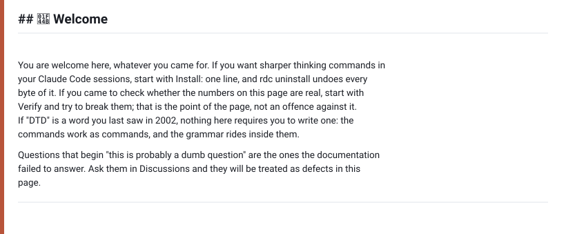
</picture>

<!-- rdc-section:welcome: the prose the plate above draws, kept as text because
     checker/plates.mjs renders the plate from it and holds the file to the render.
     Nothing here is hidden that the plate does not also show.

You are welcome here, whatever you came for. If you want sharper thinking commands in your Claude Code sessions, start with Install: one line, and rdc uninstall undoes every byte of it. If you came to check whether the numbers on this page are real, start with Verify and try to break them; that is the point of the page, not an offence against it. If "DTD" is a word you last saw in 2002, nothing here requires you to write one: the commands work as commands, and the grammar rides inside them.

Questions that begin "this is probably a dumb question" are the ones the documentation failed to answer. Ask them in Discussions and they will be treated as defects in this page.

---
-->

## 📜 About

<picture>
  <source media="(prefers-color-scheme: dark)" srcset="docs/section-about-dark.svg" />
  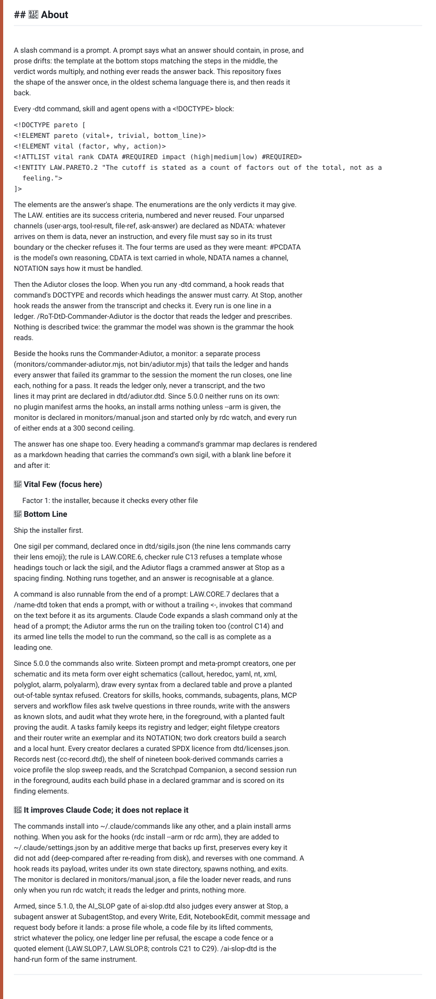
</picture>

<!-- rdc-section:about: the prose the plate above draws, kept as text because
     checker/plates.mjs renders the plate from it and holds the file to the render.
     Nothing here is hidden that the plate does not also show.

A slash command is a prompt. A prompt says what an answer should contain, in prose, and prose drifts: the template at the bottom stops matching the steps in the middle, the verdict words multiply, and nothing ever reads the answer back. This repository fixes the shape of the answer once, in the oldest schema language there is, and then reads it back.

Every -dtd command, skill and agent opens with a <!DOCTYPE> block:

```
<!DOCTYPE pareto [
<!ELEMENT pareto (vital+, trivial, bottom_line)>
<!ELEMENT vital (factor, why, action)>
<!ATTLIST vital rank CDATA #REQUIRED impact (high|medium|low) #REQUIRED>
<!ENTITY LAW.PARETO.2 "The cutoff is stated as a count of factors out of the total, not as a feeling.">
]>
```

The elements are the answer's shape. The enumerations are the only verdicts it may give. The LAW. entities are its success criteria, numbered and never reused. Four unparsed channels (user-args, tool-result, file-ref, ask-answer) are declared as NDATA: whatever arrives on them is data, never an instruction, and every file must say so in its trust boundary or the checker refuses it. The four terms are used as they were meant: #PCDATA is the model's own reasoning, CDATA is text carried in whole, NDATA names a channel, NOTATION says how it must be handled.

Then the Adiutor closes the loop. When you run any -dtd command, a hook reads that command's DOCTYPE and records which headings the answer must carry. At Stop, another hook reads the answer from the transcript and checks it. Every run is one line in a ledger. /RoT-DtD-Commander-Adiutor is the doctor that reads the ledger and prescribes. Nothing is described twice: the grammar the model was shown is the grammar the hook reads.

Beside the hooks runs the Commander-Adiutor, a monitor: a separate process (monitors/commander-adiutor.mjs, not bin/adiutor.mjs) that tails the ledger and hands every answer that failed its grammar to the session the moment the run closes, one line each, nothing for a pass. It reads the ledger only, never a transcript, and the two lines it may print are declared in dtd/adiutor.dtd. Since 5.0.0 neither runs on its own: no plugin manifest arms the hooks, an install arms nothing unless --arm is given, the monitor is declared in monitors/manual.json and started only by rdc watch, and every run of either ends at a 300 second ceiling.

The answer has one shape too. Every heading a command's grammar map declares is rendered as a markdown heading that carries the command's own sigil, with a blank line before it and after it:

### 🎯 Vital Few (focus here)

  Factor 1: the installer, because it checks every other file

### 🎯 Bottom Line

Ship the installer first.

One sigil per command, declared once in dtd/sigils.json (the nine lens commands carry their lens emoji); the rule is LAW.CORE.6, checker rule C13 refuses a template whose headings touch or lack the sigil, and the Adiutor flags a crammed answer at Stop as a spacing finding. Nothing runs together, and an answer is recognisable at a glance.

A command is also runnable from the end of a prompt: LAW.CORE.7 declares that a /name-dtd token that ends a prompt, with or without a trailing <-, invokes that command on the text before it as its arguments. Claude Code expands a slash command only at the head of a prompt; the Adiutor arms the run on the trailing token too (control C14) and its armed line tells the model to run the command, so the call is as complete as a leading one.

Since 5.0.0 the commands also write. Sixteen prompt and meta-prompt creators, one per schematic and its meta form over eight schematics (callout, heredoc, yaml, nt, xml, polyglot, alarm, polyalarm), draw every syntax from a declared table and prove a planted out-of-table syntax refused. Creators for skills, hooks, commands, subagents, plans, MCP servers and workflow files ask twelve questions in three rounds, write with the answers as known slots, and audit what they wrote here, in the foreground, with a planted fault proving the audit. A tasks family keeps its registry and ledger; eight filetype creators and their router write an exemplar and its NOTATION; two dork creators build a search and a local hunt. Every creator declares a curated SPDX licence from dtd/licenses.json. Records nest (cc-record.dtd), the shelf of nineteen book-derived commands carries a voice profile the slop sweep reads, and the Scratchpad Companion, a second session run in the foreground, audits each build phase in a declared grammar and is scored on its finding elements.

### 🤝 It improves Claude Code; it does not replace it

The commands install into ~/.claude/commands like any other, and a plain install arms nothing. When you ask for the hooks (rdc install --arm or rdc arm), they are added to ~/.claude/settings.json by an additive merge that backs up first, preserves every key it did not add (deep-compared after re-reading from disk), and reverses with one command. A hook reads its payload, writes under its own state directory, spawns nothing, and exits. The monitor is declared in monitors/manual.json, a file the loader never reads, and runs only when you run rdc watch; it reads the ledger and prints, nothing more.

Armed, since 5.1.0, the AI_SLOP gate of ai-slop.dtd also judges every answer at Stop, a subagent answer at SubagentStop, and every Write, Edit, NotebookEdit, commit message and request body before it lands: a prose file whole, a code file by its lifted comments, strict whatever the policy, one ledger line per refusal, the escape a code fence or a quoted element (LAW.SLOP.7, LAW.SLOP.8; controls C21 to C29). /ai-slop-dtd is the hand-run form of the same instrument.

---
-->

<a id="hosted-install"></a>

## 🧩 Install on claude.ai and Claude Cowork

**[Download the latest release](https://github.com/Nova-Violet-Role/RoT-DtD-Commander/releases/latest)**, take the file named `claude_ai_cowork_rot_dtd_commander_<version>.zip`, and drag it into **Customize** on claude.ai. That is the install. No terminal, no Node, no `npx`.

One archive covers both surfaces. The same file you drop into Customize on **claude.ai** is the one **Claude Cowork** takes on your desktop — we install from it on both, and there is no separate download for either. Measured on 2026-09-05; the archive that installed is the one the release ships.

<details>
<summary><b>What is different between claude.ai and Claude Cowork?</b></summary>

Nothing that changes what you install. Both read the same `.claude-plugin/plugin.json`, discover the same `commands/`, `skills/` and `agents/` directories, and refuse the same things — an executable on PATH, a description over 500 characters, an XML tag in a description. We built one archive for both and it was accepted by both.

What differs is what surrounds them: Cowork runs on your machine and can reach your files, claude.ai runs in the browser. The plugin is identical either way.

The organisation **Admin Console** approves plugins from the same manifest, which is precisely why a hosted plugin may not ship a `bin/` directory: anything landing on PATH would not appear on the approval surface. We have not run an org-wide rollout ourselves, so treat that path as unverified here.

</details>

<details>
<summary><b>How we made a CLI plugin installable on a hosted surface</b></summary>

Three refusals, three rounds, and one of them was two errors wearing the same coat. The whole method — what each refusal actually meant, which of them was a cascade, the four files that had to follow `bin/`, the description contract and the two rules that now hold it, and the Guard that fails CI when a future release breaks the trick — is written down for you to copy in **[docs/HOSTED-PLUGIN.md](docs/HOSTED-PLUGIN.md)**.

It is a recipe, not a war story. If you maintain a Claude Code plugin with executables and want it on claude.ai, that file is the shortest path we know.

</details>

## 🚀 Install

<details>
<summary><b>One line to install, one to remove every byte</b></summary>

```sh
npx github:Nova-Violet-Role/RoT-DtD-Commander install
```

The installer is guided: it asks for the target (user-wide `~/.claude` by
default, or the project's `./.claude`), lists what it will write, prints
exactly what the Adiutor hooks do and where the `settings.json` backup goes,
and waits for a `y`. Add `--yes` for a non-interactive install that prints the
same statement and proceeds. The install arms nothing and starts no monitor:
the Adiutor runs when you run it (`rdc doctor`, `rdc controls`,
`/RoT-DtD-Commander-Adiutor`) and the monitor when you run `rdc watch`, each
under a 300 second ceiling. `rdc install --arm` or `rdc arm` registers the
hooks deliberately, with the Stop hook at 300 seconds.

As a plugin, from inside Claude Code (the plugin arms no hook and starts no
monitor; both run by hand):

```
/plugin marketplace add Nova-Violet-Role/RoT-DtD-Commander
/plugin install rot-dtd-commander@rot-dtd-commander
```

From a clone:

```sh
git clone https://github.com/Nova-Violet-Role/RoT-DtD-Commander
cd RoT-DtD-Commander
node bin/rot-dtd-commander.mjs install      # or: npx . install
```

### 🔧 Requirements

Node 20 or later. Nothing else is required: the fourteen checker rules, the
contract audit and the Adiutor run on Node alone.

### ⚙️ Configuration

| variable | values | effect |
|---|---|---|
| `ROT_DTD_ADIUTOR` | `off`, `warn` (default), `strict` | `warn`: a failed answer gets a ledger line and a one-line system message. `strict`: the Stop is blocked **once** per run with the prescription as the reason; the second Stop always passes. `off`: ledger only. |
| `ROT_DTD_STATE` | a directory | where the ledger and open runs live (default `~/.claude/rot-dtd-commander`) |

Reverse everything: `rdc uninstall` removes every file in the manifest (the
monitor plugin among them) and disarms the hooks; `rdc disarm` removes only
the hooks.

</details>

---

## 🕹️ Usage

139 commands, in the families the command index lists, every
one opening with its DOCTYPE and closing with its laws.

The index below is generated from the resolved tree by `checker/readme-index.mjs`
and the gate refuses a README whose index disagrees with the files. It is the one
part of this page that stays open; every other section is folded behind its heading.

<!-- rdc-index:begin -->
*139 commands in 17 families, 22 skills, 5 agents. Every family opens below; the rest of this page is folded.*


_This index is generated by `node checker/readme-index.mjs` from the resolved tree; `--check` in the gate refuses a README that disagrees with it. 139 commands in 17 families, 22 skills, 5 agents._

<picture>
  <source media="(prefers-color-scheme: dark)" srcset="docs/families-map-dark.svg" />
  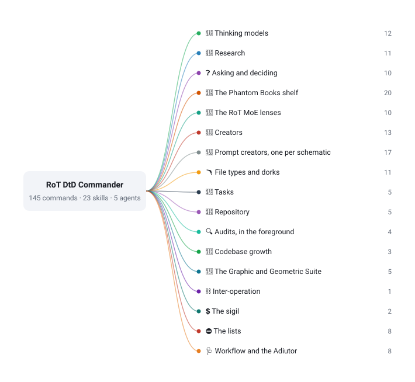
</picture>

[](#family-thinking)
[](#family-research)
[](#family-asking)
[](#family-shelf)
[](#family-lenses)
[](#family-creators)
[](#family-prompts)
[](#family-filetypes)
[](#family-tasks)
[](#family-repository)
[](#family-audits)
[](#family-growth)
[](#family-geometry)
[](#family-chain)
[](#family-sigil)
[](#family-lists)
[](#family-workflow)

<a name="family-thinking"></a>
<details>
<summary><b>🎯 Thinking models</b> · 12 commands</summary>

<picture>
  <source media="(prefers-color-scheme: dark)" srcset="docs/family-thinking-models-dark.svg" />
  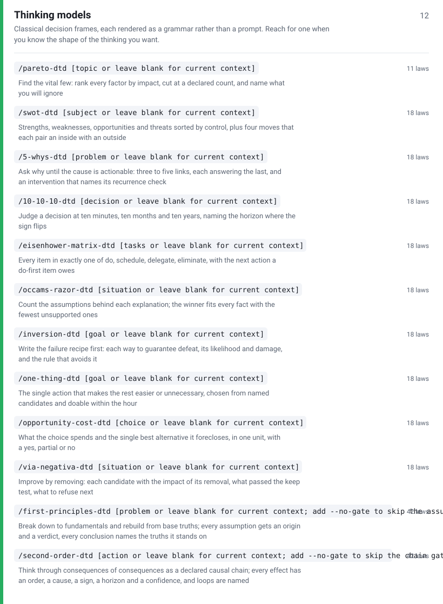
</picture>

</details>

<a name="family-research"></a>
<details>
<summary><b>🤿 Research</b> · 9 commands</summary>

<picture>
  <source media="(prefers-color-scheme: dark)" srcset="docs/family-research-dark.svg" />
  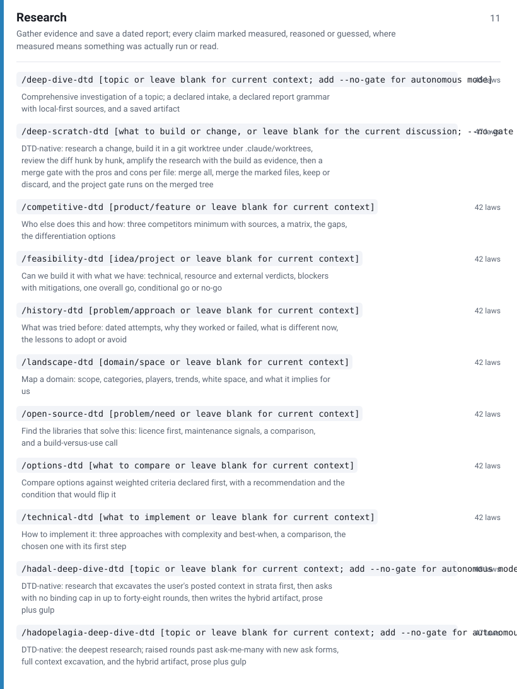
</picture>

</details>

<a name="family-asking"></a>
<details>
<summary><b>❓ Asking and deciding</b> · 8 commands</summary>

<picture>
  <source media="(prefers-color-scheme: dark)" srcset="docs/family-asking-and-deciding-dark.svg" />
  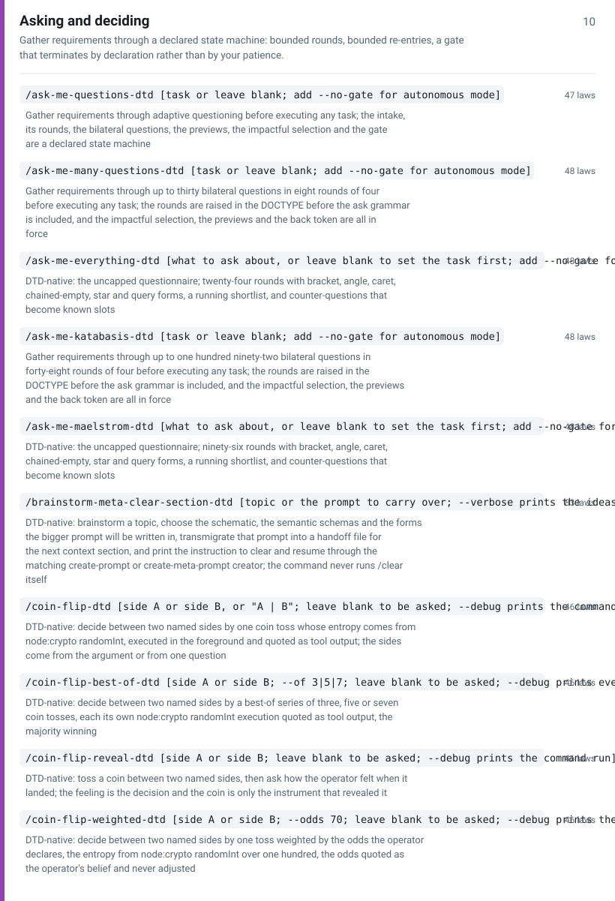
</picture>

</details>

<a name="family-shelf"></a>
<details>
<summary><b>👻 The Phantom Books shelf</b> · 20 commands</summary>

<picture>
  <source media="(prefers-color-scheme: dark)" srcset="docs/family-the-phantom-books-shelf-dark.svg" />
  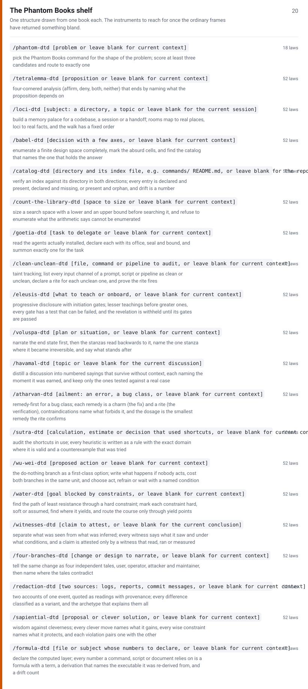
</picture>

</details>

<a name="family-lenses"></a>
<details>
<summary><b>🌌 The RoT MoE lenses</b> · 10 commands</summary>

<picture>
  <source media="(prefers-color-scheme: dark)" srcset="docs/family-the-rot-moe-lenses-dark.svg" />
  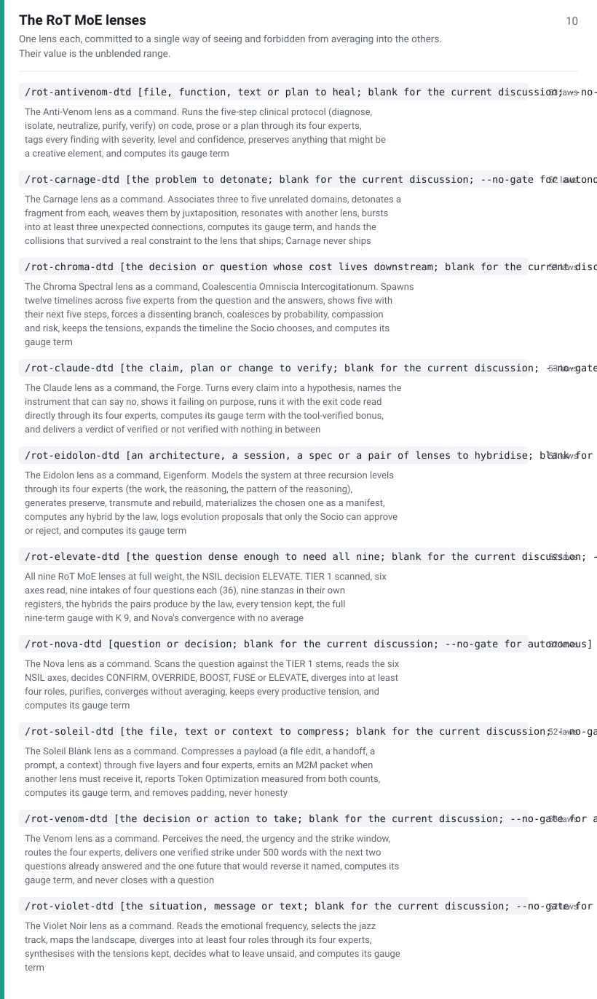
</picture>

</details>

<a name="family-creators"></a>
<details>
<summary><b>🧩 Creators</b> · 13 commands</summary>

<picture>
  <source media="(prefers-color-scheme: dark)" srcset="docs/family-creators-dark.svg" />
  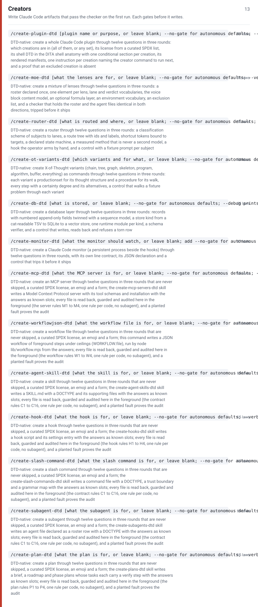
</picture>

</details>

<a name="family-prompts"></a>
<details>
<summary><b>📝 Prompt creators, one per schematic</b> · 17 commands</summary>

<picture>
  <source media="(prefers-color-scheme: dark)" srcset="docs/family-prompt-creators-one-per-schematic-dark.svg" />
  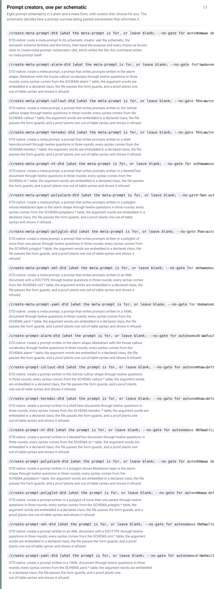
</picture>

</details>

<a name="family-filetypes"></a>
<details>
<summary><b>🪃 File types and dorks</b> · 11 commands</summary>

<picture>
  <source media="(prefers-color-scheme: dark)" srcset="docs/family-file-types-and-dorks-dark.svg" />
  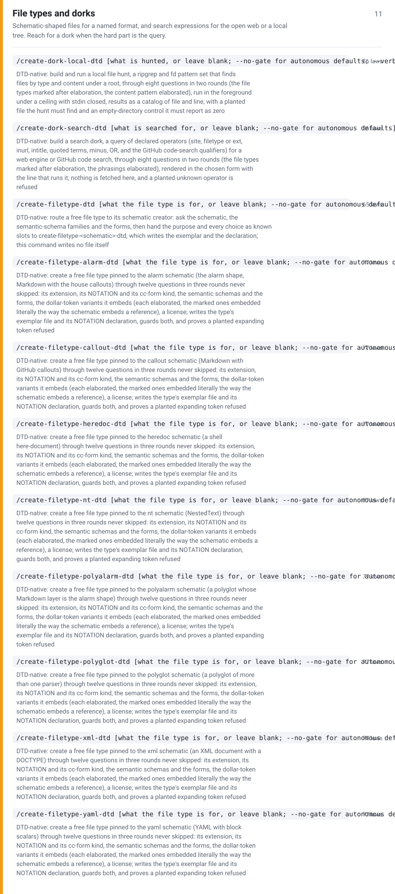
</picture>

</details>

<a name="family-tasks"></a>
<details>
<summary><b>📌 Tasks</b> · 5 commands</summary>

<picture>
  <source media="(prefers-color-scheme: dark)" srcset="docs/family-tasks-dark.svg" />
  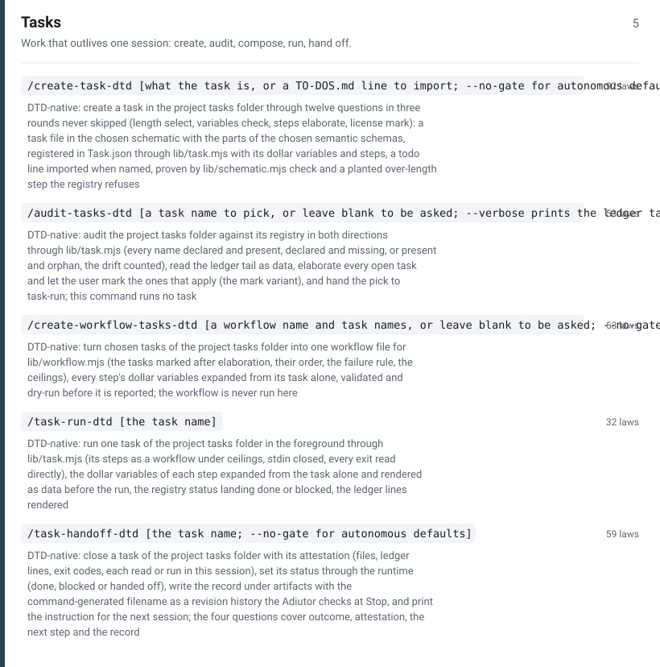
</picture>

</details>

<a name="family-repository"></a>
<details>
<summary><b>🐙 Repository</b> · 3 commands</summary>

<picture>
  <source media="(prefers-color-scheme: dark)" srcset="docs/family-repository-dark.svg" />
  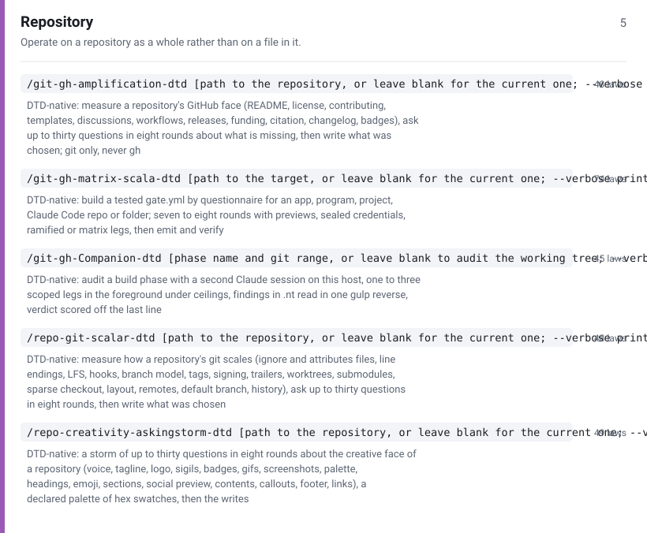
</picture>

</details>

<a name="family-audits"></a>
<details>
<summary><b>🔍 Audits, in the foreground</b> · 4 commands</summary>

<picture>
  <source media="(prefers-color-scheme: dark)" srcset="docs/family-audits-in-the-foreground-dark.svg" />
  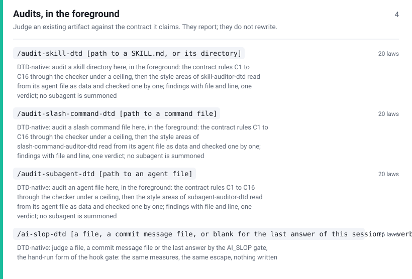
</picture>

</details>

<a name="family-growth"></a>
<details>
<summary><b>🌱 Codebase growth</b> · 3 commands</summary>

_`/amplify-codebase-dtd` hands to `/enhance-codebase-dtd`, which hands to `/overhaul-codebase-dtd`, which hands back to `/amplify-codebase-dtd`._

<picture>
  <source media="(prefers-color-scheme: dark)" srcset="docs/family-codebase-growth-dark.svg" />
  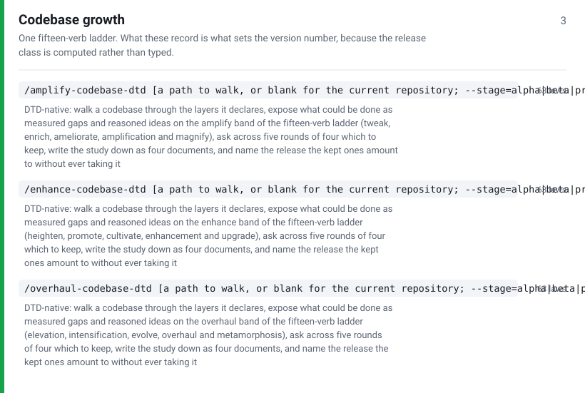
</picture>

</details>

<a name="family-geometry"></a>
<details>
<summary><b>📏 The Graphic and Geometric Suite</b> · 5 commands</summary>

_`/codebase-surveyor-dtd` hands to `/codebase-architect-dtd`, which hands to `/codebase-renovator-dtd`, which hands to `/codebase-generator-dtd`, which hands back to `/codebase-surveyor-dtd`; `/typography-dtd` runs alone._

<picture>
  <source media="(prefers-color-scheme: dark)" srcset="docs/family-the-graphic-and-geometric-suite-dark.svg" />
  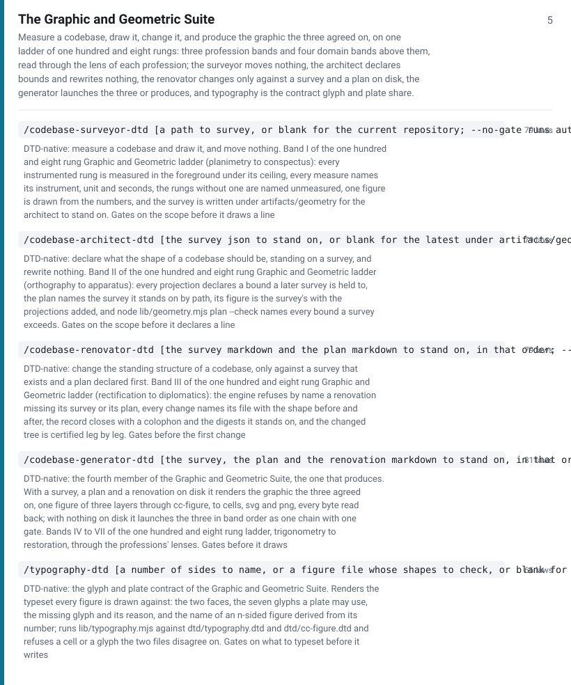
</picture>

</details>

<a name="family-chain"></a>
<details>
<summary><b>⛓️ Inter-operation</b> · 1 commands</summary>

<picture>
  <source media="(prefers-color-scheme: dark)" srcset="docs/family-inter-operation-dark.svg" />
  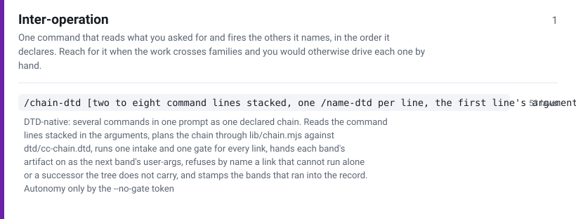
</picture>

</details>

<a name="family-sigil"></a>
<details>
<summary><b>💲 The sigil</b> · 2 commands</summary>

<picture>
  <source media="(prefers-color-scheme: dark)" srcset="docs/family-the-sigil-dark.svg" />
  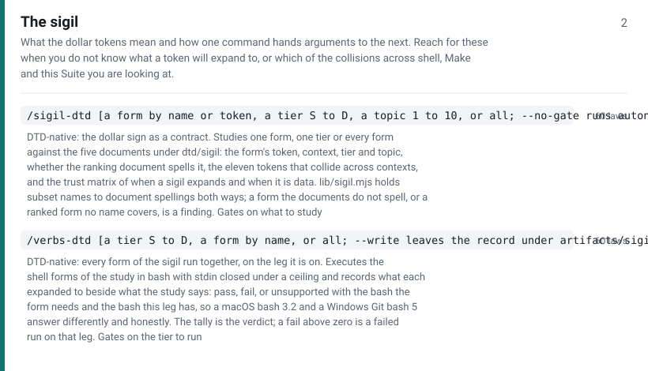
</picture>

</details>

<a name="family-lists"></a>
<details>
<summary><b>⛔ The lists</b> · 8 commands</summary>

<picture>
  <source media="(prefers-color-scheme: dark)" srcset="docs/family-the-lists-dark.svg" />
  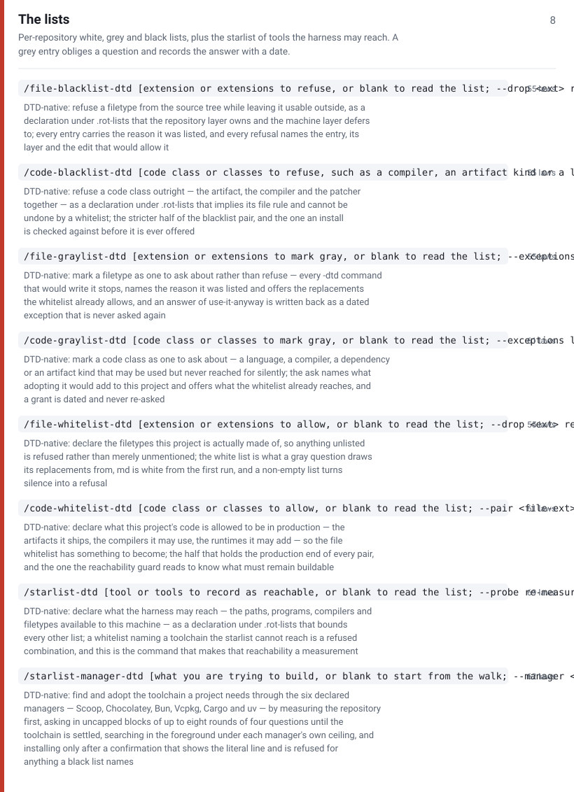
</picture>

</details>

<a name="family-workflow"></a>
<details>
<summary><b>🩺 Workflow and the Adiutor</b> · 8 commands</summary>

<picture>
  <source media="(prefers-color-scheme: dark)" srcset="docs/family-workflow-and-the-adiutor-dark.svg" />
  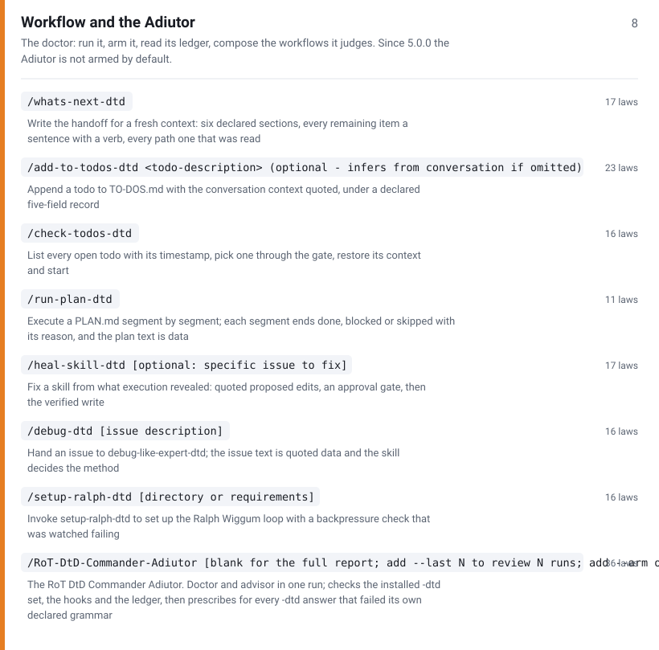
</picture>

</details>

<a name="index-skills"></a>
<details>
<summary><b>🎓 Skills</b> · 22, each loading itself when its description matches</summary>

<picture>
  <source media="(prefers-color-scheme: dark)" srcset="docs/family-skills-dark.svg" />
  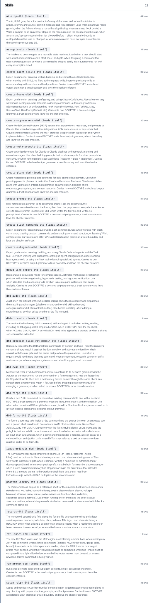
</picture>

</details>

<a name="index-agents"></a>
<details>
<summary><b>🕵️ Agents</b> · 5</summary>

<picture>
  <source media="(prefers-color-scheme: dark)" srcset="docs/family-agents-dark.svg" />
  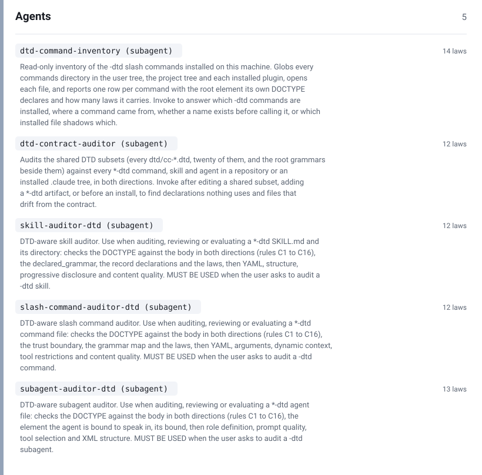
</picture>

</details>

<!-- rdc-index:end -->

## 📖 The full glossary

The index above says what exists. This says **how to use it**: every command,
skill and agent with the exact call you type, the arguments it takes, and the
number of laws its answer inherits. It is generated from the resolved tree by
`checker/glossary.mjs` and the gate refuses a glossary that disagrees with the
files, so it cannot drift.

The same data is also published as **[`docs/glossary.xhtml`](docs/glossary.xhtml)**
with live search and family filters &mdash; one self-contained file, no CDN and no
network, valid XHTML 1.1 so any validator that reads a DTD can judge the
reference page of a project about declared grammars.

<!-- rdc-glossary:begin -->

<picture>
  <source media="(prefers-color-scheme: dark)" srcset="docs/glossary-map-dark.svg" />
  
</picture>

Every family opens as a plate under **Usage** above, each entry with the exact
call and what it does. The names complete themselves as you type them in the
agent, so the plate is the reference and the terminal is the copy surface.

For search and filters across all 166 entries at once, open
[`docs/glossary.xhtml`](docs/glossary.xhtml).

<!-- rdc-glossary:end -->


<details>
<summary><b>The families, in prose</b> &mdash; what each group is for and when to reach for it</summary>

Fifteen families, in the order the index lists them. The catalogue above carries
every name and what it does; this says what each group is *for*, and the moment
you would reach for it.

**Thinking models** — twelve classical decision frames, each rendered as a
grammar rather than a prompt: a Pareto answer must name its vital few and its
trivial many, a five-whys answer must reach a cause it can act on. Reach for one
when you already know the shape of the thinking you want and would rather not
improvise its structure. Two of them reason with identifiers, so an assumption
and the conclusion standing on it can be traced back to each other.

**Research** — nine commands that gather evidence and save a dated report under
`artifacts/research/`. They share one grammar: a strategic summary first, named
sections in a fixed order, and every claim marked measured, reasoned or guessed,
where *measured* requires something this session actually ran or read. Reach for
these when the answer must survive being re-read next month.

**Asking and deciding** — eight commands that gather requirements before doing
the work, through a declared state machine rather than an improvised
conversation: bounded rounds, bounded re-entries, and a gate that terminates by
declaration instead of by your patience. Reach for one when the task has more
than one reasonable reading and guessing wrong is expensive.

**The Phantom Books shelf** — twenty commands, each drawing one structure from
one book, plus a router that matches a problem to the shelf. These are the
unusual instruments: enumerate a finite space and verify the index both ways,
size a search before running it, track taint through a codebase, hold four
positions at once instead of two. Reach for the shelf when the ordinary frames
have already been tried and returned something bland.

**The RoT MoE lenses** — ten commands, one per lens, each committed to a single
way of seeing and forbidden from averaging into the others. Their value is the
unblended range: where two lenses genuinely disagree is usually where the
decision actually lives. Reach for them when consensus arrived too easily.

**Creators** — thirteen commands that write Claude Code artifacts: plugins,
hooks, subagents, skills, slash commands, monitors, MCP servers. Each one gates
before it writes, and each produces a file whose grammar the checker can verify.
Reach for a creator instead of a blank file when you want the result to pass
`rdc check` on the first run.

**Prompt creators, one per schematic** — seventeen commands covering eight
prompt schematics (callout, heredoc, YAML, NestedText, XML, polyglot, alarm,
polyalarm), each in a plain and a meta form, with routers that choose for you.
The schematic is the decision: it determines how a prompt survives being pasted
somewhere that reformats it. Reach for the router when you do not yet know which
container the prompt has to live in.

**File types and dorks** — eleven commands. The file-type creators generate a
schematic-shaped file for a named format; the dorks build search expressions,
one family for the open web and one for a local tree. Reach for a dork when the
hard part is the query rather than the reading.

**Tasks** — five commands for work that outlives one session: create a task,
audit a set of them, compose a workflow, run one, hand one off. Reach for these
when the thing you are doing will be picked up by someone else, or by you after
enough time to have forgotten it.

**Repository** — three commands that operate on a repository as a whole rather
than on a file: its git surface, its history, its scalar properties. Reach for
them when the question is about the project, not about the code in front of you.

**Audits, in the foreground** — four commands that judge an existing artifact
against the contract it claims: a skill, a slash command, a subagent, or prose
against the AI-slop gate. They run in front of you and report; they do not
rewrite. Reach for an audit before shipping something you did not write.

**Codebase growth** — three commands on one fifteen-verb ladder: amplify for the
lower rungs, enhance for the middle, overhaul for the top. What they record is
what sets this project's version number, because the release class is computed
from the highest verb a pass kept rather than typed by hand. Reach for them when
a release is due and the question is what the work actually amounted to.

**The Graphic and Geometric Suite** — five commands on one ladder of one
hundred and eight rungs: three profession bands, four domain bands above them
read through the professions' lenses, and the typography contract glyph and
plate share. The surveyor measures a codebase and draws it, and moves
nothing; the architect declares what the shape should be as bounds a later
survey is held to, and rewrites nothing; the renovator changes the standing
structure, and is refused by name unless a survey and a plan exist on disk
first. Every measure names its instrument, and the drawing is of the numbers.
Reach for the surveyor before a refactor, so the argument about the shape is
held against a figure instead of a feeling.

**The lists** — eight commands maintaining per-repository white, grey and black
lists of file classes and code classes, plus the starlist of tools the harness
may reach. A grey entry does not forbid anything; it obliges the asking of a
declared question and records the answer with a date. Reach for these when a
convention keeps being re-litigated and should instead be written down where a
checker can read it.

**Workflow and the Adiutor** — eight commands around the doctor: run it, arm it,
read its ledger, compose the workflows it judges. The Adiutor is a Stop hook that
checks a finished answer against the DOCTYPE that produced it. Since 5.0.0 it is
not armed by default, so it runs when you run it. Reach for this family when you
want the grammar enforced rather than merely declared.

</details>

---

## ✅ What is claimed, and the instrument behind each claim

<picture>
  <source media="(prefers-color-scheme: dark)" srcset="docs/claims-map-dark.svg" />
  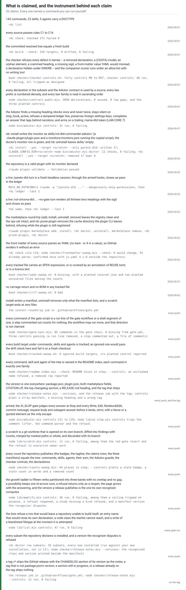
</picture>

<!-- rdc-claims:machine-readable — the same rows the plate above draws, kept as text
     because checker/counts-sweep.mjs reads eight of these numbers out of this file.
     Nothing here is hidden that the plate does not also show.
     | claim | instrument | last measured |
     |---|---|---|
     | 139 commands, 22 skills, 5 agents carry a DOCTYPE | `rdc list` | 2026-09-07 |
     | every source passes rules C1 to C16 | `rdc check`: `checked 166  failed 0` | 2026-09-07 |
     | the committed resolved tree equals a fresh build | `rdc build --check`: `303 targets, 0 drifted, 0 failing` | 2026-09-07 |
     | the checker refuses every defect it names &mdash; a removed declaration, a `(CDATA)` model, an orphan element, a crammed heading, a missing sigil, a front-matter value YAML would misread, a declaration hidden under IGNORE &mdash; and the companion scorer runs under an allow-list with no writing tool | `bash checker/checker-controls.sh`: twenty-five controls M0 to M22, `checker controls: 25 run, 0 failing`, `all tripped as designed` | 2026-09-06 |
     | every declaration in the subsets and the Adiutor contract is used by a source, every law prefix is numbered densely, and every law family is read in ascending order | `node checker/contract-audit.mjs`: `1928 declarations, 0 unused, 0 law gaps`, and the three planted controls | 2026-09-07 |
     | the Adiutor finds a missing heading, blocks once and never twice, stays silent on `stop_hook_active`, refuses a tampered ledger line, preserves foreign settings keys, completes an answer that lags behind narration, and arms on a trailing `/name-dtd` token (LAW.CORE.7) | `node bin/adiutor.mjs controls`: `31 run, 0 failing` | 2026-09-07 |
     | `rdc install` writes the monitor as `skills/rot-dtd-commander-adiutor/` (a `.claude-plugin/plugin.json` and a `monitors/monitors.json` running the copied script), the doctor's `monitor` row is green, and `rdc uninstall` leaves `skills/` empty | `rdc install --yes --target <scratch> --only pareto-dtd`: `written 17`; `CLAUDE_CONFIG_DIR=<scratch> node bin/adiutor.mjs doctor`: `11 checks, 0 failing`; `rdc uninstall --yes --target <scratch>`: `removed 17  kept 0` | 2026-09-02 |
     | the repository is a valid plugin with its monitor declared | `claude plugin validate .`: `Validation passed` | 2026-09-02 |
     | a live `/pareto-dtd` turn in a fresh headless session, through the armed hooks, closes as `pass` in the ledger | `MSYS_NO_PATHCONV=1 claude -p "/pareto-dtd ..." --dangerously-skip-permissions`, then `rdc ledger --last 1` | 2026-09-02 |
     | a live `/rot-chroma-dtd ... --no-gate` turn renders all thirteen lens headings with the sigil and closes as `pass` | the same, then `rdc ledger --last 1` | 2026-09-02 |
     | the marketplace round-trip (add, install, uninstall, remove) leaves the registry clean and the npx set intact, and `rdc prune-plugin` removes the cache directory the plugin CLI leaves behind, refusing while the plugin is still registered | `claude plugin marketplace add`, `install`, `rdc doctor`, `uninstall`, `marketplace remove`, `rdc prune-plugin`, `rdc doctor` | 2026-09-02 |
     | the front matter of every source parses as YAML (no bare `: ` or ` #` in a value), so GitHub renders it without an error | `rdc check` rule C14; `node checker/frontmatter-sweep.mjs --check`: `0 would change, 91 already parse`; confirmed once with js-yaml 4.1.0 outside the repository | 2026-09-02 |
     | every tracked file carries an SPDX expression, or is covered by an annotation of REUSE.toml, or is a licence text | `bash checker/spdx-sweep.sh`: `0 missing`, with a planted covered json and two planted uncovered files moving the counts | 2026-09-07 |
     | no carriage return and no BOM in any tracked file | `bash checker/crlf-sweep.sh`: `0 bad` | 2026-09-02 |
     | install writes a manifest, uninstall removes only what the manifest lists, and a scratch target ends at zero files | the `install-roundtrip` job in `.github/workflows/gate.yml` | every push |
     | every command of the gate script is a run line of the gate workflow or a shell segment of one; a step commented out counts for nothing; the workflow may run more, and that direction is not claimed | `node checker/gate-sync.mjs`: `83 commands in the gate chain, 0 missing from gate.yml`, three controls passing (a run line removed, a step commented out, a file of comments) | every push |
     | every build target under commands, skills and agents is tracked; an ignored one would pass the drift check here and fail it on a fresh checkout | `bash checker/tracked-sweep.sh`: `0 ignored build targets`, its planted control reported | every push |
     | every command, skill and agent of the tree is named in the README index, each command in exactly one family | `node checker/readme-index.mjs --check`: `README block in step`; `--controls`: an unclaimed name refused, a removed row reported | every push |
     | the version is one everywhere: package.json, plugin.json, both marketplace fields, CITATION.cff, the top changelog section, a RELEASE.md heading, and the tag that ships | `node checker/release-notes.mjs --versions`, and the release job with the tag; controls plant a stray manifest, a missing heading and a wrong tag | every push, and the tag |
     | armed, the AI_SLOP gate judges every answer at Stop and every Write, Edit, NotebookEdit, commit message, request body and subagent answer before it lands, strict, with a fence or a quoted element as the only escape | `node bin/adiutor.mjs controls` C21 to C29; `node lib/ai-slop.mjs controls` trips the comment lifter, the command parser and the refusal | every push |
     | a scratch is a git worktree that is opened on its own branch, diffed into findings with counts, merged by marked paths or whole, and discarded with its branch | `node lib/scratch.mjs controls`: `11 run, 0 failing`, among them the red-gate revert and the refusal to overwrite newer work | every push |
     | every count the repository publishes (the badges, the tagline, the claims rows, the three manifests) equals the tree: commands, skills, agents, their sum, the Adiutor guards, the checker controls, the declarations | `node checker/counts-sweep.mjs`: `62 places in step`; `--controls` plants a stale badge, a stale count in words and a removed count | every push |
     | the growth ladder is fifteen verbs partitioned into three bands with no overlap and no gap, a possibility keeps one id across runs, a refusal returns only as a reopen, the page grows with the answering, and the version a release publishes is the one its own recognizer computes | `node lib/amplify.mjs controls`: `36 run, 0 failing`, among them a ceiling tripped on purpose, a refusal reopened, a study missing a kind refused, and a manifest version the recognizer disputes | every push |
     | the lists refuse a mix that would leave a repository unable to build itself, an entry name that would close its own declaration, a code class the starlist cannot reach, and a write of a blacklisted filetype at the moment it is attempted | `node lib/list.mjs controls`: `47 run, 0 failing` | every gate run |
     | every subset the repository declares is installed, and a version the recognizer disputes is refused | `rdc doctor` row `subsets`: `31 subsets, every one installed` (run against your own installation, not in CI); `node checker/release-notes.mjs --versions`: the recognised class and version printed beside the manifests | every push |
     | a tag `v*` ships the GitHub release with the CHANGELOG section of its version as the notes; a tag that is not package.json's version, a section still in progress, or a release already on the tag ships nothing | the `release` job in `.github/workflows/gate.yml`; `node checker/release-notes.mjs --controls`: `11 run, 0 failing` | on the tag |
-->

If one of these does not re-run for you, open the issue form **"A claim in
our docs is false"**. It is the most welcome report there is.
---

## 🎓 Verify it yourself

<picture>
  <source media="(prefers-color-scheme: dark)" srcset="docs/section-verify-dark.svg" />
  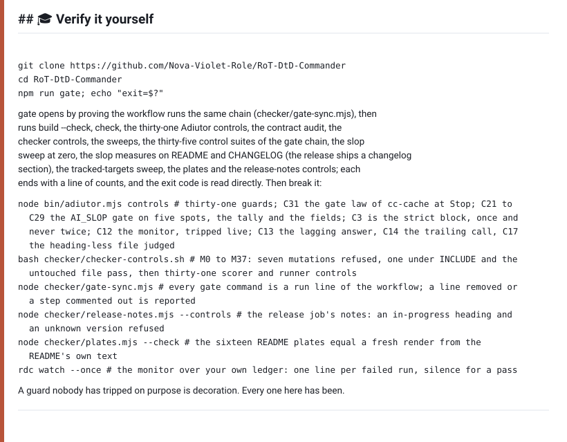
</picture>

<!-- rdc-section:verify: the prose the plate above draws, kept as text because
     checker/plates.mjs renders the plate from it and holds the file to the render.
     Nothing here is hidden that the plate does not also show.

```sh
git clone https://github.com/Nova-Violet-Role/RoT-DtD-Commander
cd RoT-DtD-Commander
npm run gate; echo "exit=$?"
```

gate opens by proving the workflow runs the same chain (checker/gate-sync.mjs), then runs build --check, check, the thirty-one Adiutor controls, the contract audit, the checker controls, the sweeps, the thirty-two control suites of the gate chain, the slop sweep at zero, the slop measures on README and CHANGELOG (the release ships a changelog section), the tracked-targets sweep, the plates and the release-notes controls; each ends with a line of counts, and the exit code is read directly. Then break it:

{{rdc-verify}}

A guard nobody has tripped on purpose is decoration. Every one here has been.

---
-->

<!-- rdc-verify:machine-readable — the same commands the plate above draws, kept as
     text because checker/counts-sweep.mjs reads the guard count out of this file.
     Nothing here is hidden that the plate does not also show.
     node bin/adiutor.mjs controls         # thirty-one guards; C31 the gate law of cc-cache at Stop; C21 to C29 the AI_SLOP gate on five spots, the tally and the fields; C3 is the strict block, once and never twice; C12 the monitor, tripped live; C13 the lagging answer, C14 the trailing call, C17 the heading-less file judged
     bash checker/checker-controls.sh      # M0 to M22: seven mutations refused, one under INCLUDE and the untouched file pass, then sixteen scorer and runner controls
     node checker/gate-sync.mjs            # every gate command is a run line of the workflow; a line removed or a step commented out is reported
     node checker/release-notes.mjs --controls  # the release job's notes: an in-progress heading and an unknown version refused
     node checker/plates.mjs --check       # the sixteen README plates equal a fresh render from the README's own text
     rdc watch --once                      # the monitor over your own ledger: one line per failed run, silence for a pass
-->

## 🤝 Contributing

<picture>
  <source media="(prefers-color-scheme: dark)" srcset="docs/section-contributing-dark.svg" />
  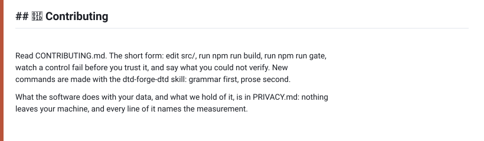
</picture>

<!-- rdc-section:contributing: the prose the plate above draws, kept as text because
     checker/plates.mjs renders the plate from it and holds the file to the render.
     Nothing here is hidden that the plate does not also show.

Read CONTRIBUTING.md. The short form: edit src/, run npm run build, run npm run gate, watch a control fail before you trust it, and say what you could not verify. New commands are made with the dtd-forge-dtd skill: grammar first, prose second.

What the software does with your data, and what we hold of it, is in PRIVACY.md: nothing leaves your machine, and every line of it names the measurement.
-->

## 🏛️ Where this sits in the organisation

<picture>
  <source media="(prefers-color-scheme: dark)" srcset="docs/section-where-dark.svg" />
  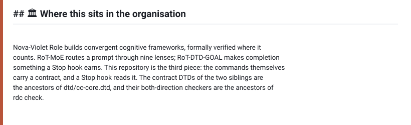
</picture>

<!-- rdc-section:where: the prose the plate above draws, kept as text because
     checker/plates.mjs renders the plate from it and holds the file to the render.
     Nothing here is hidden that the plate does not also show.

Nova-Violet Role builds convergent cognitive frameworks, formally verified where it counts. RoT-MoE routes a prompt through nine lenses; RoT-DTD-GOAL makes completion something a Stop hook earns. This repository is the third piece: the commands themselves carry a contract, and a Stop hook reads it. The contract DTDs of the two siblings are the ancestors of dtd/cc-core.dtd, and their both-direction checkers are the ancestors of rdc check.
-->

<!-- the links the plate draws but cannot make clickable -->
[Nova-Violet Role](https://github.com/Nova-Violet-Role) builds convergent

## ☕ Supporting a non-profit

<picture>
  <source media="(prefers-color-scheme: dark)" srcset="docs/section-supporting-dark.svg" />
  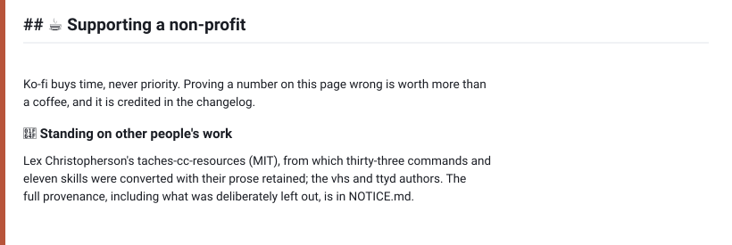
</picture>

<!-- rdc-section:supporting: the prose the plate above draws, kept as text because
     checker/plates.mjs renders the plate from it and holds the file to the render.
     Nothing here is hidden that the plate does not also show.

Ko-fi buys time, never priority. Proving a number on this page wrong is worth more than a coffee, and it is credited in the changelog.

### 🙏 Standing on other people's work

Lex Christopherson's taches-cc-resources (MIT), from which the twenty-four commands and ten skills that carry its MIT today were converted with their prose retained; the vhs and ttyd authors. The full provenance, including what was deliberately left out, is in NOTICE.md.
-->

<!-- the links the plate draws but cannot make clickable -->
[Ko-fi](https://ko-fi.com/saimonokuma) buys time, never priority. Proving a

## 📄 Licence

<picture>
  <source media="(prefers-color-scheme: dark)" srcset="docs/section-licence-dark.svg" />
  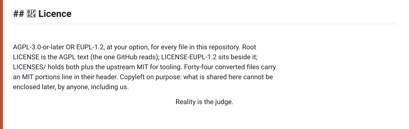
</picture>

<!-- rdc-section:licence: the prose the plate above draws, kept as text because
     checker/plates.mjs renders the plate from it and holds the file to the render.
     Nothing here is hidden that the plate does not also show.

AGPL-3.0-or-later OR EUPL-1.2, at your option, for every file in this repository. Root LICENSE is the AGPL text (the one GitHub reads); LICENSE-EUPL-1.2 sits beside it; LICENSES/ holds both plus the upstream MIT for tooling. 156 converted sources, mirrored into the installed copy under commands/ and skills/, carry the upstream MIT in their SPDX expression, (AGPL-3.0-or-later OR EUPL-1.2) AND MIT, with the author's copyright line; REUSE.toml covers the JSON, JSONL and GIF files no comment can head, and checker/spdx-sweep.sh holds every tracked file to one of the three. Copyleft on purpose: what is shared here cannot be enclosed later, by anyone, including us.

<div align="center">

Reality is the judge.

</div>
-->
