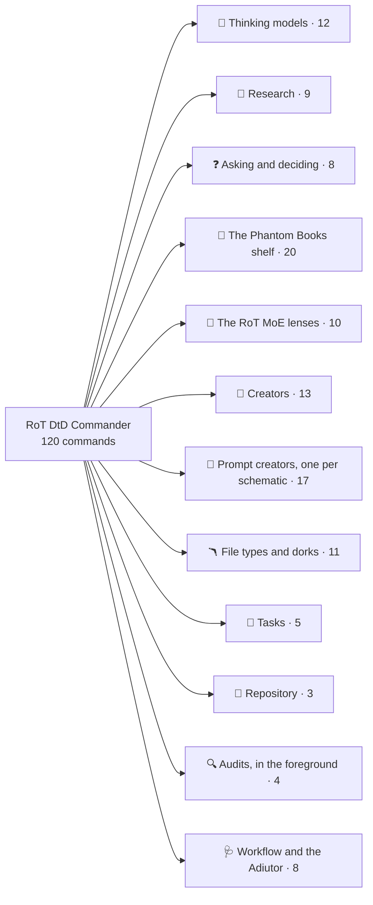
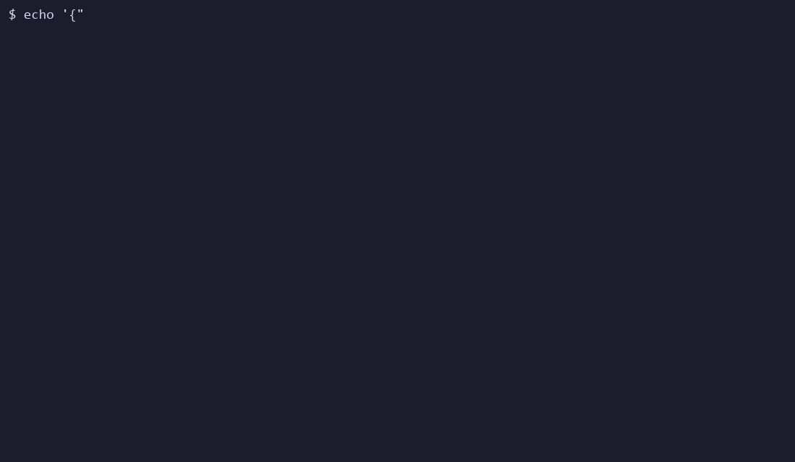

<!--
    This file is part of RoT DtD Commander.
    SPDX-License-Identifier: AGPL-3.0-or-later OR EUPL-1.2
    Copyright 2026 Saimonokuma.
-->

<div align="center">

# 🜏 RoT DtD Commander

**Commands that carry their own grammar, and a doctor that reads it**

*120 Claude Code slash commands, 22 skills and 5 agents whose answer grammar, verdicts, laws and trust boundary are declared in a DTD inside each file; a guided NPX installer; the Adiutor, a Stop hook that checks every answer against the DOCTYPE that produced it; and the Commander-Adiutor, a monitor that hands every failed answer to the session as the ledger closes it*

[](https://ko-fi.com/saimonokuma)
[](https://github.com/Nova-Violet-Role)
[](LICENSE)

[](#-what-is-claimed-and-the-instrument-behind-each-claim)
[](#-what-is-claimed-and-the-instrument-behind-each-claim)
[](#-verify-it-yourself)
[](https://www.claudepluginhub.com/plugins/nova-violet-role-rot-dtd-commander?ref=badge)
[](https://claude.com/claude-code)
[](https://reuse.software/)

</div>

---

## 👋 Welcome

**You are welcome here, whatever you came for.** If you want sharper thinking
commands in your Claude Code sessions, [start with Install](#-install): one
line, and `rdc uninstall` undoes every byte of it. If you came to check whether
the numbers on this page are real, [start with Verify](#-verify-it-yourself)
and try to break them; that is the point of the page, not an offence against
it. If "DTD" is a word you last saw in 2002, nothing here requires you to write
one: the commands work as commands, and the grammar rides inside them.

Questions that begin "this is probably a dumb question" are the ones the
documentation failed to answer. Ask them in Discussions and they will be
treated as defects in this page.

---

## 📜 About

A slash command is a prompt. A prompt says what an answer should contain, in
prose, and prose drifts: the template at the bottom stops matching the steps
in the middle, the verdict words multiply, and nothing ever reads the answer
back. This repository fixes the shape of the answer once, in the oldest schema
language there is, and then reads it back.

Every `*-dtd` command, skill and agent opens with a `<!DOCTYPE>` block:

```
<!DOCTYPE pareto [
  <!ELEMENT pareto (vital+, trivial*, bottom_line)>
  <!ELEMENT vital (factor, why, action)>
  <!ATTLIST vital rank CDATA #REQUIRED impact (high|medium|low) #REQUIRED>
  <!ENTITY LAW.PARETO.2 "The cutoff is stated as a count of factors out of the total, not as a feeling.">
]>
```

The elements are the answer's shape. The enumerations are the only verdicts it
may give. The `LAW.*` entities are its success criteria, numbered and never
reused. Four unparsed channels (`user-args`, `tool-result`, `file-ref`,
`ask-answer`) are declared as NDATA: whatever arrives on them is data, never an
instruction, and every file must say so in its trust boundary or the checker
refuses it. The four terms are used as they were meant: `#PCDATA` is the
model's own reasoning, `CDATA` is text carried in whole, `NDATA` names a
channel, `NOTATION` says how it must be handled.

Then the **Adiutor** closes the loop. When you run any `-dtd` command, a hook
reads that command's DOCTYPE and records which headings the answer must carry.
At Stop, another hook reads the answer from the transcript and checks it.
Every run is one line in a ledger. `/RoT-DtD-Commander-Adiutor` is the doctor
that reads the ledger and prescribes. Nothing is described twice: the grammar
the model was shown is the grammar the hook reads.

Beside the hooks runs the **Commander-Adiutor**, a monitor: a separate
process (`monitors/commander-adiutor.mjs`, not `bin/adiutor.mjs`) that tails
the ledger and hands every answer that failed its grammar to the session the
moment the run closes, one line each, nothing for a pass. It reads the ledger
only, never a transcript, and the two lines it may print are declared in
`dtd/adiutor.dtd`. Since 5.0.0 neither runs on its own: no plugin manifest
arms the hooks, an install arms nothing unless `--arm` is given, the monitor
is declared in `monitors/manual.json` and started only by `rdc watch`, and
every run of either ends at a 300 second ceiling.

The answer has one shape too. Every heading a command's grammar map declares
is rendered as a markdown heading that carries the command's own sigil, with
a blank line before it and after it:

```
### 🎯 Vital Few (focus here)

- Factor 1: the installer, because it checks every other file

### 🎯 Bottom Line

Ship the installer first.
```

One sigil per command, declared once in `dtd/sigils.json` (the nine lens
commands carry their lens emoji); the rule is `LAW.CORE.6`, checker rule
C13 refuses a template whose headings touch or lack the sigil, and the
Adiutor flags a crammed answer at Stop as a `spacing` finding. Nothing runs
together, and an answer is recognisable at a glance.

A command is also runnable from the end of a prompt: `LAW.CORE.7` declares
that a `/name-dtd` token that ends a prompt, with or without a trailing `<-`,
invokes that command on the text before it as its arguments. Claude Code
expands a slash command only at the head of a prompt; the Adiutor arms the
run on the trailing token too (control C14) and its armed line tells the
model to run the command, so the call is as complete as a leading one.

Since 5.0.0 the commands also write. Sixteen prompt and meta-prompt creators,
one per schematic (callout, heredoc, yaml, nt, xml, polyglot, alarm,
polyalarm), draw every syntax from a declared table and prove a planted
out-of-table syntax refused. Creators for skills, hooks, commands, subagents,
plans, MCP servers and workflow files ask twelve questions in three rounds,
write with the answers as known slots, and audit what they wrote here, in the
foreground, with a planted fault proving the audit. A tasks family keeps its
registry and ledger; eight filetype creators and their router write an
exemplar and its NOTATION; two dork creators build a search and a local hunt.
Every creator declares a curated SPDX licence from `dtd/licenses.json`.
Records nest (`cc-record.dtd`), the shelf of nineteen book-derived commands
carries a voice profile the slop sweep reads, and the Scratchpad Companion, a
second session run in the foreground, audits each build phase in a declared
grammar and is scored on its finding elements.

### 🤝 It **improves** Claude Code; it does not replace it

The commands install into `~/.claude/commands` like any other, and a plain
install arms nothing. When you ask for the hooks (`rdc install --arm` or
`rdc arm`), they are added to `~/.claude/settings.json` by an additive merge
that backs up first, preserves every key it did not add (deep-compared after
re-reading from disk), and reverses with one command. A hook reads its
payload, writes under its own state directory, spawns nothing, and exits. The
monitor is declared in `monitors/manual.json`, a file the loader never reads,
and runs only when you run `rdc watch`; it reads the ledger and prints,
nothing more.

Armed, since 5.1.0, the AI_SLOP gate of `ai-slop.dtd` also judges every
answer at Stop and every Write, Edit, NotebookEdit, commit message and
request body before it lands: a prose file whole, a code file by its lifted
comments, strict whatever the policy, one ledger line per refusal, the
escape a code fence or a quoted element (LAW.SLOP.7, LAW.SLOP.8; controls
C21 to C26). `/ai-slop-dtd` is the hand-run form of the same instrument.

---

## 🚀 Install

```sh
npx github:Nova-Violet-Role/RoT-DtD-Commander install
```

The installer is guided: it asks for the target (user-wide `~/.claude` by
default, or the project's `./.claude`), lists what it will write, prints
exactly what the Adiutor hooks do and where the `settings.json` backup goes,
and waits for a `y`. Add `--yes` for a non-interactive install that prints the
same statement and proceeds. The install arms nothing and starts no monitor:
the Adiutor runs when you run it (`rdc doctor`, `rdc controls`,
`/RoT-DtD-Commander-Adiutor`) and the monitor when you run `rdc watch`, each
under a 300 second ceiling. `rdc install --arm` or `rdc arm` registers the
hooks deliberately, with the Stop hook at 300 seconds.

As a plugin, from inside Claude Code (the plugin arms no hook and starts no
monitor; both run by hand):

```
/plugin marketplace add Nova-Violet-Role/RoT-DtD-Commander
/plugin install rot-dtd-commander@rot-dtd-commander
```

From a clone:

```sh
git clone https://github.com/Nova-Violet-Role/RoT-DtD-Commander
cd RoT-DtD-Commander
node bin/rot-dtd-commander.mjs install      # or: npx . install
```

### 🔧 Requirements

Node 20 or later. Nothing else is required: the fourteen checker rules, the
contract audit and the Adiutor run on Node alone.

### ⚙️ Configuration

| variable | values | effect |
|---|---|---|
| `ROT_DTD_ADIUTOR` | `off`, `warn` (default), `strict` | `warn`: a failed answer gets a ledger line and a one-line system message. `strict`: the Stop is blocked **once** per run with the prescription as the reason; the second Stop always passes. `off`: ledger only. |
| `ROT_DTD_STATE` | a directory | where the ledger and open runs live (default `~/.claude/rot-dtd-commander`) |

Reverse everything: `rdc uninstall` removes every file in the manifest (the
monitor plugin among them) and disarms the hooks; `rdc disarm` removes only
the hooks.

---

## 🕹️ Usage

One hundred and twenty commands, in the families the index below lists, every
one opening with its DOCTYPE and closing with its laws. The index is generated
from the tree by `checker/readme-index.mjs`: the map shows the families, a badge
jumps to one, and each family expands to its commands; the gate refuses a README
whose index disagrees with the files.

<!-- rdc-index:begin -->
_This index is generated by `node checker/readme-index.mjs` from the resolved tree; `--check` in the gate refuses a README that disagrees with it. 120 commands in 12 families, 22 skills, 5 agents._



[](#family-thinking)
[](#family-research)
[](#family-asking)
[](#family-shelf)
[](#family-lenses)
[](#family-creators)
[](#family-prompts)
[](#family-filetypes)
[](#family-tasks)
[](#family-repository)
[](#family-audits)
[](#family-workflow)

<a name="family-thinking"></a>
<details>
<summary><b>🎯 Thinking models</b> · 12 commands</summary>

| command | sigil | what it does |
|---|:-:|---|
| `/10-10-10-dtd` | ⏳ | Judge a decision at ten minutes, ten months and ten years, naming the horizon where the sign flips |
| `/5-whys-dtd` | 🔁 | Ask why until the cause is actionable: three to five links, each answering the last, and an intervention that names its recurrence check |
| `/eisenhower-matrix-dtd` | 🗂️ | Every item in exactly one of do, schedule, delegate, eliminate, with the next action a do-first item owes |
| `/first-principles-dtd` | 🧱 | Break down to fundamentals and rebuild from base truths; every assumption gets an origin and a verdict, every conclusion names the truths… |
| `/inversion-dtd` | 🔃 | Write the failure recipe first: each way to guarantee defeat, its likelihood and damage, and the rule that avoids it |
| `/occams-razor-dtd` | 🪒 | Count the assumptions behind each explanation; the winner fits every fact with the fewest unsupported ones |
| `/one-thing-dtd` | 🔑 | The single action that makes the rest easier or unnecessary, chosen from named candidates and doable within the hour |
| `/opportunity-cost-dtd` | 💱 | What the choice spends and the single best alternative it forecloses, in one unit, with a yes, partial or no |
| `/pareto-dtd` | 🎯 | Find the vital few: rank every factor by impact, cut at a declared count, and name what you will ignore |
| `/second-order-dtd` | 🌊 | Think through consequences of consequences as a declared causal chain; every effect has an order, a cause, a sign, a horizon and a… |
| `/swot-dtd` | ⚖️ | Strengths, weaknesses, opportunities and threats sorted by control, plus four moves that each pair an inside with an outside |
| `/via-negativa-dtd` | ➖ | Improve by removing: each candidate with the impact of its removal, what passed the keep test, what to refuse next |

</details>

<a name="family-research"></a>
<details>
<summary><b>🤿 Research</b> · 9 commands</summary>

| command | sigil | what it does |
|---|:-:|---|
| `/competitive-dtd` | 🏁 | Who else does this and how: three competitors minimum with sources, a matrix, the gaps, the differentiation options |
| `/deep-dive-dtd` | 🤿 | Comprehensive investigation of a topic; a declared intake, a declared report grammar with local-first sources, and a saved artifact |
| `/deep-scratch-dtd` | 🔬 | DTD-native: research a change, build it in a git worktree under .claude/worktrees, review the diff hunk by hunk, amplify the research with… |
| `/feasibility-dtd` | 🧪 | Can we build it with what we have: technical, resource and external verdicts, blockers with mitigations, one overall go, conditional go or… |
| `/history-dtd` | 🕰️ | What was tried before: dated attempts, why they worked or failed, what is different now, the lessons to adopt or avoid |
| `/landscape-dtd` | 🌄 | Map a domain: scope, categories, players, trends, white space, and what it implies for us |
| `/open-source-dtd` | 🌐 | Find the libraries that solve this: licence first, maintenance signals, a comparison, and a build-versus-use call |
| `/options-dtd` | 🔀 | Compare options against weighted criteria declared first, with a recommendation and the condition that would flip it |
| `/technical-dtd` | ⚙️ | How to implement it: three approaches with complexity and best-when, a comparison, the chosen one with its first step |

</details>

<a name="family-asking"></a>
<details>
<summary><b>❓ Asking and deciding</b> · 8 commands</summary>

| command | sigil | what it does |
|---|:-:|---|
| `/ask-me-many-questions-dtd` | ❔ | Gather requirements through up to thirty bilateral questions in eight rounds of four before executing any task; the rounds are raised in… |
| `/ask-me-preview-dtd` | 🔭 | Gather requirements through questions whose every option carries a preview, cut inside the widget and expanded in the transcript with the… |
| `/ask-me-questions-dtd` | ❓ | Gather requirements through adaptive questioning before executing any task; the intake, its rounds, the bilateral questions, the previews,… |
| `/brainstorm-meta-clear-section-dtd` | 🌀 | DTD-native: brainstorm a topic, choose the schematic, the semantic schemas and the forms the bigger prompt will be written in,… |
| `/coin-flip-best-of-dtd` | 🥇 | DTD-native: decide between two named sides by a best-of series of three, five or seven coin tosses, each its own node:crypto randomInt… |
| `/coin-flip-dtd` | 🪙 | DTD-native: decide between two named sides by one coin toss whose entropy comes from node:crypto randomInt, executed in the foreground and… |
| `/coin-flip-reveal-dtd` | 🎭 | DTD-native: toss a coin between two named sides, then ask how the operator felt when it landed; the feeling is the decision and the coin… |
| `/coin-flip-weighted-dtd` | 🎚️ | DTD-native: decide between two named sides by one toss weighted by the odds the operator declares, the entropy from node:crypto randomInt… |

</details>

<a name="family-shelf"></a>
<details>
<summary><b>👻 The Phantom Books shelf</b> · 20 commands</summary>

| command | sigil | what it does |
|---|:-:|---|
| `/atharvan-dtd` | 🪄 | remedy-first for a bug class; each remedy is a charm (the fix) and a rite (the verification), contraindications name what forbids it, and… |
| `/babel-dtd` | 📚 | enumerate a finite design space completely, mark the absurd cells, and find the catalog that names the one that holds the answer |
| `/catalog-dtd` | 🗃️ | verify an index against its directory in both directions; every entry is declared and present, declared and missing, or present and… |
| `/clean-unclean-dtd` | 🧼 | taint tracking; list every input channel of a prompt, script or pipeline as clean or unclean, declare a rite for each unclean one, and… |
| `/count-the-library-dtd` | 🔢 | size a search space with a lower and an upper bound before searching it, and refuse to enumerate what the arithmetic says cannot be… |
| `/eleusis-dtd` | 🚪 | progressive disclosure with initiation gates; lesser teachings before greater ones, every gate has a test that can be failed, and the… |
| `/formula-dtd` | 🧮 | declare the computed layer; every number a command, script or document relies on is a formula with a term, a derivation that names the… |
| `/four-branches-dtd` | 🌳 | tell the same change as four independent tales, user, operator, attacker and maintainer, then name where the tales contradict |
| `/goetia-dtd` | 🔱 | read the agents actually installed, declare each with its office, seal and bound, and summon exactly one for the task |
| `/havamal-dtd` | 📜 | distill a discussion into numbered sayings that survive without context, each naming the moment it was earned, and keep only the ones… |
| `/loci-dtd` | 🏛️ | build a memory palace for a codebase, a session or a handoff; rooms map to real places, loci to real facts, and the walk has a fixed order |
| `/phantom-dtd` | 👻 | pick the Phantom Books command for the shape of the problem; score at least three candidates and route to exactly one |
| `/redaction-dtd` | ✂️ | two accounts of one event, quoted as readings with provenance; every difference classified as a variant, and the archetype that explains… |
| `/sapiential-dtd` | 🦉 | wisdom against cleverness; every clever move names what it gains, every wise constraint names what it protects, and each violation pairs… |
| `/sutra-dtd` | 🧵 | audit the shortcuts in use; every heuristic is written as a rule with the exact domain where it is valid and a counterexample that was tried |
| `/tetralemma-dtd` | 🔲 | four-cornered analysis (affirm, deny, both, neither) that ends by naming what the proposition depends on |
| `/voluspa-dtd` | 🌋 | narrate the end state first, then the stanzas read backwards to it, name the one stanza where it became irreversible, and say what stands… |
| `/water-dtd` | 💧 | find the path of least resistance through a hard constraint; mark each constraint hard, soft or assumed, find where it yields, and route… |
| `/witnesses-dtd` | 👁️ | separate what was seen from what was inferred; every witness says what it saw and under what conditions, and a claim is attested only by a… |
| `/wu-wei-dtd` | 🍃 | the do-nothing branch as a first-class option; write what happens if nobody acts, cost both branches in the same unit, and choose act,… |

</details>

<a name="family-lenses"></a>
<details>
<summary><b>🌌 The RoT MoE lenses</b> · 10 commands</summary>

| command | sigil | what it does |
|---|:-:|---|
| `/rot-antivenom-dtd` | ⚪ | The Anti-Venom lens as a command. |
| `/rot-carnage-dtd` | 🩸 | The Carnage lens as a command. |
| `/rot-chroma-dtd` | 🔮 | The Chroma Spectral lens as a command, Coalescentia Omniscia Intercogitationum. |
| `/rot-claude-dtd` | 🧭 | The Claude lens as a command, the Forge. |
| `/rot-eidolon-dtd` | 🜏 | The Eidolon lens as a command, Eigenform. |
| `/rot-elevate-dtd` | 🌌 | All nine RoT MoE lenses at full weight, the NSIL decision ELEVATE. |
| `/rot-nova-dtd` | ⚜️ | The Nova lens as a command. |
| `/rot-soleil-dtd` | ⬜ | The Soleil Blank lens as a command. |
| `/rot-venom-dtd` | 🕷️ | The Venom lens as a command. |
| `/rot-violet-dtd` | 🎷 | The Violet Noir lens as a command. |

</details>

<a name="family-creators"></a>
<details>
<summary><b>🧩 Creators</b> · 13 commands</summary>

| command | sigil | what it does |
|---|:-:|---|
| `/create-agent-skill-dtd` | 🎓 | DTD-native: create a skill through twelve questions in three rounds that are never skipped, a curated SPDX license, an emoji and a form;… |
| `/create-db-dtd` | 🗄️ | DTD-native: create a database layer through twelve questions in three rounds: records with numbered append-only fields twinned with a… |
| `/create-hook-dtd` | 🪝 | DTD-native: create a hook through twelve questions in three rounds that are never skipped, a curated SPDX license, an emoji and a form;… |
| `/create-mcp-dtd` | 🔌 | DTD-native: create an MCP server through twelve questions in three rounds that are never skipped, a curated SPDX license, an emoji and a… |
| `/create-moe-dtd` | 🎛️ | DTD-native: create a mixture of lenses through twelve questions in three rounds: a roster declared once, one element per lens, lane and… |
| `/create-monitor-dtd` | 📡 | DTD-native: create a Claude Code monitor (a persistent process beside the hooks) through twelve questions in three rounds, with its own… |
| `/create-ot-variants-dtd` | 🧠 | DTD-native: create X-of-Thought variants (chain, tree, graph, skeleton, program, algorithm, buffer, everything) as commands through twelve… |
| `/create-plan-dtd` | 🗺️ | DTD-native: create a plan through twelve questions in three rounds that are never skipped, a curated SPDX license, an emoji and a form;… |
| `/create-plugin-dtd` | 🧩 | DTD-native: create a whole Claude Code plugin through twelve questions in three rounds: which creations are in (all of them, or any set),… |
| `/create-router-dtd` | 🚦 | DTD-native: create a router through twelve questions in three rounds: a classification scheme of subjects to lanes, a route tree with ids… |
| `/create-slash-command-dtd` | ✍️ | DTD-native: create a slash command through twelve questions in three rounds that are never skipped, a curated SPDX license, an emoji and a… |
| `/create-subagent-dtd` | 🤖 | DTD-native: create a subagent through twelve questions in three rounds that are never skipped, a curated SPDX license, an emoji and a… |
| `/create-workflowjson-dtd` | 🧰 | DTD-native: create a workflow file through twelve questions in three rounds that are never skipped, a curated SPDX license, an emoji and a… |

</details>

<a name="family-prompts"></a>
<details>
<summary><b>📝 Prompt creators, one per schematic</b> · 17 commands</summary>

| command | sigil | what it does |
|---|:-:|---|
| `/create-meta-prompt-alarm-dtd` | 📯 | DTD-native: create a meta-prompt, a prompt that writes prompts written in the alarm shape, Markdown with the house callout vocabulary… |
| `/create-meta-prompt-callout-dtd` | 🗯️ | DTD-native: create a meta-prompt, a prompt that writes prompts written in the GitHub callout shape through twelve questions in three… |
| `/create-meta-prompt-dtd` | 🪞 | DTD-native: route a meta-prompt to its schematic creator: ask the schematic, the semantic-schema families and the forms, then hand the… |
| `/create-meta-prompt-heredoc-dtd` | 🧬 | DTD-native: create a meta-prompt, a prompt that writes prompts written in a shell here-document through twelve questions in three rounds;… |
| `/create-meta-prompt-nt-dtd` | 🪆 | DTD-native: create a meta-prompt, a prompt that writes prompts written in a NestedText document through twelve questions in three rounds;… |
| `/create-meta-prompt-polyalarm-dtd` | 🪅 | DTD-native: create a meta-prompt, a prompt that writes prompts written in a polyglot whose Markdown layer is the alarm shape through… |
| `/create-meta-prompt-polyglot-dtd` | 🎩 | DTD-native: create a meta-prompt, a prompt that writes prompts written in a polyglot of more than one parser through twelve questions in… |
| `/create-meta-prompt-xml-dtd` | 🔖 | DTD-native: create a meta-prompt, a prompt that writes prompts written in an XML document with a DOCTYPE through twelve questions in three… |
| `/create-meta-prompt-yaml-dtd` | 🧶 | DTD-native: create a meta-prompt, a prompt that writes prompts written in a YAML document through twelve questions in three rounds; every… |
| `/create-prompt-alarm-dtd` | 🚨 | DTD-native: create a prompt written in the alarm shape, Markdown with the house callout vocabulary through twelve questions in three… |
| `/create-prompt-callout-dtd` | 📣 | DTD-native: create a prompt written in the GitHub callout shape through twelve questions in three rounds; every syntax comes from the… |
| `/create-prompt-heredoc-dtd` | 🧾 | DTD-native: create a prompt written in a shell here-document through twelve questions in three rounds; every syntax comes from the… |
| `/create-prompt-nt-dtd` | 🪜 | DTD-native: create a prompt written in a NestedText document through twelve questions in three rounds; every syntax comes from the… |
| `/create-prompt-polyalarm-dtd` | 🎪 | DTD-native: create a prompt written in a polyglot whose Markdown layer is the alarm shape through twelve questions in three rounds; every… |
| `/create-prompt-polyglot-dtd` | 🎴 | DTD-native: create a prompt written in a polyglot of more than one parser through twelve questions in three rounds; every syntax comes… |
| `/create-prompt-xml-dtd` | 🏷️ | DTD-native: create a prompt written in an XML document with a DOCTYPE through twelve questions in three rounds; every syntax comes from… |
| `/create-prompt-yaml-dtd` | 🧷 | DTD-native: create a prompt written in a YAML document through twelve questions in three rounds; every syntax comes from the SCHEMA.yaml.*… |

</details>

<a name="family-filetypes"></a>
<details>
<summary><b>🪃 File types and dorks</b> · 11 commands</summary>

| command | sigil | what it does |
|---|:-:|---|
| `/create-dork-local-dtd` | 🔦 | DTD-native: build and run a local file hunt, a ripgrep and fd pattern set that finds files by type and content under a root, through eight… |
| `/create-dork-search-dtd` | 🕸️ | DTD-native: build a search dork, a query of declared operators (site, filetype or ext, inurl, intitle, quoted terms, minus, OR, and the… |
| `/create-filetype-alarm-dtd` | 🪁 | DTD-native: create a free file type pinned to the alarm schematic (the alarm shape, Markdown with the house callouts) through twelve… |
| `/create-filetype-callout-dtd` | 📍 | DTD-native: create a free file type pinned to the callout schematic (Markdown with GitHub callouts) through twelve questions in three… |
| `/create-filetype-dtd` | 🪃 | DTD-native: route a free file type to its schematic creator: ask the schematic, the semantic-schema families and the forms, then hand the… |
| `/create-filetype-heredoc-dtd` | 🛎️ | DTD-native: create a free file type pinned to the heredoc schematic (a shell here-document) through twelve questions in three rounds never… |
| `/create-filetype-nt-dtd` | 🧲 | DTD-native: create a free file type pinned to the nt schematic (NestedText) through twelve questions in three rounds never skipped: its… |
| `/create-filetype-polyalarm-dtd` | 🧊 | DTD-native: create a free file type pinned to the polyalarm schematic (a polyglot whose Markdown layer is the alarm shape) through twelve… |
| `/create-filetype-polyglot-dtd` | 🎲 | DTD-native: create a free file type pinned to the polyglot schematic (a polyglot of more than one parser) through twelve questions in… |
| `/create-filetype-xml-dtd` | 🧿 | DTD-native: create a free file type pinned to the xml schematic (an XML document with a DOCTYPE) through twelve questions in three rounds… |
| `/create-filetype-yaml-dtd` | 🪪 | DTD-native: create a free file type pinned to the yaml schematic (YAML with block scalars) through twelve questions in three rounds never… |

</details>

<a name="family-tasks"></a>
<details>
<summary><b>📌 Tasks</b> · 5 commands</summary>

| command | sigil | what it does |
|---|:-:|---|
| `/audit-tasks-dtd` | 📋 | DTD-native: audit the project tasks folder against its registry in both directions through lib/task.mjs (every name declared and present,… |
| `/create-task-dtd` | 📌 | DTD-native: create a task in the project tasks folder through twelve questions in three rounds never skipped (length select, variables… |
| `/create-workflow-tasks-dtd` | 🏗️ | DTD-native: turn chosen tasks of the project tasks folder into one workflow file for lib/workflow.mjs (the tasks marked after elaboration,… |
| `/task-handoff-dtd` | 🤝 | DTD-native: close a task of the project tasks folder with its attestation (files, ledger lines, exit codes, each read or run in this… |
| `/task-run-dtd` | 🏃 | DTD-native: run one task of the project tasks folder in the foreground through lib/task.mjs (its steps as a workflow under ceilings, stdin… |

</details>

<a name="family-repository"></a>
<details>
<summary><b>🐙 Repository</b> · 3 commands</summary>

| command | sigil | what it does |
|---|:-:|---|
| `/git-gh-amplification-dtd` | 🐙 | DTD-native: measure a repository's GitHub face (README, license, contributing, templates, discussions, workflows, releases, funding,… |
| `/repo-creativity-askingstorm-dtd` | 🎨 | DTD-native: a storm of up to thirty questions in eight rounds about the creative face of a repository (voice, tagline, logo, sigils,… |
| `/repo-git-scalar-dtd` | 🌿 | DTD-native: measure how a repository's git scales (ignore and attributes files, line endings, LFS, hooks, branch model, tags, signing,… |

</details>

<a name="family-audits"></a>
<details>
<summary><b>🔍 Audits, in the foreground</b> · 4 commands</summary>

| command | sigil | what it does |
|---|:-:|---|
| `/ai-slop-dtd` | 🧼 | DTD-native: judge a file, a commit message file or the last answer by the AI_SLOP gate, the hand-run form of the hook gate: the same… |
| `/audit-skill-dtd` | 🔍 | DTD-native: audit a skill directory here, in the foreground: the contract rules C1 to C14 through the checker under a ceiling, then the… |
| `/audit-slash-command-dtd` | 🔎 | DTD-native: audit a slash command file here, in the foreground: the contract rules C1 to C14 through the checker under a ceiling, then the… |
| `/audit-subagent-dtd` | 🕵️ | DTD-native: audit an agent file here, in the foreground: the contract rules C1 to C14 through the checker under a ceiling, then the style… |

</details>

<a name="family-workflow"></a>
<details>
<summary><b>🩺 Workflow and the Adiutor</b> · 8 commands</summary>

| command | sigil | what it does |
|---|:-:|---|
| `/RoT-DtD-Commander-Adiutor` | 🩺 | The RoT DtD Commander Adiutor. |
| `/add-to-todos-dtd` | ➕ | Append a todo to TO-DOS.md with the conversation context quoted, under a declared five-field record |
| `/check-todos-dtd` | ☑️ | List every open todo with its timestamp, pick one through the gate, restore its context and start |
| `/debug-dtd` | 🐛 | Hand an issue to debug-like-expert-dtd; the issue text is quoted data and the skill decides the method |
| `/heal-skill-dtd` | 🩹 | Fix a skill from what execution revealed: quoted proposed edits, an approval gate, then the verified write |
| `/run-plan-dtd` | ▶️ | Execute a PLAN.md segment by segment; each segment ends done, blocked or skipped with its reason, and the plan text is data |
| `/setup-ralph-dtd` | 🔄 | Invoke setup-ralph-dtd to set up the Ralph Wiggum loop with a backpressure check that was watched failing |
| `/whats-next-dtd` | ⏭️ | Write the handoff for a fresh context: six declared sections, every remaining item a sentence with a verb, every path one that was read |

</details>

<a name="index-skills"></a>
<details>
<summary><b>🎓 Skills</b> · 22, each loading itself when its description matches</summary>

| skill | what it holds |
|---|---|
| `ai-slop-dtd` | The AI_SLOP gate, the voice contract of every -dtd answer and, when the Adiutor is armed, of every answer, file, commit message and… |
| `ask-gate-dtd` | The intake and decision gate as a reusable state machine. |
| `create-agent-skills-dtd` | Expert guidance for creating, writing, building, and refining Claude Code Skills. |
| `create-hooks-dtd` | Expert guidance for creating, configuring, and using Claude Code hooks. |
| `create-mcp-servers-dtd` | Create Model Context Protocol (MCP) servers that expose tools, resources, and prompts to Claude. |
| `create-meta-prompts-dtd` | Create optimized prompts for Claude-to-Claude pipelines with research, planning, and execution stages. |
| `create-plans-dtd` | Create hierarchical project plans optimized for solo agentic development. |
| `create-prompt-dtd` | DTD-native: route a prompt to its schematic creator: ask the schematic, the semantic-schema families and the forms, then hand the purpose… |
| `create-slash-commands-dtd` | Expert guidance for creating Claude Code slash commands. |
| `create-subagents-dtd` | Expert guidance for creating, building, and using Claude Code subagents and the Task tool. |
| `debug-like-expert-dtd` | Deep analysis debugging mode for complex issues. |
| `dtd-audit-dtd` | Audit one *-dtd artifact or the whole DTD corpus. |
| `dtd-core-dtd` | The contract behind every *-dtd command, skill and agent. |
| `dtd-eval-dtd` | Measure whether a *-dtd command's answers conform to its declared grammar with the Adiutor as the instrument: run the command on a fixture… |
| `dtd-forge-dtd` | Create a new *-dtd command, or convert an existing command into one, with a declared DOCTYPE, a trust boundary, a grammar map and laws,… |
| `dtd-forms-dtd` | The forms a text may take inside a -dtd command and the guards between an untrusted text and a parser: shell heredocs in five variants,… |
| `iupac-ordinals-dtd` | The IUPAC numerical multiplier prefixes (mono-, di-, tri-, icosa-, triaconta-, hecta-, kilia-) used as ordinals in file and directory names. |
| `phantom-library-dtd` | The Phantom Books corpus as a reference shelf for the nineteen book-derived commands (tetralemma, loci, babel, count-the-library, goetia,… |
| `records-dtd` | The numbered, append-only field discipline for any file one session writes and a later session parses: handoffs, todo lists, plans,… |
| `rot-lenses-dtd` | The nine RoT MoE lenses and the MoE engine as declared grammar. |
| `run-prompt-dtd` | Ejecuta los prompts guardados en contextos de sub-agentes independientes. |
| `setup-ralph-dtd` | Set up and configure Geoffrey Huntley's original Ralph Wiggum autonomous coding loop in any directory with proper structure, prompts, and… |

</details>

<a name="index-agents"></a>
<details>
<summary><b>🕵️ Agents</b> · 5</summary>

| agent | sigil | what it does |
|---|:-:|---|
| `dtd-command-inventory` | 📇 | Read-only inventory of the -dtd slash commands installed on this machine. |
| `dtd-contract-auditor` | 📐 | Audits the shared DTD subsets (dtd/cc-core.dtd, cc-ask.dtd, cc-report.dtd, cc-record.dtd) against every *-dtd command, skill and agent in… |
| `skill-auditor-dtd` | 🎖️ | DTD-aware skill auditor. |
| `slash-command-auditor-dtd` | 🛡️ | DTD-aware slash command auditor. |
| `subagent-auditor-dtd` | 🪖 | DTD-aware subagent auditor. |

</details>
<!-- rdc-index:end -->

**The 5.0.0 families** (each with its laws in the CHANGELOG): the creators
(`/create-plugin-dtd`, `/create-moe-dtd`, `/create-router-dtd`,
`/create-ot-variants-dtd`, `/create-db-dtd`, `/create-monitor-dtd`,
`/create-mcp-dtd`, `/create-workflowjson-dtd`, and the amplified
`/create-agent-skill-dtd`, `/create-hook-dtd`, `/create-slash-command-dtd`,
`/create-subagent-dtd`, `/create-plan-dtd`), the prompt creators per
schematic (`/create-prompt-<schematic>-dtd` and
`/create-meta-prompt-<schematic>-dtd` for callout, heredoc, yaml, nt, xml,
polyglot, alarm and polyalarm, with `/create-prompt-dtd` and
`/create-meta-prompt-dtd` as the routers), the asking family
(`/ask-me-many-questions-dtd`, `/ask-me-preview-dtd`,
`/brainstorm-meta-clear-section-dtd`, the four `/coin-flip*-dtd`), the
repository commands (`/git-gh-amplification-dtd`, `/repo-git-scalar-dtd`,
`/repo-creativity-askingstorm-dtd`), the tasks family (`/create-task-dtd`,
`/audit-tasks-dtd`, `/create-workflow-tasks-dtd`, `/task-run-dtd`,
`/task-handoff-dtd`), the file types (`/create-filetype-<schematic>-dtd`
with `/create-filetype-dtd` as the router), the dorks
(`/create-dork-search-dtd`, `/create-dork-local-dtd`), and the audits that
run in the foreground (`/audit-skill-dtd`, `/audit-slash-command-dtd`,
`/audit-subagent-dtd`, and since 5.1.0 `/ai-slop-dtd`, the hand-run form of the
AI_SLOP hook gate). Every question of every one of them names its
variant: select, check, elaborate or mark.

**Thinking models** (the argument, or the current discussion): `/pareto-dtd`,
`/swot-dtd`, `/5-whys-dtd`, `/10-10-10-dtd`, `/eisenhower-matrix-dtd`,
`/occams-razor-dtd`, `/inversion-dtd`, `/one-thing-dtd`,
`/opportunity-cost-dtd`, `/via-negativa-dtd`, and the two that reason with
ids: `/first-principles-dtd` (every assumption has an origin and a verdict;
the rebuilt conclusion names the truths it stands on) and `/second-order-dtd`
(every effect has an order, a cause, a sign, a horizon and a confidence; loops
are named).

**The Phantom Books shelf**, nineteen commands each drawing one structure from
one book, and `/phantom-dtd` that routes a problem to the shelf: `/tetralemma-dtd` (four corners, then what the claim depends on),
`/loci-dtd` (a memory palace for a codebase or a handoff), `/babel-dtd` and
`/catalog-dtd` (enumerate a finite space; verify an index both ways),
`/count-the-library-dtd` (size a space before searching it), `/goetia-dtd`
(the agents actually installed, each with office, seal and bound),
`/clean-unclean-dtd` (taint tracking with a rite that is proven to fire),
`/eleusis-dtd` (progressive disclosure with gates that can be failed),
`/voluspa-dtd` (the end first, then the stanzas back to now),
`/havamal-dtd` (sayings that survive without their context),
`/atharvan-dtd` (a charm and a rite per remedy), `/sutra-dtd` (every shortcut
with its domain and a tried counterexample), `/wu-wei-dtd` (the do-nothing
branch costed), `/water-dtd` (constraints marked hard, soft or assumed; the
course through yield points), `/witnesses-dtd` (seen versus inferred),
`/four-branches-dtd` (one change told by user, operator, attacker,
maintainer), `/redaction-dtd` (two accounts, classified variants, the
archetype), `/sapiential-dtd` (clever against wise), `/formula-dtd` (every
number re-derived from the executable), and `/phantom-dtd`, which routes a
problem to the right shelf.

**Research** (with the AskUserQuestion intake declared in `cc-ask.dtd`):
`/deep-dive-dtd`, `/deep-scratch-dtd` (the research, then a build in a git
worktree under `.claude/worktrees`, the diff reviewed hunk by hunk, the
research amplified by what the build measured, and a merge gate with the pros
and cons per file: merge all, merge the marked files, keep or discard, the
project gate on the merged tree), `/ask-me-questions-dtd`, `/competitive-dtd`,
`/feasibility-dtd`, `/history-dtd`, `/landscape-dtd`, `/open-source-dtd`,
`/options-dtd`, `/technical-dtd`. Add `--no-gate` to any of them for an
autonomous run: every gap becomes a listed assumption instead of a question.

**The nine lenses of RoT MoE, as commands.** Each one carries its lens's
mechanism as grammar, opens with that lens's own four questions, holds one
mid-run gate where the mechanism branches, renders the lens's bound as a
checkable line, and quotes the live router marker when the RoT MoE plugin is
installed:

| command | what the lens does here | mid-run gate |
|---|---|---|
| ⚜️ `/rot-nova-dtd` | six NSIL axes, one decision (CONFIRM, OVERRIDE, BOOST, FUSE, ELEVATE), four or more roles, purification, a convergence that names what it retains | which roles to weight |
| 🎷 `/rot-violet-dtd` | the emotional frequency, one of five jazz tracks, a weighted landscape, four roles, a synthesis, the unplayed note | play the unplayed note or not |
| ⚪ `/rot-antivenom-dtd` | diagnose, isolate, neutralize, purify, verify; findings with severity, level and confidence; anything possibly creative preserved and flagged | purify or preserve |
| 🕷️ `/rot-venom-dtd` | perceive, route, one strike under 500 words at `ci` 0.95 or as a recommendation with its deciding fact, two questions pre-empted, the reversal named | none, by its bound |
| 🩸 `/rot-carnage-dtd` | three to five unrelated domains, a fragment each, a juxtaposed weave, three or more connections, survivors judged by a real constraint and handed to the lens that ships | which collisions meet reality |
| 🔮 `/rot-chroma-dtd` | twelve timelines under five experts spawned from the question and the answers, five shown with five steps, a forced dissent, forks kept, a horizon | which timeline to expand |
| ⬜ `/rot-soleil-dtd` | a payload through five layers, an M2M packet, Token Optimization from both counts; for file edits, handoffs and context | none, by its bound |
| 🜏 `/rot-eidolon-dtd` | three recursion levels, preserve, transmute, rebuild, a manifest, hybrids by the law, evolution proposals born pending | approve or reject each proposal |
| 🧭 `/rot-claude-dtd` | hypotheses, instruments shown failing first, measurements with exit codes read directly, a verdict with no middle state | which measurements to run now |
| 🌌 `/rot-elevate-dtd` | all nine at full weight: nine intakes of four questions, nine stanzas, hybrids for the fused pairs, tensions kept, a convergence with a named lead | the nine gates |

The parameter rows, the bands and the hybrid law live in `dtd/cc-rot.dtd`
and the `rot-lenses-dtd` skill; the mechanisms are transcribed from this
organisation's own RoT MoE packet at v10.0.2 (the nine charters and the engine), and `NOTICE.md` says so.

**Workflow and the Adiutor**: `/whats-next-dtd`, `/add-to-todos-dtd`,
`/check-todos-dtd`, `/run-plan-dtd`, `/heal-skill-dtd`, `/debug-dtd`,
`/setup-ralph-dtd`, and `/RoT-DtD-Commander-Adiutor`; the `create-*-dtd`
creators and the `audit-*-dtd` foreground audits stand in their own families
above.

Twenty-two skills load themselves when the description matches, every one
named in the index above: the ten converted ones (`create-plans-dtd`,
`create-slash-commands-dtd`, `debug-like-expert-dtd`, and the rest), eight of
4.0.0: `dtd-core-dtd` (the contract), `dtd-forge-dtd` (make a new command),
`dtd-audit-dtd`, `ask-gate-dtd`, `phantom-library-dtd`, `records-dtd`,
`dtd-eval-dtd`, and `rot-lenses-dtd` (the nine lenses' rows, bands and hybrid
law), and four of 5.0.0: `ai-slop-dtd`, `iupac-ordinals-dtd`, `dtd-forms-dtd`
and `create-prompt-dtd`, rewritten as the schematic router. Four
agents audit the set: `slash-command-auditor-dtd`, `skill-auditor-dtd`,
`subagent-auditor-dtd`, `dtd-contract-auditor`. A fifth,
`dtd-command-inventory`, audits nothing: it holds Read, Grep and Glob only
and reports which `-dtd` commands are installed on the machine, from which
root, with the DOCTYPE root element and law count each file declares.

### The Adiutor, decoded

```
Adiutor armed for /pareto-dtd: root pareto; required headings: Vital Few (focus here), Bottom Line; 8 laws; the answer is checked at Stop (policy warn).
```

That line is injected when a `-dtd` command starts. It is read from the
command's own file, not from a second description. At Stop the check judges
the rendered markdown: the declared headings present and in order, an
"Assumptions Made" section on an autonomous run, and every short id an answer
references (`E4`, `T1`, `A2`) defined somewhere in it. It does not judge
whether the content is true; `NOTICE.md` §D says so in full.

```sh
rdc doctor          # manifest vs disk, checker on installed files, hooks armed or deliberately not, settings parses, ledger sound, monitor declared manual
rdc ledger --last 5 # closed runs, ten numbered fields each
rdc suggest         # a charm and a rite for every failed run
rdc watch --once    # what the Commander-Adiutor monitor would have said for the ledger as it stands; without --once it watches for 300 s (--secs)
```

The monitor's two lines, verbatim from `dtd/adiutor.dtd`:

```
Adiutor: /pareto-dtd failed at Stop: required heading "Bottom Line" (element bottom_line) is absent. Run /RoT-DtD-Commander-Adiutor.
Adiutor: ledger line 14 malformed (9 fields, expected 10). Run rdc doctor.
```

A pass prints nothing, and a run that closed before the monitor started is
never replayed. Every stdout line of a monitor is a notification in the
session, so it prints only what needs acting on.

---

## 🎬 The install tutorial, on camera

Every GIF is rendered from a committed [VHS tape](docs/tapes/) on release.
`vhs` renders them where it runs (the `tapes` workflow does so on ubuntu); on
the maintainer's Windows machine it stalls before spawning `ttyd`, so
`docs/tapes/render.mjs` reads the same tapes, really runs the commands, feeds
the typed answers on stdin, and draws the captured output with `ffmpeg`.
Either way the install tape is the test of the guided prompts: a tape that
fails to render is a failed test.

### Step 1: install

```sh
npx github:Nova-Violet-Role/RoT-DtD-Commander install
```

Answer three questions: the target (`1` for user-wide, `2` for this project,
`3` for a path), the kinds (Enter for all), and `y` after reading what the
Adiutor will do.

<details>
<summary><b>Watch: the guided installer, end to end</b> (installs into a scratch path so every line is visible: the three questions, the capability statement, 219 files written and verified, the hooks armed with the backup path printed)</summary>


</details>

Afterwards, restart Claude Code once so the agents and the hooks load.

### Step 2: check what you installed

```sh
rdc doctor          # or: node ~/.claude/rot-dtd-commander/bin/adiutor.mjs doctor
rdc check           # from a clone: every source against its own DOCTYPE, rules C1 to C14
```

<details>
<summary><b>Watch: the checker over the whole tree</b> (rules C1 to C14 over the sources of that day, then <code>checker/checker-controls.sh</code> refusing mutations on purpose; the counts on screen are the recording's, the current ones stand in the claims table)</summary>


</details>

### Step 3: run a command, then ask the Adiutor

In Claude Code, type any `-dtd` command, for example:

```
/pareto-dtd what to do first on the release
```

The prompt hook prints one line saying which headings the answer must carry;
the answer arrives as `### 🎯 Vital Few (focus here)`, `### 🎯 Trivial Many
(deprioritize)` and `### 🎯 Bottom Line`, each with a blank line around it;
at Stop the answer is checked; the run becomes one ledger line. Then:

```
/RoT-DtD-Commander-Adiutor
```

<details>
<summary><b>Watch: the Adiutor, driven by hand in a scratch state directory</b> (a <code>/pareto-dtd</code> prompt opens a run and prints the armed line, a complete answer passes at Stop, a broken one fails with the missing heading named, then <code>rdc ledger</code> and <code>rdc suggest</code> with the charm and the rite)</summary>



</details>

### Step 4: when an answer fails its grammar

Under the default `warn` policy you get a one-line system message and a
ledger line; `/RoT-DtD-Commander-Adiutor` shows the charm (what to change)
and the rite (how the fix is verified). Under `ROT_DTD_ADIUTOR=strict` the
Stop is blocked once with that prescription as the reason.

<details>
<summary><b>Watch: seventeen guards tripped on purpose</b> (<code>node bin/adiutor.mjs controls</code>: C1 a missing heading is found, C2 a complete answer passes, C3 strict blocks the Stop once and never twice, C4 <code>stop_hook_active</code> is silent, C5 a ledger line with an inserted column is refused, C6 arm preserves foreign keys and is idempotent, C7 the policy default is bound to the DTD, C8 a run opens only for an installed command, C9 a crammed answer is a spacing finding, C10 the answer of a run is every assistant text after the command prompt, C11 prune-plugin refuses while registered and removes the leftover, C12 the monitor prints one line per failed run and per malformed line, nothing for a pass or for history, in the DTD's words, C13 narration before a lagging answer is completed from the Stop payload's <code>last_assistant_message</code>: the same transcript fails without it and passes with it, C14 a trailing <code>/name-dtd</code> token arms the run with or without <code>&lt;-</code>, a token in the middle does not, and an installed -dtd skill arms it too, C15 a heading inside narration does not end the wait and a payload answer skips it, C16 a reference is judged only inside the id families the answer defines, C17 a file that declares no heading is still judged by the shared laws and no run closes as skipped)</summary>


</details>

### Step 5: summon a lens

```
/rot-chroma-dtd should we keep committing the generated command tree
```

Chroma asks its four questions (horizon, coalescence mode, the constraint
every future inherits, what you fear and hope), spawns twelve timelines,
shows five with their steps, forces a dissent, and asks which timeline to
expand. `/rot-elevate-dtd` does the same with all nine lenses, 36 questions in
nine rounds.

<details>
<summary><b>Watch: a lens command under the checker and the Adiutor</b> (<code>rdc check</code> on the ten lens commands with the engine subset inlined, the eight ROT laws present in the ELEVATE command, then the Adiutor arming for <code>/rot-chroma-dtd</code> and naming the headings its answer must carry)</summary>


</details>

### Step 6: undo any of it

```sh
rdc disarm       # remove only the hooks; files stay
rdc uninstall    # remove every file the manifest lists (the monitor plugin among them), disarm, remove its own backups
rdc prune-plugin # after `claude plugin uninstall` and `marketplace remove`: delete the cache the plugin CLI leaves behind
```

A `settings.json` you had before is left byte-identical; one this tool created
from nothing is removed again once it is empty. The plugin CLI's own
`uninstall` and `marketplace remove` clean the registry but leave
`~/.claude/plugins/cache/rot-dtd-commander/` on disk (measured: 6.2 MB); the
doctor flags it as a double install and `rdc prune-plugin` removes it, refusing
while the plugin is still registered.

---

## ✅ What is claimed, and the instrument behind each claim

| claim | instrument | last measured |
|---|---|---|
| 120 commands, 22 skills, 5 agents carry a DOCTYPE | `rdc list` | 2026-09-03 |
| every source passes rules C1 to C14 | `rdc check`: `checked 147  failed 0` | 2026-09-03 |
| the committed resolved tree equals a fresh build | `rdc build --check`: `282 targets, 0 drifted` | 2026-09-03 |
| the checker refuses a removed declaration, a `(CDATA)` model, an orphan element, a crammed heading, a heading without its sigil, a front-matter value YAML would misread and a declaration hidden under IGNORE, passes one under INCLUDE and the untouched file, and the companion scorer counts a high finding only in a finding element's opening tag, refuses a finding missing one of its four attributes, and runs under an allow-list with no writing tool | `bash checker/checker-controls.sh`: eighteen controls M0 to M17, `all tripped as designed` | 2026-09-03 |
| every declaration in the subsets and the Adiutor contract is used by a source, every law prefix is numbered densely, and every law family is read in ascending order | `node checker/contract-audit.mjs`: `1253 declarations, 0 unused, 0 law gaps`, and the two planted controls | 2026-09-03 |
| the Adiutor finds a missing heading, passes a complete answer, blocks once under strict and never twice, stays silent on `stop_hook_active`, refuses a ledger line with an inserted column, preserves foreign settings keys and is idempotent, binds its policy default to `dtd/adiutor.dtd`, opens runs only for installed `-dtd` commands, flags a crammed answer as a spacing finding, reads the whole turn after the command prompt, and its monitor prints one line per failed run and one per malformed ledger line in the DTD's words, nothing for a pass and nothing for history, and an answer that lags behind narration at Stop is completed from the payload's `last_assistant_message`, a prompt that ends with a `/name-dtd` token arms the run (LAW.CORE.7) and a -dtd skill arms it like a command, a reference is judged only inside the id families the answer defines, and a file with no heading is judged by the shared laws, never skipped | `node bin/adiutor.mjs controls`: `20 run, 0 failing` | 2026-09-03 |
| `rdc install` writes the monitor as `skills/rot-dtd-commander-adiutor/` (a `.claude-plugin/plugin.json` and a `monitors/monitors.json` running the copied script), the doctor's `monitor` row is green, and `rdc uninstall` leaves `skills/` empty | `rdc install --yes --target <scratch> --only pareto-dtd`: `written 17`; `CLAUDE_CONFIG_DIR=<scratch> node bin/adiutor.mjs doctor`: `11 checks, 0 failing`; `rdc uninstall --yes --target <scratch>`: `removed 17  kept 0` | 2026-09-02 |
| the repository is a valid plugin with its monitor declared | `claude plugin validate .`: `Validation passed` | 2026-09-02 |
| a live `/pareto-dtd` turn in a fresh headless session, through the armed hooks, closes as `pass` in the ledger | `MSYS_NO_PATHCONV=1 claude -p "/pareto-dtd ..." --dangerously-skip-permissions`, then `rdc ledger --last 1` | 2026-09-02 |
| a live `/rot-chroma-dtd ... --no-gate` turn renders all thirteen lens headings with the sigil and closes as `pass` | the same, then `rdc ledger --last 1` | 2026-09-02 |
| the marketplace round-trip (add, install, uninstall, remove) leaves the registry clean and the npx set intact; the doctor turns its `plugin state` and `double install` rows red while both are installed, and red again on the cache directory the plugin CLI leaves behind, which `rdc prune-plugin` removes (and refuses to touch while the plugin is registered) | `claude plugin marketplace add Nova-Violet-Role/RoT-DtD-Commander`, `claude plugin install rot-dtd-commander@rot-dtd-commander`, `rdc doctor`, `claude plugin uninstall ...`, `claude plugin marketplace remove rot-dtd-commander`, `rdc prune-plugin`, `rdc doctor` | 2026-09-02 |
| the front matter of every source parses as YAML (no bare `: ` or ` #` in a value), so GitHub renders it without an error | `rdc check` rule C14; `node checker/frontmatter-sweep.mjs --check`: `0 would change, 91 already parse`; confirmed once with js-yaml 4.1.0 outside the repository | 2026-09-02 |
| every source file carries the SPDX header | `bash checker/spdx-sweep.sh`: `0 missing` | 2026-09-02 |
| no carriage return and no BOM in any tracked file | `bash checker/crlf-sweep.sh`: `0 bad` | 2026-09-02 |
| install writes a manifest, uninstall removes only what the manifest lists, and a scratch target ends at zero files | the `install-roundtrip` job in `.github/workflows/gate.yml` | every push |
| every command of the gate script is a run line of the gate workflow or a shell segment of one; a step commented out counts for nothing; the workflow may run more, and that direction is not claimed | `node checker/gate-sync.mjs`: `24 commands in the gate chain, 0 missing from gate.yml`, three controls passing (a run line removed, a step commented out, a file of comments) | every push |
| every build target under commands, skills and agents is tracked; an ignored one would pass the drift check here and fail it on a fresh checkout | `bash checker/tracked-sweep.sh`: `0 ignored build targets`, its planted control reported | every push |
| every command, skill and agent of the tree is named in the README index, each command in exactly one family | `node checker/readme-index.mjs --check`: `README block in step`; `--controls`: an unclaimed name refused, a removed row reported | every push |
| the version is one everywhere: package.json, plugin.json, both marketplace fields, the top changelog section, a RELEASE.md heading, and the tag that ships | `node checker/release-notes.mjs --versions`, and the release job with the tag; controls plant a stray manifest, a missing heading and a wrong tag | every push, and the tag |
| armed, the AI_SLOP gate judges every answer at Stop and every Write, Edit, NotebookEdit, commit message and request body before it lands, strict, with a fence or a quoted element as the only escape | `node bin/adiutor.mjs controls` C21 to C26; `node lib/ai-slop.mjs controls` trips the comment lifter, the command parser and the refusal | every push |
| a scratch is a git worktree that is opened on its own branch, diffed into findings with counts, merged by marked paths or whole, and discarded with its branch | `node lib/scratch.mjs controls`: `7 run, 0 failing` | every push |
| a tag `v*` ships the GitHub release with the CHANGELOG section of its version as the notes; a tag that is not package.json's version, a section still in progress, or a release already on the tag ships nothing | the `release` job in `.github/workflows/gate.yml`; `node checker/release-notes.mjs --controls`: `4 run, 0 failing` | on the tag |

If one of these does not re-run for you, open the issue form **"A claim in
our docs is false"**. It is the most welcome report there is.

---

## 🎓 Verify it yourself

```sh
git clone https://github.com/Nova-Violet-Role/RoT-DtD-Commander
cd RoT-DtD-Commander
npm run gate; echo "exit=$?"
```

`gate` opens by proving the workflow runs the same chain
(`checker/gate-sync.mjs`), then runs `build --check`, `check`, the twenty
Adiutor controls, the contract audit, the checker controls, the two sweeps,
the ten library controls (ordinals, slop, ceiling, form, args, schematic,
workflow, task, record, license), the slop sweep at zero, the slop
measures on README and CHANGELOG (the release ships a changelog section),
the tracked-targets sweep and the release-notes controls; each ends with a line of counts, and the
exit code is read directly. Then break it:

```sh
bash checker/checker-controls.sh      # M0 to M17: seven mutations refused, one under INCLUDE and the untouched file pass, then nine scorer and runner controls
node checker/gate-sync.mjs            # every gate command is a run line of the workflow; a line removed or a step commented out is reported
node checker/release-notes.mjs --controls  # the release job's notes: an in-progress heading and an unknown version refused
node bin/adiutor.mjs controls         # twenty-six guards; C21 to C26 the AI_SLOP gate on four spots; C3 is the strict block, once and never twice; C12 the monitor, tripped live; C13 the lagging answer, C14 the trailing call, C17 the heading-less file judged
rdc watch --once                      # the monitor over your own ledger: one line per failed run, silence for a pass
```

A guard nobody has tripped on purpose is decoration. Every one here has been.

---

## 🤝 Contributing

Read [CONTRIBUTING.md](CONTRIBUTING.md). The short form: edit `src/`, run
`npm run build`, run `npm run gate`, watch a control fail before you trust it,
and say what you could not verify. New commands are made with the
`dtd-forge-dtd` skill: grammar first, prose second.

What the software does with your data, and what we hold of it, is in
[PRIVACY.md](PRIVACY.md): nothing leaves your machine, and every line of it
names the measurement.

## 🏛️ Where this sits in the organisation

[Nova-Violet Role](https://github.com/Nova-Violet-Role) builds convergent
cognitive frameworks, formally verified where it counts. `RoT-MoE` routes a
prompt through nine lenses; `RoT-DTD-GOAL` makes completion something a Stop
hook earns. This repository is the third piece: the commands themselves carry
a contract, and a Stop hook reads it. The contract DTDs of the two siblings are
the ancestors of `dtd/cc-core.dtd`, and their both-direction checkers are the
ancestors of `rdc check`.

## ☕ Supporting a non-profit

[Ko-fi](https://ko-fi.com/saimonokuma) buys time, never priority. Proving a
number on this page wrong is worth more than a coffee, and it is credited in
the changelog.

### 🙏 Standing on other people's work

Lex Christopherson's `taches-cc-resources` (MIT), from which thirty-three
commands and eleven skills were converted with their prose retained; the
`vhs` and `ttyd` authors. The full
provenance, including what was deliberately left out, is in
[NOTICE.md](NOTICE.md).

## 📄 Licence

**AGPL-3.0-or-later OR EUPL-1.2**, at your option, for every file in this
repository. Root `LICENSE` is the AGPL text (the one GitHub reads);
`LICENSE-EUPL-1.2` sits beside it; `LICENSES/` holds both plus the upstream
MIT for tooling. Forty-four converted files carry an MIT portions line in
their header. Copyleft on purpose: what is shared here cannot be enclosed
later, by anyone, including us.

<div align="center">

*Reality is the judge.*

</div>
